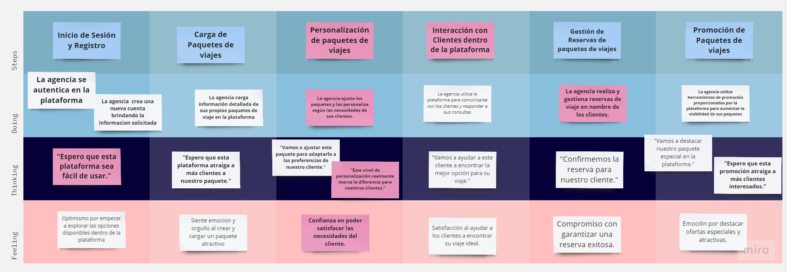
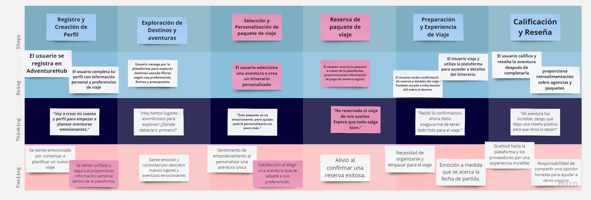

## 3.1. To-Be Scenario Mapping.

La elaboración del "To Be Scenario Map" en el contexto del proyecto AdventureHub se erige como un proceso fundamental en la mejora y optimización de la experiencia del usuario. Este mapa nos proporciona una representación visual del estado ideal que aspiramos alcanzar en nuestra plataforma, donde los usuarios disfrutan de una experiencia sin contratiempos y gratificante en cada fase de su viaje. Cada paso de este mapa refleja con precisión las acciones ejecutadas por el usuario, así como sus emociones y necesidades en ese momento particular.
#### To-Be Scenario Map de las agencias turísticas.

El To Be Scenario Map del usuario agencia de viajes en AdventureHub es un diagrama sistemático que describe de manera secuencial los pasos y acciones que los agentes de viajes llevarán a cabo al interactuar con la plataforma. Esto abarca desde el proceso de inicio de sesión hasta las tareas relacionadas con la promoción de paquetes de viaje. 

#### To-Be Scenario Map del usuario turista.

El To Be Scenario Map del usuario turista en AdventureHub representa una experiencia ideal de viaje. El usuario utiliza la plataforma de manera intuitiva para explorar, personalizar y reservar sus viajes de manera segura y emocionante.

## Capítulo 3.2: User Stories y Technical User Stories

En este capítulo, nos adentraremos en el mundo de las <strong>User Stories</strong> (Historias de Usuario) y las <strong>Technical User Stories</strong> (Historias de Usuario Técnicas) que conforman los requisitos esenciales y las funcionalidades centrales de <strong>AdventureHub</strong>.

Las <strong>User Stories</strong> representan las necesidades y expectativas de los usuarios finales de la aplicación. En contraste, las <strong>Technical User Stories</strong> son las tareas técnicas y de desarrollo necesarias para hacer realidad estas funcionalidades de manera efectiva.

El desarrollo ágil de software se basa en la definición y el seguimiento de <strong>User Stories</strong> para asegurar que la aplicación satisfaga los objetivos comerciales y las necesidades de los usuarios. Cada <strong>User Story</strong> es una descripción concisa y centrada en el usuario de una funcionalidad específica que agrega valor al producto. Por otro lado, las <strong>Technical User Stories</strong> se enfocan en los aspectos técnicos y de implementación necesarios para dar vida a las <strong>User Stories</strong>.

A lo largo de este capítulo, descompondremos las <strong>User Stories</strong> en sus componentes individuales, detallando los objetivos del usuario, las acciones requeridas y los criterios de aceptación que definen cuándo se considera completa una <strong>User Story</strong>. Además, exploraremos las <strong>Technical User Stories</strong> que respaldan estas funcionalidades, proporcionando detalles sobre las tareas técnicas, los requisitos de desarrollo y las tecnologías involucradas.

Este capítulo servirá como una guía completa para comprender las necesidades de los usuarios, los objetivos comerciales y los aspectos técnicos clave que impulsan el desarrollo de <strong>AdventureHub</strong>.

### Lista de Epics

#### Epic 1: Búsqueda y Exploración de Paquetes de Viaje

Este Epic se centra en funcionalidades relacionadas con la búsqueda de paquetes de viaje por diferentes criterios, como presupuesto, temporada y destino. Permite a los usuarios explorar opciones de viaje que se adapten a sus necesidades.

#### Epic 2: Reserva y Pago de Paquetes de Viaje

Este Epic abarca la funcionalidad que permite a los usuarios reservar y pagar paquetes de viaje en la aplicación de manera segura y conveniente. Incluye la confirmación de reservas y pagos, así como la recepción de recibos por correo electrónico.

#### Epic 3: Gestión de Perfil y Notificaciones de Usuarios

En este Epic se encuentran funcionalidades relacionadas con la gestión de perfiles de usuario, la configuración de preferencias de notificaciones y la personalización de alertas. Los usuarios pueden editar sus perfiles y recibir notificaciones relevantes.

#### Epic 4: Reseñas y Comunicación con Agencias de Viajes

Este Epic se enfoca en las reseñas de viajes escritas por usuarios registrados y la comunicación directa con agencias de viajes a través de un chat.

#### Epic 5: Contenido Dinámico en la Landing Page

El Epic del contenido dinámico se refiere a la personalización de la página de inicio (landing page). Aquí, el objetivo es mostrar contenido basado en las preferencias del usuario y ofertas actuales para aumentar la participación y conversiones en el sitio web.

  

<table>
<thead>
  <tr>
    <th>EPIC</th>
    <th>User Story ID </th>
    <th>Titulo</th>
    <th>Descripcion</th>
    <th>Criterios de Aceptacion </th>
  </tr>
</thead>
<tbody>
  <tr>
    <td>1</td>
    <td>US001</td>
    <td>Búsqueda de paquetes de viaje por presupuesto</td>
    <td>
        
<strong>Como usuario</strong>, quiero buscar paquetes de viaje en base a un rango de presupuesto, para encontrar opciones que se ajusten a mis necesidades financieras.

    </td>
    <td>
        <strong>Escenario 1: Búsqueda exitosa por presupuesto en un rango específico</strong>
        <ul>
            <li><strong>Dado que</strong> el usuario busca paquetes de viaje por presupuesto.</li>
            <li><strong>Cuando</strong> ingrese un rango de presupuesto válido.</li>
            <li><strong>Entonces</strong> la aplicación mostrará una lista de destinos disponibles dentro del rango especificado.</li>
        </ul>
        <strong>Escenario 2: Búsqueda fallida por presupuesto en un rango sin paquetes</strong>
        <ul>
            <li><strong>Dado que</strong> el usuario busca paquetes de viaje por presupuesto.</li>
            <li><strong>Cuando</strong> ingrese un rango de presupuesto sin opciones disponibles.</li>
            <li><strong>Entonces</strong> la aplicación mostrará un mensaje que indica que no se encontraron paquetes de viaje.</li>
        </ul>
        <strong>Escenario 3: Búsqueda por presupuesto con opciones de filtro</strong>
        <ul>
            <li><strong>Dado que</strong> el usuario busca paquetes de viaje por presupuesto y selecciona un filtro adicional.</li>
            <li><strong>Cuando</strong> ingrese un rango de presupuesto y aplique un filtro.</li>
            <li><strong>Entonces</strong> la aplicación mostrará una lista de destinos disponibles dentro del rango de presupuesto y que cumplan con el filtro seleccionado.</li>
        </ul>
    </td>
</tr>

<tr>
    <td>1</td>
    <td>TUS001</td>
    <td>Implementación de la búsqueda de paquetes por presupuesto</td>
    <td>
        
<strong>Como equipo de desarrollo</strong>, debemos implementar la funcionalidad de búsqueda de paquetes de viaje por presupuesto en la aplicación.

    </td>
    <td>
        <strong>Escenario 1: Integración de la funcionalidad de búsqueda de paquetes por presupuesto</strong>
        <ul>
            <li><strong>Dado que</strong> se ha diseñado la interfaz de búsqueda por presupuesto.</li>
            <li><strong>Cuando</strong> se implemente la lógica de búsqueda.</li>
            <li><strong>Entonces</strong> la búsqueda mostrará resultados dentro del rango de presupuesto especificado.</li>
        </ul>
        <strong>Escenario 2: Manejo de búsqueda sin resultados</strong>
        <ul>
            <li><strong>Dado que</strong> se ha implementado la búsqueda por presupuesto.</li>
            <li><strong>Cuando</strong> se realice una búsqueda sin resultados.</li>
            <li><strong>Entonces</strong> la aplicación mostrará un mensaje indicando que no se encontraron paquetes de viaje.</li>
        </ul>
        <strong>Escenario 3: Integración de filtros de búsqueda</strong>
        <ul>
            <li><strong>Dado que</strong> se ha diseñado la interfaz de búsqueda por presupuesto.</li>
            <li><strong>Cuando</strong> se implementen los filtros de búsqueda.</li>
            <li><strong>Entonces</strong> la búsqueda mostrará resultados que cumplan con los filtros seleccionados.</li>
        </ul>
    </td>
</tr>

<tr>
    <td>1</td>
    <td>US002</td>
    <td>Exploración de paquetes por temporada</td>
    <td>
        
<strong>Como usuario</strong>, quiero explorar paquetes de viaje según la temporada del año, para encontrar opciones adecuadas al clima y las actividades disponibles en ese momento.

    </td>
    <td>
        <strong>Escenario 1: Visualización de destinos por temporada en la página principal</strong>
        <ul>
            <li><strong>Dado que</strong> soy un usuario de AdventureHub.</li>
            <li><strong>Cuando</strong> abra la página principal de la aplicación.</li>
            <li><strong>Entonces</strong> veré una sección donde puedo explorar paquetes de viaje según la temporada del año.</li>
        </ul>
        <strong>Escenario 2: Filtro de búsqueda de paquetes por temporada</strong>
        <ul>
            <li><strong>Dado que</strong> soy un usuario de AdventureHub.</li>
            <li><strong>Cuando</strong> visite la página de búsqueda de destinos.</li>
            <li><strong>Entonces</strong> veré un filtro donde puedo seleccionar la temporada del año en la que deseo viajar, y la aplicación me mostrará los paquetes de viaje disponibles para esa temporada.</li>
        </ul>
        <strong>Escenario 3: Recomendaciones personalizadas de destinos por temporada</strong>
        <ul>
            <li><strong>Dado que</strong> soy un usuario registrado de AdventureHub.</li>
            <li><strong>Cuando</strong> inicie sesión en mi cuenta.</li>
            <li><strong>Entonces</strong> veré una sección de recomendaciones personalizadas donde la aplicación me mostrará destinos recomendados para la temporada en la que deseo viajar, basados en mi historial de viajes y preferencias personales.</li>
        </ul>
    </td>
</tr>
<tr>
    <td>1</td>
    <td>TUS002</td>
    <td>Implementación de exploración de paquetes por temporada</td>
    <td>
        
<strong>Como equipo de desarrollo</strong>, debemos implementar la funcionalidad que permita a los usuarios explorar paquetes de viaje según la temporada del año.

    </td>
    <td>
        <strong>Escenario 1: Diseño e integración de la sección de destinos por temporada en la página principal</strong>
        <ul>
            <li><strong>Dado que</strong> se ha diseñado la sección de destinos por temporada en la página principal.</li>
            <li><strong>Cuando</strong> se integre la lógica para mostrar destinos de temporada.</li>
            <li><strong>Entonces</strong> los usuarios podrán explorar destinos según la temporada desde la página principal.</li>
        </ul>
        <strong>Escenario 2: Implementación del filtro de búsqueda por temporada</strong>
        <ul>
            <li><strong>Dado que</strong> se ha diseñado el filtro de búsqueda por temporada en la página de búsqueda de destinos.</li>
            <li><strong>Cuando</strong> se implemente la lógica para filtrar paquetes de viaje por temporada.</li>
            <li><strong>Entonces</strong> los usuarios podrán seleccionar una temporada y ver paquetes de viaje disponibles para esa temporada.</li>
        </ul>
        <strong>Escenario 3: Integración de recomendaciones personalizadas</strong>
        <ul>
            <li><strong>Dado que</strong> se ha diseñado la sección de recomendaciones personalizadas en la página de inicio de usuarios registrados.</li>
            <li><strong>Cuando</strong> se implemente la lógica para recomendar destinos según la temporada y las preferencias del usuario.</li>
            <li><strong>Entonces</strong> los usuarios verán recomendaciones personalizadas en función de su historial de viajes y preferencias.</li>
        </ul>
    </td>
</tr>
<tr>
    <td>1</td>
    <td>US003</td>
    <td>Búsqueda de paquetes de viaje por destino</td>
    <td>
        
<strong>Como usuario</strong>, quiero buscar paquetes de viaje según el destino elegido, para encontrar opciones que se adapten a mi ubicación y preferencias culturales.

    </td>
    <td>
        <strong>Escenario 1: Búsqueda de paquetes por destino con resultados exitosos</strong>
        <ul>
            <li><strong>Dado que</strong> soy un usuario registrado en la aplicación de AdventureHub.</li>
            <li><strong>Cuando</strong> realice una búsqueda de paquetes de viaje en base a mi país de origen.</li>
            <li><strong>Entonces</strong> se mostrarán en pantalla los resultados de los paquetes disponibles que se encuentran en dicho destino y podré seleccionar uno para obtener más información.</li>
        </ul>
        <strong>Escenario 2: Búsqueda de paquetes de viaje por destino sin resultados coincidentes</strong>
        <ul>
            <li><strong>Dado que</strong> soy un usuario registrado en la aplicación de AdventureHub.</li>
            <li><strong>Cuando</strong> realice una búsqueda de paquetes de viaje en base a un destino que no tiene resultados.</li>
            <li><strong>Entonces</strong> se mostrará un mensaje de error en pantalla informando que no se encontraron resultados, y se me brindará la opción de modificar mi búsqueda o explorar otros destinos.</li>
        </ul>
        <strong>Escenario 3: Búsqueda de paquetes por destino sin haber iniciado sesión</strong>
        <ul>
            <li><strong>Dado que</strong> soy un usuario no registrado en la aplicación de AdventureHub.</li>
            <li><strong>Cuando</strong> intente realizar una búsqueda de destinos en base a mi país de origen.</li>
            <li><strong>Entonces</strong> se me solicitará iniciar sesión o crear una cuenta para poder utilizar la función de búsqueda de destinos por país de origen.</li>
        </ul>
    </td>
</tr>
<tr>
    <td>1</td>
    <td>TUS003</td>
    <td>Implementación de búsqueda de paquetes por destino</td>
    <td>
        
<strong>Como equipo de desarrollo</strong>, debemos implementar la funcionalidad que permita a los usuarios buscar paquetes de viaje por destino.

    </td>
    <td>
        <strong>Escenario 1: Integración de la lógica de búsqueda por destino</strong>
        <ul>
            <li><strong>Dado que</strong> se ha diseñado la interfaz de búsqueda por destino.</li>
            <li><strong>Cuando</strong> se implemente la lógica de búsqueda por destino.</li>
            <li><strong>Entonces</strong> la búsqueda mostrará resultados de paquetes de viaje en base al destino especificado.</li>
        </ul>
        <strong>Escenario 2: Manejo de búsqueda sin resultados</strong>
        <ul>
            <li><strong>Dado que</strong> se ha implementado la búsqueda por destino.</li>
            <li><strong>Cuando</strong> se realice una búsqueda sin resultados.</li>
            <li><strong>Entonces</strong> la aplicación mostrará un mensaje de error indicando que no se encontraron paquetes de viaje y ofrecerá opciones para modificar la búsqueda.</li>
        </ul>
        <strong>Escenario 3: Integración de inicio de sesión requerido</strong>
        <ul>
            <li><strong>Dado que</strong> se ha diseñado la funcionalidad de búsqueda por destino.</li>
            <li><strong>Cuando</strong> un usuario no registrado intente realizar una búsqueda por destino.</li>
            <li><strong>Entonces</strong> se le solicitará iniciar sesión o crear una cuenta antes de realizar la búsqueda.</li>
        </ul>
    </td>
</tr>
<tr>
    <td>2</td>
    <td>US004</td>
    <td>Reserva de paquete de viaje</td>
    <td>
        
<strong>Como usuario</strong>, quiero poder reservar un paquete de viaje en la aplicación, para poder asegurar mi lugar y mi itinerario.

    </td>
    <td>
        <strong>Escenario 1: Reservar un paquete de viaje con éxito</strong>
        <ul>
            <li><strong>Dado que</strong> estoy en la página de reservas de paquetes de viaje.</li>
            <li><strong>Cuando</strong> seleccione un paquete de viaje y proporcione la información necesaria (fechas de viaje, número de personas, información de pago, etc.).</li>
            <li><strong>Entonces</strong> se realizará la reserva correctamente, y recibiré una confirmación de mi reserva y pago.</li>
        </ul>
        <strong>Escenario 2: Verificar la disponibilidad de un paquete de viaje antes de hacer la reserva</strong>
        <ul>
            <li><strong>Dado que</strong> estoy en la página de reservas de paquetes de viaje.</li>
            <li><strong>Cuando</strong> ingrese las fechas de viaje y el número de personas para un paquete de viaje específico.</li>
            <li><strong>Entonces</strong> se me mostrará si hay disponibilidad para el paquete en esas fechas, y podré proceder con la reserva si hay disponibilidad o buscar otra opción si no hay disponibilidad.</li>
        </ul>
        <strong>Escenario 3: Cancelar una reserva de paquete de viaje</strong>
        <ul>
            <li><strong>Dado que</strong> tengo una reserva de paquete de viaje confirmada.</li>
            <li><strong>Cuando</strong> acceda a mi historial de reservas y seleccione la reserva que deseo cancelar.</li>
            <li><strong>Entonces</strong> se me presentará la opción de cancelar la reserva, se me informará si hay algún cargo por cancelación y se me proporcionará un reembolso si corresponde.</li>
        </ul>
    </td>
</tr>
<tr>
    <td>2</td>
    <td>TUS004</td>
    <td>Implementación de Reserva y Gestión de Paquetes de Viaje</td>
    <td>
        
<strong>Como equipo de desarrollo</strong>, debemos implementar la funcionalidad que permita a los usuarios reservar paquetes de viaje y gestionar sus reservas.

    </td>
    <td>
        <strong>Escenario 1: Implementación de la lógica de reserva de paquetes de viaje</strong>
        <ul>
            <li><strong>Dado que</strong> se ha diseñado la página de reservas de paquetes de viaje.</li>
            <li><strong>Cuando</strong> se implemente la lógica que permite a los usuarios seleccionar un paquete, proporcionar información necesaria y realizar una reserva exitosa.</li>
            <li><strong>Entonces</strong> los usuarios recibirán una confirmación de reserva y pago.</li>
        </ul>
        <strong>Escenario 2: Integración de verificación de disponibilidad</strong>
        <ul>
            <li><strong>Dado que</strong> se ha diseñado la página de reservas de paquetes de viaje.</li>
            <li><strong>Cuando</strong> se implemente la lógica que verifica la disponibilidad de paquetes de viaje antes de la reserva.</li>
            <li><strong>Entonces</strong> los usuarios podrán verificar la disponibilidad y tomar decisiones informadas.</li>
        </ul>
        <strong>Escenario 3: Implementación de cancelación de reservas</strong>
        <ul>
            <li><strong>Dado que</strong> se ha diseñado la funcionalidad de gestión de reservas.</li>
            <li><strong>Cuando</strong> se implemente la lógica que permite a los usuarios cancelar reservas existentes.</li>
            <li><strong>Entonces</strong> los usuarios podrán gestionar sus reservas y, si corresponde, recibir reembolsos.</li>
        </ul>
    </td>
</tr>
<tr>
    <td>2</td>
    <td>US005</td>
    <td>Pago de paquete de viaje</td>
    <td>
        
<strong>Como usuario</strong>, quiero poder pagar por un paquete de viaje en la aplicación, para tener una transacción segura y conveniente.

    </td>
    <td>
        <strong>Escenario 1: Pago exitoso del paquete de viaje con tarjeta de crédito</strong>
        <ul>
            <li><strong>Dado que</strong> he seleccionado un paquete de viaje y estoy en la página de pago.</li>
            <li><strong>Cuando</strong> ingrese los detalles de mi tarjeta de crédito.</li>
            <li><strong>Entonces</strong> el pago se procesará exitosamente, y se mostrará una confirmación de pago en la aplicación.</li>
        </ul>
        <strong>Escenario 2: Pago fallido del paquete de viaje por falta de fondos</strong>
        <ul>
            <li><strong>Dado que</strong> he seleccionado un paquete de viaje y estoy en la página de pago.</li>
            <li><strong>Cuando</strong> ingrese los detalles de mi tarjeta de crédito y no haya suficientes fondos disponibles.</li>
            <li><strong>Entonces</strong> se me informará del fallo en el pago y se me pedirá que elija un método de pago alternativo.</li>
        </ul>
        <strong>Escenario 3: Pago del paquete de viaje por transferencia bancaria</strong>
        <ul>
            <li><strong>Dado que</strong> he seleccionado un paquete de viaje y estoy en la página de pago.</li>
            <li><strong>Cuando</strong> elija la opción de pago por transferencia bancaria y se me muestre la información de la cuenta bancaria de la agencia de viajes.</li>
            <li><strong>Entonces</strong> realizaré la transferencia bancaria y enviaré el comprobante a través de la aplicación, y se mostrará una confirmación de pago en la aplicación después de que la agencia verifique la transferencia bancaria.</li>
        </ul>
    </td>
</tr>
<tr>
    <td>2</td>
    <td>TUS005</td>
    <td>Implementación de Proceso de Pago de Paquetes de Viaje</td>
    <td>
        
<strong>Como equipo de desarrollo</strong>, debemos implementar el proceso de pago de paquetes de viaje para garantizar transacciones seguras y convenientes.

    </td>
    <td>
        <strong>Escenario 1: Integración de procesamiento de pago con tarjeta de crédito</strong>
        <ul>
            <li><strong>Dado que</strong> se ha diseñado la página de pago de paquetes de viaje.</li>
            <li><strong>Cuando</strong> se integre la lógica que permite a los usuarios ingresar los detalles de su tarjeta de crédito y procesar el pago con éxito.</li>
            <li><strong>Entonces</strong> los usuarios recibirán una confirmación de pago.</li>
        </ul>
        <strong>Escenario 2: Manejo de pago fallido por falta de fondos</strong>
        <ul>
            <li><strong>Dado que</strong> se ha diseñado la página de pago de paquetes de viaje.</li>
            <li><strong>Cuando</strong> se implemente la lógica para manejar el pago fallido debido a la falta de fondos en la tarjeta de crédito del usuario.</li>
            <li><strong>Entonces</strong> se informará al usuario sobre el fallo en el pago y se le ofrecerán alternativas de pago.</li>
        </ul>
        <strong>Escenario 3: Integración de pago por transferencia bancaria</strong>
        <ul>
            <li><strong>Dado que</strong> se ha diseñado la página de pago de paquetes de viaje.</li>
            <li><strong>Cuando</strong> se implemente la opción de pago por transferencia bancaria y se permita a los usuarios realizar la transferencia y enviar el comprobante.</li>
            <li><strong>Entonces</strong> se mostrará una confirmación de pago después de que la agencia de viajes verifique la transferencia.</li>
        </ul>
    </td>
</tr>
<tr>
    <td>2</td>
    <td>US006</td>
    <td>Confirmación de reserva y pago</td>
    <td>
        
<strong>Como usuario</strong>, quiero recibir una confirmación de mi reserva y pago en la aplicación, para tener la tranquilidad de que mi transacción ha sido exitosa.

    </td>
    <td>
        <strong>Escenario 1: Confirmación de reserva y pago al finalizar la transacción</strong>
        <ul>
            <li><strong>Dado que</strong> el usuario ha seleccionado un paquete de viaje y ha ingresado su información de pago.</li>
            <li><strong>Cuando</strong> presione el botón "Completar transacción".</li>
            <li><strong>Entonces</strong> se mostrará una confirmación de reserva y pago que incluye los detalles de la reserva, el costo total, el método de pago utilizado y la fecha de viaje.</li>
        </ul>
        <strong>Escenario 2: Confirmación de reserva y pago por correo electrónico</strong>
        <ul>
            <li><strong>Dado que</strong> el usuario ha completado una transacción de reserva y pago en la aplicación.</li>
            <li><strong>Cuando</strong> se confirme la transacción.</li>
            <li><strong>Entonces</strong> se enviará un correo electrónico al usuario con los detalles de la reserva y el pago realizado.</li>
        </ul>
        <strong>Escenario 3: Confirmación de reserva y pago para el administrador</strong>
        <ul>
            <li><strong>Dado que</strong> un usuario ha completado una transacción de reserva y pago en la aplicación.</li>
            <li><strong>Cuando</strong> se confirme la transacción.</li>
            <li><strong>Entonces</strong> el administrador recibirá una notificación de la transacción y podrá ver los detalles de la reserva y el pago en la sección de transacciones de la aplicación.</li>
        </ul>
    </td>
</tr>
<tr>
    <td>2</td>
    <td>TUS006</td>
    <td>Implementación de Confirmación de Reserva y Pago</td>
    <td>
        
<strong>Como equipo de desarrollo</strong>, debemos implementar la funcionalidad que permita a los usuarios recibir confirmaciones de reserva y pago, así como notificaciones para el administrador.

    </td>
    <td>
        <strong>Escenario 1: Integración de confirmación de reserva y pago al finalizar la transacción</strong>
        <ul>
            <li><strong>Dado que</strong> se ha diseñado la página de finalización de transacción.</li>
            <li><strong>Cuando</strong> se integre la lógica que genera una confirmación detallada al usuario al completar la transacción.</li>
            <li><strong>Entonces</strong> los usuarios verán los detalles de su reserva y pago.</li>
        </ul>
        <strong>Escenario 2: Implementación de envío de confirmación por correo electrónico</strong>
        <ul>
            <li><strong>Dado que</strong> se ha diseñado la funcionalidad de correo electrónico.</li>
            <li><strong>Cuando</strong> se implemente el envío automático de correos electrónicos con detalles de reserva y pago después de que se complete una transacción.</li>
            <li><strong>Entonces</strong> los usuarios recibirán confirmaciones por correo electrónico.</li>
        </ul>
        <strong>Escenario 3: Integración de notificación para el administrador</strong>
        <ul>
            <li><strong>Dado que</strong> se ha diseñado la funcionalidad de administración de transacciones.</li>
            <li><strong>Cuando</strong> se implemente la notificación al administrador sobre las transacciones completadas.</li>
            <li><strong>Entonces</strong> el administrador podrá acceder a los detalles de las transacciones en la aplicación.</li>
        </ul>
    </td>
</tr>
<tr>
    <td>3</td>
    <td>US007</td>
    <td>Múltiples métodos de pago en perfil de usuario</td>
    <td>
        
<strong>Como usuario registrado</strong>, quiero poder guardar múltiples métodos de pago en mi perfil, para poder hacer reservas con mayor facilidad y rapidez.

    </td>
    <td>
        <strong>Escenario 1: Agregar un nuevo método de pago al perfil de usuario</strong>
        <ul>
            <li><strong>Dado que</strong> estoy en mi perfil de usuario.</li>
            <li><strong>Cuando</strong> seleccione la opción de "Agregar método de pago".</li>
            <li><strong>Entonces</strong> se me redirigirá a una página donde podré ingresar los detalles de mi nuevo método de pago, como el número de tarjeta y la fecha de vencimiento, y luego presionar "Guardar".</li>
        </ul>
        <strong>Escenario 2: Seleccionar un método de pago guardado durante la reserva de un paquete de viaje</strong>
        <ul>
            <li><strong>Dado que</strong> estoy en la página de pago para reservar un paquete de viaje.</li>
            <li><strong>Cuando</strong> seleccione la opción de "Método de pago".</li>
            <li><strong>Entonces</strong> se me mostrará una lista de mis métodos de pago guardados en mi perfil de usuario, y podré seleccionar uno para usar en la reserva.</li>
        </ul>
        <strong>Escenario 3: Eliminar un método de pago del perfil de usuario</strong>
        <ul>
            <li><strong>Dado que</strong> estoy en mi perfil de usuario.</li>
            <li><strong>Cuando</strong> seleccione la opción de "Eliminar método de pago".</li>
            <li><strong>Entonces</strong> se me mostrará una lista de mis métodos de pago guardados, y podré seleccionar uno para eliminar. Después de confirmar la eliminación, el método de pago se eliminará permanentemente de mi perfil de usuario.</li>
        </ul>
    </td>
</tr>
<tr>
    <td>3</td>
    <td>TUS007</td>
    <td>Implementación de Gestión de Métodos de Pago en el Perfil de Usuario</td>
    <td>
        
<strong>Como equipo de desarrollo</strong>, debemos implementar la funcionalidad que permita a los usuarios gestionar sus métodos de pago en sus perfiles.

    </td>
    <td>
        <strong>Escenario 1: Diseño e implementación de la interfaz de agregar un nuevo método de pago</strong>
        <ul>
            <li><strong>Dado que</strong> se ha diseñado la página de perfil de usuario.</li>
            <li><strong>Cuando</strong> se implemente la lógica que permite a los usuarios agregar un nuevo método de pago.</li>
            <li><strong>Entonces</strong> los usuarios podrán ingresar los detalles de su nuevo método de pago y guardarlo en su perfil.</li>
        </ul>
        <strong>Escenario 2: Integración de selección de método de pago durante la reserva</strong>
        <ul>
            <li><strong>Dado que</strong> se ha diseñado la página de reserva de paquetes de viaje.</li>
            <li><strong>Cuando</strong> se implemente la lógica que muestra los métodos de pago guardados en el perfil del usuario durante el proceso de reserva.</li>
            <li><strong>Entonces</strong> los usuarios podrán seleccionar uno de sus métodos de pago guardados para usar en la reserva.</li>
        </ul>
        <strong>Escenario 3: Implementación de eliminación de método de pago</strong>
        <ul>
            <li><strong>Dado que</strong> se ha diseñado la página de perfil de usuario.</li>
            <li><strong>Cuando</strong> se implemente la opción de eliminar un método de pago guardado.</li>
            <li><strong>Entonces</strong> los usuarios podrán eliminar métodos de pago de su perfil de manera permanente después de confirmar la acción.</li>
        </ul>
    </td>
</tr>
<tr>
    <td>3</td>
    <td>US008</td>
    <td>Recibo de pago por correo electrónico</td>
    <td>
        
<strong>Como usuario registrado</strong>, quiero recibir un recibo de mi pago por correo electrónico después de hacer una reserva exitosa, para tener un registro de mi transacción.

    </td>
    <td>
        <strong>Escenario 1: Envío de recibo de pago después de una reserva exitosa</strong>
        <ul>
            <li><strong>Dado que</strong> soy un usuario registrado que ha realizado una reserva en AdventureHub.</li>
            <li><strong>Cuando</strong> la reserva se haya pagado con éxito.</li>
            <li><strong>Entonces</strong> debo recibir un recibo de pago por correo electrónico en mi bandeja de entrada, que incluya detalles de la reserva y la información del pago.</li>
        </ul>
        <strong>Escenario 2: Contenido del recibo de pago</strong>
        <ul>
            <li><strong>Dado que</strong> soy un usuario registrado que ha realizado una reserva en AdventureHub y he recibido un recibo de pago por correo electrónico.</li>
            <li><strong>Cuando</strong> abra el correo electrónico con el recibo de pago.</li>
            <li><strong>Entonces</strong> el recibo debe incluir información clara y detallada sobre el costo de la reserva, los impuestos y las tarifas aplicables, la fecha y hora de la reserva, y los detalles de contacto de la agencia de viajes.</li>
        </ul>
        <strong>Escenario 3: Personalización del contenido del recibo de pago</strong>
        <ul>
            <li><strong>Dado que</strong> soy un usuario registrado que ha realizado una reserva en AdventureHub y he recibido un recibo de pago por correo electrónico.</li>
            <li><strong>Cuando</strong> abra el correo electrónico con el recibo de pago.</li>
            <li><strong>Entonces</strong> el recibo debe incluir información personalizada, como mi nombre, la fecha y hora de la reserva, el nombre del paquete de viaje, el itinerario detallado y cualquier otra información relevante para mi experiencia de viaje.</li>
        </ul>
    </td>
</tr>
<tr>
    <td>3</td>
    <td>TUS008</td>
    <td>Implementación de Envío de Recibo de Pago por Correo Electrónico</td>
    <td>
        
<strong>Como equipo de desarrollo</strong>, debemos implementar la funcionalidad que permita a los usuarios recibir automáticamente un recibo de pago por correo electrónico después de completar una reserva exitosa.

    </td>
    <td>
        <strong>Escenario 1: Integración de envío automático de recibo de pago</strong>
        <ul>
            <li><strong>Dado que</strong> se ha diseñado la funcionalidad de recibo de pago.</li>
            <li><strong>Cuando</strong> se implemente la lógica que envía automáticamente un recibo de pago por correo electrónico a los usuarios después de que completen una reserva exitosa.</li>
            <li><strong>Entonces</strong> los usuarios recibirán sus recibos en sus bandejas de entrada.</li>
        </ul>
        <strong>Escenario 2: Diseño del contenido del recibo de pago</strong>
        <ul>
            <li><strong>Dado que</strong> se ha diseñado la plantilla de recibo de pago.</li>
            <li><strong>Cuando</strong> se implemente el contenido del recibo que incluye detalles claros y detallados sobre la reserva, el pago y los datos de contacto de la agencia de viajes.</li>
            <li><strong>Entonces</strong> los usuarios recibirán recibos completos y comprensibles.</li>
        </ul>
        <strong>Escenario 3: Personalización del contenido del recibo de pago</strong>
        <ul>
            <li><strong>Dado que</strong> se ha diseñado la plantilla de recibo de pago personalizado.</li>
            <li><strong>Cuando</strong> se implemente la lógica que personaliza el contenido del recibo con información específica del usuario y de la reserva.</li>
            <li><strong>Entonces</strong> los usuarios recibirán recibos personalizados que reflejen su experiencia de viaje única.</li>
        </ul>
    </td>
</tr>
<tr>
    <td>3</td>
    <td>US009</td>
    <td>Información detallada de transacciones de pago</td>
    <td>
        
<strong>Como administrador</strong>, quiero poder acceder a información detallada sobre las transacciones de pago, para asegurarme de que todas las reservas se hayan pagado correctamente y mantener un registro actualizado.

    </td>
    <td>
        <strong>Escenario 1: Mostrar lista de transacciones de pago</strong>
        <ul>
            <li><strong>Dado que</strong> estoy en la página de administración de AdventureHub.</li>
            <li><strong>Cuando</strong> haga clic en el menú de transacciones de pago.</li>
            <li><strong>Entonces</strong> se me mostrará una lista detallada de todas las transacciones de pago realizadas en la aplicación, incluyendo el nombre del usuario, el número de reserva, la fecha, el método de pago y el monto.</li>
        </ul>
        <strong>Escenario 2: Filtrar transacciones de pago por fecha</strong>
        <ul>
            <li><strong>Dado que</strong> estoy en la página de transacciones de pago de AdventureHub.</li>
            <li><strong>Cuando</strong> seleccione un rango de fechas específico en el filtro de fecha.</li>
            <li><strong>Entonces</strong> se me mostrará una lista detallada de todas las transacciones de pago realizadas en ese período de tiempo, incluyendo el nombre del usuario, el número de reserva, la fecha, el método de pago y el monto.</li>
        </ul>
        <strong>Escenario 3: Exportar informe de transacciones de pago</strong>
        <ul>
            <li><strong>Dado que</strong> estoy en la página de transacciones de pago de AdventureHub.</li>
            <li><strong>Cuando</strong> haga clic en el botón "Exportar informe" en la parte inferior de la página.</li>
            <li><strong>Entonces</strong> se me descargará un archivo CSV con todos los detalles de las transacciones de pago realizadas en la aplicación, incluyendo el nombre del usuario, el número de reserva, la fecha, el método de pago y el monto.</li>
        </ul>
    </td>
</tr>
<tr>
    <td>3</td>
    <td>TUS009</td>
    <td>Implementación de Gestión de Transacciones de Pago para Administradores</td>
    <td>
        
<strong>Como equipo de desarrollo</strong>, debemos implementar la funcionalidad que permita a los administradores acceder a información detallada sobre las transacciones de pago, filtrar transacciones por fecha y exportar informes de transacciones.

    </td>
    <td>
        <strong>Escenario 1: Diseño e implementación de la lista de transacciones de pago</strong>
        <ul>
            <li><strong>Dado que</strong> se ha diseñado la página de administración de transacciones de pago.</li>
            <li><strong>Cuando</strong> se implemente la lógica que muestra una lista detallada de todas las transacciones de pago realizadas en la aplicación, incluyendo los detalles del usuario, la reserva, la fecha, el método de pago y el monto.</li>
            <li><strong>Entonces</strong> los administradores podrán acceder a esta lista.</li>
        </ul>
        <strong>Escenario 2: Integración de filtro de transacciones por fecha</strong>
        <ul>
            <li><strong>Dado que</strong> se ha diseñado la página de administración de transacciones de pago.</li>
            <li><strong>Cuando</strong> se implemente la opción de filtrar transacciones por un rango de fechas específico.</li>
            <li><strong>Entonces</strong> los administradores podrán seleccionar un período de tiempo y verán las transacciones realizadas en ese período.</li>
        </ul>
        <strong>Escenario 3: Implementación de exportación de informe de transacciones de pago</strong>
        <ul>
            <li><strong>Dado que</strong> se ha diseñado la página de administración de transacciones de pago.</li>
            <li><strong>Cuando</strong> se implemente la función de exportar informes de transacciones en formato CSV.</li>
            <li><strong>Entonces</strong> los administradores podrán descargar informes que incluyen detalles de todas las transacciones realizadas en la aplicación.</li>
        </ul>
    </td>
</tr>
<tr>
    <td>4</td>
    <td>US010</td>
    <td>Notificaciones de cambios en itinerario de viaje</td>
    <td>
        
<strong>Como usuario</strong>, quiero recibir notificaciones sobre cambios en mi itinerario de viaje, para estar informado y preparado.

    </td>
    <td>
        <strong>Escenario 1: Recibir notificación cuando hay un cambio en el itinerario de mi viaje reservado</strong>
        <ul>
            <li><strong>Dado que</strong> soy un usuario de AdventureHub con un viaje reservado.</li>
            <li><strong>Cuando</strong> haya un cambio en el itinerario de mi viaje.</li>
            <li><strong>Entonces</strong> debo recibir una notificación en tiempo real que me informe sobre el cambio.</li>
        </ul>
        <strong>Escenario 2: Actualizar itinerario en la aplicación después de recibir una notificación de cambio</strong>
        <ul>
            <li><strong>Dado que</strong> soy un usuario de AdventureHub y recibí una notificación de cambio en mi itinerario de viaje.</li>
            <li><strong>Cuando</strong> abro la aplicación.</li>
            <li><strong>Entonces</strong> debo ver el cambio actualizado en mi itinerario.</li>
        </ul>
        <strong>Escenario 3: Desactivar notificaciones de cambio en el itinerario de viaje</strong>
        <ul>
            <li><strong>Dado que</strong> soy un usuario de AdventureHub y no quiero recibir notificaciones sobre cambios en mi itinerario de viaje.</li>
            <li><strong>Cuando</strong> acceda a la configuración de notificaciones de mi perfil.</li>
            <li><strong>Entonces</strong> debo poder desactivar la opción de recibir notificaciones de cambios en el itinerario de viaje.</li>
        </ul>
    </td>
</tr>
<tr>
    <td>4</td>
    <td>TUS010</td>
    <td>Implementación de Notificaciones de Cambios en el Itinerario de Viaje</td>
    <td>
        
<strong>Como equipo de desarrollo</strong>, debemos implementar la funcionalidad que permite a los usuarios recibir notificaciones en tiempo real sobre cambios en sus itinerarios de viaje reservados, actualizar automáticamente los itinerarios y gestionar sus preferencias de notificaciones.

    </td>
    <td>
        <strong>Escenario 1: Integración de notificaciones en tiempo real</strong>
        <ul>
            <li><strong>Dado que</strong> se ha diseñado la funcionalidad de notificaciones de cambio en itinerario de viaje.</li>
            <li><strong>Cuando</strong> se implemente la lógica que envía notificaciones en tiempo real a los usuarios cuando hay cambios en sus itinerarios de viaje reservados.</li>
            <li><strong>Entonces</strong> los usuarios recibirán notificaciones instantáneas.</li>
        </ul>
        <strong>Escenario 2: Actualización automática del itinerario</strong>
        <ul>
            <li><strong>Dado que</strong> se ha diseñado la funcionalidad de notificaciones de cambio en itinerario de viaje.</li>
            <li><strong>Cuando</strong> se implemente la lógica que actualiza automáticamente los itinerarios de los usuarios en la aplicación cuando reciben una notificación de cambio.</li>
            <li><strong>Entonces</strong> los usuarios verán los cambios actualizados en sus itinerarios sin necesidad de acciones adicionales.</li>
        </ul>
        <strong>Escenario 3: Configuración de preferencias de notificaciones</strong>
        <ul>
            <li><strong>Dado que</strong> se ha diseñado la página de configuración de notificaciones en el perfil del usuario.</li>
            <li><strong>Cuando</strong> se implemente la opción de desactivar las notificaciones de cambios en el itinerario de viaje.</li>
            <li><strong>Entonces</strong> los usuarios podrán gestionar sus preferencias de notificaciones y desactivar esta opción si lo desean.</li>
        </ul>
    </td>
</tr>
<tr>
    <td>4</td>
    <td>US011</td>
    <td>Alertas de ofertas y promociones</td>
    <td>
        
<strong>Como usuario</strong>, quiero recibir alertas sobre ofertas y promociones para destinos de mi interés, para poder aprovechar descuentos y ahorrar dinero.

    </td>
    <td>
        <strong>Escenario 1: Notificación de ofertas detalladas en dispositivo móvil con preferencias de notificación en 'sí'</strong>
        <ul>
            <li><strong>Dado que</strong> soy un usuario de la aplicación y he establecido mis preferencias de notificación en "sí" para las alertas de ofertas y promociones.</li>
            <li><strong>Cuando</strong> una nueva oferta esté disponible.</li>
            <li><strong>Entonces</strong> recibiré una notificación en mi dispositivo móvil con información detallada sobre la oferta, incluyendo el destino, las fechas, el precio y cualquier término y condición relevante.</li>
        </ul>
        <strong>Escenario 2: No recibir notificaciones de ofertas con preferencias de notificación en 'no'</strong>
        <ul>
            <li><strong>Dado que</strong> soy un usuario de la aplicación y he establecido mis preferencias de notificación en "no" para las alertas de ofertas y promociones.</li>
            <li><strong>Cuando</strong> una nueva oferta esté disponible.</li>
            <li><strong>Entonces</strong> no recibiré una notificación en mi dispositivo móvil y no se me molestará con información de oferta.</li>
        </ul>
        <strong>Escenario 3: Notificación personalizada de ofertas relevantes para destinos favoritos en dispositivo móvil con preferencias de notificación en 'personalizado'</strong>
        <ul>
            <li><strong>Dado que</strong> soy un usuario de la aplicación y he establecido mis preferencias de notificación en "personalizado" para las alertas de ofertas y promociones.</li>
            <li><strong>Cuando</strong> una nueva oferta esté disponible para uno de mis destinos de viaje favoritos.</li>
            <li><strong>Entonces</strong> recibiré una notificación en mi dispositivo móvil con información detallada sobre la oferta, pero si la oferta no es relevante para mis destinos de viaje favoritos, entonces no recibiré una notificación.</li>
        </ul>
    </td>
</tr>
<tr>
    <td>4</td>
    <td>TUS011</td>
    <td>Implementación de Alertas de Ofertas y Promociones</td>
    <td>
        
<strong>Como equipo de desarrollo</strong>, debemos implementar la funcionalidad que permite a los usuarios recibir alertas de ofertas y promociones de acuerdo con sus preferencias de notificación.

    </td>
    <td>
        <strong>Escenario 1: Integración de notificaciones detalladas de ofertas.</strong>
        <ul>
            <li><strong>Dado que</strong> se ha diseñado la funcionalidad de alertas de ofertas y promociones.</li>
            <li><strong>Cuando</strong> se implemente la lógica que envía notificaciones detalladas de ofertas a los usuarios que tienen sus preferencias de notificación en "sí".</li>
            <li><strong>Entonces</strong> los usuarios recibirán notificaciones con información completa sobre las ofertas disponibles.</li>
        </ul>
        <strong>Escenario 2: Respetar preferencias de notificación 'no'.</strong>
        <ul>
            <li><strong>Dado que</strong> se ha diseñado la funcionalidad de alertas de ofertas y promociones.</li>
            <li><strong>Cuando</strong> se implemente la lógica que respeta las preferencias de notificación en "no" y no envía notificaciones a los usuarios que han optado por no recibirlas.</li>
            <li><strong>Entonces</strong> los usuarios no serán molestados con notificaciones de ofertas.</li>
        </ul>
        <strong>Escenario 3: Notificaciones personalizadas para preferencias 'personalizado'.</strong>
        <ul>
            <li><strong>Dado que</strong> se ha diseñado la funcionalidad de alertas de ofertas y promociones.</li>
            <li><strong>Cuando</strong> se implemente la lógica que envía notificaciones personalizadas a los usuarios que tienen preferencias de notificación en "personalizado" y que son relevantes para sus destinos favoritos.</li>
            <li><strong>Entonces</strong> los usuarios recibirán notificaciones específicas de ofertas que se ajustan a sus intereses de viaje.</li>
        </ul>
    </td>
</tr>
<tr>
    <td>4</td>
    <td>US012</td>
    <td>Recordatorios de próximo viaje</td>
    <td>
        
<strong>Como usuario registrado</strong>, quiero recibir recordatorios y alertas sobre mi próximo viaje, para asegurarme de estar preparado y no olvidar detalles importantes.

    </td>
    <td>
        <strong>Escenario 1: Recepción de recordatorio del próximo viaje.</strong>
        <ul>
            <li><strong>Dado que</strong> soy un usuario registrado de AdventureHub con un próximo viaje reservado.</li>
            <li><strong>Cuando</strong> se acerque la fecha de inicio de mi próximo viaje.</li>
            <li><strong>Entonces</strong> recibiré un recordatorio o alerta en la aplicación que me informará sobre la fecha, hora y detalles de mi viaje.</li>
        </ul>
        <strong>Escenario 2: Visualización de detalles del próximo viaje.</strong>
        <ul>
            <li><strong>Dado que</strong> soy un usuario registrado de AdventureHub y he recibido un recordatorio del próximo viaje.</li>
            <li><strong>Cuando</strong> hago clic en el recordatorio o alerta.</li>
            <li><strong>Entonces</strong> se me mostrarán los detalles completos de mi próximo viaje, incluyendo itinerario, reservas, horarios y otra información relevante.</li>
        </ul>
        <strong>Escenario 3: Configuración de preferencias de recordatorio.</strong>
        <ul>
            <li><strong>Dado que</strong> soy un usuario registrado de AdventureHub.</li>
            <li><strong>Cuando</strong> acceda a la configuración de notificaciones en mi perfil.</li>
            <li><strong>Entonces</strong> podré configurar mis preferencias de recordatorio para el próximo viaje, incluyendo la anticipación deseada y el tipo de notificación (por ejemplo, notificación en la aplicación, correo electrónico, SMS).</li>
        </ul>
    </td>
</tr>
<tr>
    <td>4</td>
    <td>TUS012</td>
    <td>Implementación de Recordatorios de Próximo Viaje</td>
    <td>
        
<strong>Como equipo de desarrollo</strong>, debemos implementar la funcionalidad que permite a los usuarios registrados recibir recordatorios y alertas sobre su próximo viaje, con opciones de configuración de preferencias.

    </td>
    <td>
        <strong>Escenario 1: Diseño e implementación de recordatorios del próximo viaje.</strong>
        <ul>
            <li><strong>Dado que</strong> se ha diseñado la funcionalidad de recordatorios del próximo viaje.</li>
            <li><strong>Cuando</strong> se implemente la lógica que envía recordatorios o alertas a los usuarios registrados cuando se acerque la fecha de inicio de su próximo viaje.</li>
            <li><strong>Entonces</strong> los usuarios recibirán estos recordatorios o alertas en la aplicación.</li>
        </ul>
        <strong>Escenario 2: Detalles completos del próximo viaje.</strong>
        <ul>
            <li><strong>Dado que</strong> se ha diseñado la funcionalidad de recordatorios del próximo viaje.</li>
            <li><strong>Cuando</strong> se implemente la opción de ver detalles completos del próximo viaje al hacer clic en el recordatorio o alerta.</li>
            <li><strong>Entonces</strong> los usuarios podrán acceder fácilmente a todos los detalles de su próximo viaje.</li>
        </ul>
        <strong>Escenario 3: Configuración de preferencias de recordatorio.</strong>
        <ul>
            <li><strong>Dado que</strong> se ha diseñado la página de configuración de notificaciones en el perfil del usuario.</li>
            <li><strong>Cuando</strong> se implemente la opción de configurar preferencias de recordatorio, incluyendo la anticipación deseada y el tipo de notificación.</li>
            <li><strong>Entonces</strong> los usuarios podrán personalizar cómo desean recibir los recordatorios de su próximo viaje.</li>
        </ul>
    </td>
</tr>
<tr>
    <td>3</td>
    <td>US013</td>
    <td>Personalización de notificaciones de usuario registrado</td>
    <td>
        
<strong>Como usuario registrado</strong>, quiero poder personalizar mis preferencias de notificaciones en la aplicación, para recibir alertas y comunicaciones relevantes según mis intereses y necesidades.

    </td>
    <td>
        <strong>Escenario 1: Acceso a la configuración de notificaciones.</strong>
        <ul>
            <li><strong>Dado que</strong> soy un usuario registrado de AdventureHub.</li>
            <li><strong>Cuando</strong> accedo a la sección de configuración de notificaciones en mi perfil.</li>
            <li><strong>Entonces</strong> puedo ver una lista de tipos de notificaciones que puedo personalizar.</li>
        </ul>
        <strong>Escenario 2: Personalización de tipos de notificaciones.</strong>
        <ul>
            <li><strong>Dado que</strong> soy un usuario registrado y accedo a la configuración de notificaciones.</li>
            <li><strong>Cuando</strong> selecciono un tipo de notificación, como ofertas, alertas de viaje o actualizaciones de destino.</li>
            <li><strong>Entonces</strong> puedo elegir si deseo recibir o no notificaciones de ese tipo, y cómo deseo recibirlas (por ejemplo, en la aplicación, por correo electrónico, por SMS).</li>
        </ul>
        <strong>Escenario 3: Guardar preferencias de notificación.</strong>
        <ul>
            <li><strong>Dado que</strong> he personalizado mis preferencias de notificaciones en la configuración.</li>
            <li><strong>Cuando</strong> hago clic en "Guardar" o una opción similar.</li>
            <li><strong>Entonces</strong> mis preferencias de notificación se guardan y se aplican para asegurar que reciba las alertas y comunicaciones según mis elecciones.</li>
        </ul>
    </td>
</tr>
<tr>
    <td>3</td>
    <td>TUS013</td>
    <td>Implementación de Personalización de Notificaciones de Usuario Registrado</td>
    <td>
        
<strong>Como equipo de desarrollo,</strong> debemos implementar la funcionalidad que permite a los usuarios registrados personalizar sus preferencias de notificaciones en la aplicación.

    </td>
    <td>
        <strong>Escenario 1: Diseño e implementación de la sección de configuración de notificaciones.</strong>
        <ul>
            <li><strong>Dado que</strong> se ha diseñado la sección de configuración de notificaciones en el perfil del usuario.</li>
            <li><strong>Cuando</strong> se implemente la lógica que muestra una lista de tipos de notificaciones personalizables.</li>
            <li><strong>Entonces</strong> los usuarios podrán acceder a esta sección desde su perfil.</li>
        </ul>
        <strong>Escenario 2: Diseño e implementación de la personalización de tipos de notificaciones.</strong>
        <ul>
            <li><strong>Dado que</strong> se ha diseñado la sección de configuración de notificaciones en el perfil del usuario.</li>
            <li><strong>Cuando</strong> se implemente la opción que permite a los usuarios seleccionar los tipos de notificaciones que desean recibir y cómo desean recibirlas.</li>
            <li><strong>Entonces</strong> los usuarios podrán personalizar sus preferencias de notificación.</li>
        </ul>
        <strong>Escenario 3: Guardar preferencias de notificación.</strong>
        <ul>
            <li><strong>Dado que</strong> los usuarios han personalizado sus preferencias de notificaciones.</li>
            <li><strong>Cuando</strong> hagan clic en "Guardar" o una opción similar en la sección de configuración de notificaciones.</li>
            <li><strong>Entonces</strong> las preferencias personalizadas se guardarán en la base de datos y se aplicarán para dirigir las notificaciones de acuerdo con las elecciones de los usuarios.</li>
        </ul>
    </td>
</tr>
<tr>
    <td>3</td>
    <td>US014</td>
    <td>Notificaciones personalizadas de administrador</td>
    <td>
        
<strong>Como administrador,</strong> quiero poder configurar y recibir notificaciones personalizadas sobre eventos y actividades críticas en la plataforma, para poder tomar medidas proactivas cuando sea necesario.

    </td>
    <td>
        <strong>Escenario 1: Acceso a la configuración de notificaciones de administrador.</strong>
        <ul>
            <li><strong>Dado que</strong> soy un administrador de AdventureHub y he iniciado sesión en mi cuenta de administrador.</li>
            <li><strong>Cuando</strong> accedo a la sección de configuración de notificaciones personalizadas en mi panel de administración.</li>
            <li><strong>Entonces</strong> puedo ver una lista de eventos y actividades críticas que puedo configurar para recibir notificaciones.</li>
        </ul>
        <strong>Escenario 2: Personalización de notificaciones de eventos críticos.</strong>
        <ul>
            <li><strong>Dado que</strong> soy un administrador y accedo a la configuración de notificaciones personalizadas.</li>
            <li><strong>Cuando</strong> selecciono un evento crítico, como problemas técnicos, quejas de usuarios o pagos no procesados.</li>
            <li><strong>Entonces</strong> puedo configurar cómo deseo recibir notificaciones sobre ese evento (por ejemplo, correo electrónico, mensaje en la aplicación, mensaje de texto) y a qué dirección o número de teléfono se deben enviar.</li>
        </ul>
        <strong>Escenario 3: Recepción de notificaciones personalizadas de eventos críticos.</strong>
        <ul>
            <li><strong>Dado que</strong> he configurado mis preferencias de notificaciones como administrador.</li>
            <li><strong>Cuando</strong> ocurre un evento crítico en la plataforma que coincide con mis preferencias.</li>
            <li><strong>Entonces</strong> recibo una notificación personalizada sobre ese evento de acuerdo con la configuración que he seleccionado.</li>
        </ul>
    </td>
</tr>
<tr>
    <td>3</td>
    <td>TUS014</td>
    <td>Implementación de Notificaciones Personalizadas de Administrador</td>
    <td>
        
<strong>Como equipo de desarrollo,</strong> debemos implementar la funcionalidad que permite a los administradores configurar y recibir notificaciones personalizadas sobre eventos críticos en la plataforma.

    </td>
    <td>
        <strong>Escenario 1: Diseño e implementación de la sección de configuración de notificaciones de administrador.</strong>
        <ul>
            <li><strong>Dado que</strong> se ha diseñado la sección de configuración de notificaciones personalizadas en el panel de administración.</li>
            <li><strong>Cuando</strong> se implemente la lógica que muestra una lista de eventos y actividades críticas configurables.</li>
            <li><strong>Entonces</strong> los administradores podrán acceder a esta sección desde su panel de administración.</li>
        </ul>
        <strong>Escenario 2: Diseño e implementación de la personalización de notificaciones de eventos críticos.</strong>
        <ul>
            <li><strong>Dado que</strong> se ha diseñado la sección de configuración de notificaciones personalizadas en el panel de administración.</li>
            <li><strong>Cuando</strong> se implemente la opción que permite a los administradores seleccionar eventos críticos y configurar cómo desean recibir notificaciones sobre esos eventos.</li>
            <li><strong>Entonces</strong> los administradores podrán personalizar sus preferencias de notificación.</li>
        </ul>
        <strong>Escenario 3: Envío de notificaciones personalizadas de eventos críticos.</strong>
        <ul>
            <li><strong>Dado que</strong> los administradores han configurado sus preferencias de notificaciones.</li>
            <li><strong>Cuando</strong> ocurra un evento crítico en la plataforma que coincida con las preferencias de un administrador.</li>
            <li><strong>Entonces</strong> el sistema enviará una notificación personalizada sobre ese evento de acuerdo con la configuración seleccionada por el administrador.</li>
        </ul>
    </td>
</tr>
<tr>
    <td>2</td>
    <td>US015</td>
    <td>Notificación de Actualización de Paquete de Viaje en Lista de Deseos</td>
    <td>
        
<strong>Como usuario,</strong> quiero recibir una notificación cuando un paquete de viaje que he guardado en mi lista de deseos se actualiza, para estar al tanto de las últimas ofertas y cambios en los itinerarios.

    </td>
    <td>
        <strong>Escenario 1: Agregar paquete de viaje a lista de deseos.</strong>
        <ul>
            <li><strong>Dado que</strong> soy un usuario registrado de AdventureHub y estoy explorando un paquete de viaje.</li>
            <li><strong>Cuando</strong> selecciono la opción de "Guardar en mi lista de deseos" para un paquete de viaje específico.</li>
            <li><strong>Entonces</strong> el paquete de viaje se agrega a mi lista de deseos y se guarda en mi perfil.</li>
        </ul>    
        <strong>Escenario 2: Recepción de notificación de actualización.</strong>
        <ul>
            <li><strong>Dado que</strong> soy un usuario registrado de AdventureHub y he guardado un paquete de viaje en mi lista de deseos.</li>
            <li><strong>Cuando</strong> se realizan cambios significativos en el paquete de viaje, como cambios en las fechas, el precio o el itinerario.</li>
            <li><strong>Entonces</strong> recibo una notificación en la aplicación que me informa sobre la actualización del paquete de viaje en mi lista de deseos.</li>
        </ul>
        <strong>Escenario 3: Opción de desactivar notificaciones.</strong>
        <ul>
            <li><strong>Dado que</strong> soy un usuario registrado de AdventureHub y he guardado un paquete de viaje en mi lista de deseos.</li>
            <li><strong>Cuando</strong> accedo a la configuración de notificaciones en mi perfil.</li>
            <li><strong>Entonces</strong> tengo la opción de desactivar las notificaciones de actualización para paquetes de viaje en mi lista de deseos si lo deseo.</li>
        </ul>
    </td>
</tr>
<tr>
    <td>2</td>
    <td>TUS015</td>
    <td>Implementación de Notificación de Actualización de Paquete de Viaje en Lista de Deseos</td>
    <td>
        
<strong>Como equipo de desarrollo,</strong> debemos implementar la funcionalidad que permite a los usuarios recibir notificaciones cuando un paquete de viaje guardado en su lista de deseos se actualiza.

    </td>
    <td>
        <strong>Escenario 1: Diseño e implementación de la opción "Guardar en mi lista de deseos".</strong>
        <ul>
            <li><strong>Dado que</strong> se ha diseñado la opción "Guardar en mi lista de deseos" en la página de detalles de un paquete de viaje.</li>
            <li><strong>Cuando</strong> se implemente la lógica que permite a los usuarios agregar un paquete de viaje a su lista de deseos.</li>
            <li><strong>Entonces</strong> los usuarios podrán guardar paquetes de viaje en su lista de deseos desde la página de detalles.</li>
        </ul>
        <strong>Escenario 2: Diseño e implementación de notificaciones de actualización.</strong>
        <ul>
            <li><strong>Dado que</strong> se ha diseñado la opción de notificaciones de actualización para paquetes de viaje en lista de deseos.</li>
            <li><strong>Cuando</strong> se implemente la lógica que detecta cambios significativos en los paquetes de viaje guardados en la lista de deseos de un usuario.</li>
            <li><strong>Entonces</strong> los usuarios recibirán notificaciones en la aplicación cuando ocurran actualizaciones en los paquetes de viaje guardados en su lista de deseos.</li>
        </ul>
        <strong>Escenario 3: Implementación de opción para desactivar notificaciones.</strong>
        <ul>
            <li><strong>Dado que</strong> se ha diseñado la opción para desactivar las notificaciones de actualización en la configuración de notificaciones en el perfil del usuario.</li>
            <li><strong>Cuando</strong> se implemente la lógica que permite a los usuarios desactivar las notificaciones de actualización para paquetes de viaje en su lista de deseos si lo desean.</li>
            <li><strong>Entonces</strong> los usuarios podrán gestionar sus preferencias de notificación de acuerdo con sus necesidades.</li>
        </ul>
    </td>
</tr>
<tr>
    <td>3</td>
    <td>US016</td>
    <td>Edición de perfil de usuario</td>
    <td>
        
<strong>Como usuario registrado,</strong> quiero poder editar la información de mi perfil en la aplicación, para mantener mis datos personales actualizados y precisos.

    </td>
    <td>
        <strong>Escenario 1: Acceso a la edición de perfil.</strong>
        <ul>
            <li><strong>Dado que</strong> soy un usuario registrado de AdventureHub y he iniciado sesión en mi cuenta.</li>
            <li><strong>Cuando</strong> accedo a la sección de edición de perfil desde la configuración de mi cuenta.</li>
            <li><strong>Entonces</strong> puedo ver y modificar la información de mi perfil, como mi nombre, dirección de correo electrónico, número de teléfono y contraseña.</li>
        </ul>
        <strong>Escenario 2: Actualización de información de perfil.</strong>
        <ul>
            <li><strong>Dado que</strong> soy un usuario registrado y estoy en la sección de edición de perfil.</li>
            <li><strong>Cuando</strong> modifico algún campo de mi información de perfil, como mi dirección de correo electrónico o número de teléfono.</li>
            <li><strong>Entonces</strong> puedo guardar los cambios y mi información de perfil se actualiza correctamente en la base de datos.</li>
        </ul>
        <strong>Escenario 3: Cambio de contraseña.</strong>
        <ul>
            <li><strong>Dado que</strong> soy un usuario registrado y estoy en la sección de edición de perfil.</li>
            <li><strong>Cuando</strong> deseo cambiar mi contraseña actual.</li>
            <li><strong>Entonces</strong> puedo ingresar mi contraseña actual y luego ingresar y confirmar mi nueva contraseña, y al guardar, mi contraseña se actualiza de manera segura.</li>
        </ul>
    </td>
</tr>
<tr>
    <td>3</td>
    <td>TUS016</td>
    <td>Implementación de Edición de Perfil de Usuario</td>
    <td>
        
<strong>Como equipo de desarrollo,</strong> debemos implementar la funcionalidad que permite a los usuarios registrados editar la información de su perfil en la aplicación.

    </td>
    <td>
        <strong>Escenario 1: Diseño e implementación de la sección de edición de perfil.</strong>
        <ul>
            <li><strong>Dado que</strong> se ha diseñado la sección de edición de perfil en la configuración de la cuenta del usuario.</li>
            <li><strong>Cuando</strong> se implemente la lógica que muestra la información actual del perfil del usuario y permite la edición de campos como nombre, dirección de correo electrónico, número de teléfono y contraseña.</li>
            <li><strong>Entonces</strong> los usuarios podrán acceder a esta sección desde su perfil.</li>
        </ul>
        <strong>Escenario 2: Diseño e implementación de la actualización de información de perfil.</strong>
        <ul>
            <li><strong>Dado que</strong> se ha diseñado la sección de edición de perfil en la configuración de la cuenta del usuario.</li>
            <li><strong>Cuando</strong> se implemente la opción que permite a los usuarios modificar campos de su información de perfil y guardar los cambios.</li>
            <li><strong>Entonces</strong> los usuarios podrán actualizar su información de perfil y los cambios se reflejarán en la base de datos.</li>
        </ul>
        <strong>Escenario 3: Diseño e implementación del cambio de contraseña.</strong>
        <ul>
            <li><strong>Dado que</strong> se ha diseñado la sección de edición de perfil en la configuración de la cuenta del usuario.</li>
            <li><strong>Cuando</strong> se implemente la opción que permite a los usuarios cambiar su contraseña actual proporcionando su contraseña actual y una nueva contraseña.</li>
            <li><strong>Entonces</strong> los usuarios podrán cambiar su contraseña de manera segura y la contraseña se actualizará en la base de datos.</li>
        </ul>
    </td>
</tr>
<tr>
    <td>3</td>
    <td>US017</td>
    <td>Configuración de preferencias de notificaciones</td>
    <td>
        
<strong>Como usuario registrado,</strong> quiero poder configurar mis preferencias de notificaciones en la aplicación, para recibir información relevante de manera personalizada.

    </td>
    <td>
        <strong>Escenario 1: Acceso a la configuración de notificaciones.</strong>
        <ul>
            <li><strong>Dado que</strong> soy un usuario registrado de AdventureHub y he iniciado sesión en mi cuenta.</li>
            <li><strong>Cuando</strong> accedo a la sección de configuración de notificaciones desde la configuración de mi cuenta.</li>
            <li><strong>Entonces</strong> puedo ver una lista de tipos de notificaciones que puedo configurar.</li>
        </ul>
        <strong>Escenario 2: Personalización de preferencias de notificaciones.</strong>
        <ul>
            <li><strong>Dado que</strong> soy un usuario registrado y estoy en la sección de configuración de notificaciones.</li>
            <li><strong>Cuando</strong> selecciono un tipo de notificación, como ofertas, actualizaciones de paquetes de viaje o recordatorios de viaje.</li>
            <li><strong>Entonces</strong> puedo configurar cómo deseo recibir estas notificaciones (por ejemplo, correo electrónico, mensaje en la aplicación, mensaje de texto) y con qué frecuencia.</li>
        </ul>
        <strong>Escenario 3: Guardar preferencias de notificaciones.</strong>
        <ul>
            <li><strong>Dado que</strong> soy un usuario registrado y he personalizado mis preferencias de notificaciones.</li>
            <li><strong>Cuando</strong> guardo mis preferencias de notificación.</li>
            <li><strong>Entonces</strong> mis preferencias se almacenan en mi perfil de usuario y se aplican a las notificaciones que recibo.</li>
        </ul>
    </td>
</tr>
<tr>
    <td>3</td>
    <td>TUS017</td>
    <td>Implementación de Configuración de Preferencias de Notificaciones</td>
    <td>
        
<strong>Como equipo de desarrollo,</strong> debemos implementar la funcionalidad que permite a los usuarios registrados configurar sus preferencias de notificaciones en la aplicación.

    </td>
    <td>
        <strong>Escenario 1: Diseño e implementación de la sección de configuración de notificaciones.</strong>
        <ul>
            <li><strong>Dado que</strong> se ha diseñado la sección de configuración de notificaciones en la configuración de la cuenta del usuario.</li>
            <li><strong>Cuando</strong> se implemente la lógica que muestra la lista de tipos de notificaciones que los usuarios pueden configurar.</li>
            <li><strong>Entonces</strong> los usuarios podrán acceder a esta sección desde su perfil.</li>
        </ul>
        <strong>Escenario 2: Diseño e implementación de personalización de preferencias de notificaciones.</strong>
        <ul>
            <li><strong>Dado que</strong> se ha diseñado la sección de configuración de notificaciones en la configuración de la cuenta del usuario.</li>
            <li><strong>Cuando</strong> se implemente la opción que permite a los usuarios seleccionar tipos de notificaciones y configurar cómo desean recibirlas y con qué frecuencia.</li>
            <li><strong>Entonces</strong> los usuarios podrán personalizar sus preferencias de notificación.</li>
        </ul>
        <strong>Escenario 3: Implementación de guardar preferencias de notificaciones.</strong>
        <ul>
            <li><strong>Dado que</strong> los usuarios han personalizado sus preferencias de notificaciones.</li>
            <li><strong>Cuando</strong> guarden sus preferencias de notificación.</li>
            <li><strong>Entonces</strong> las preferencias se almacenarán en la base de datos de manera segura y se aplicarán a las notificaciones que reciban.</li>
        </ul>
    </td>
</tr>
<tr>
    <td>3</td>
    <td>US018</td>
    <td>Eliminación de cuenta de usuario</td>
    <td>
        
<strong>Como usuario registrado,</strong> quiero tener la opción de eliminar mi cuenta de usuario en la aplicación, en caso de que decida no utilizar más el servicio.

    </td>
    <td>
        <strong>Escenario 1: Acceso a la eliminación de cuenta.</strong>
        <ul>
            <li><strong>Dado que</strong> soy un usuario registrado de AdventureHub y he iniciado sesión en mi cuenta.</li>
            <li><strong>Cuando</strong> accedo a la sección de eliminación de cuenta desde la configuración de mi cuenta.</li>
            <li><strong>Entonces</strong> puedo ver información sobre la eliminación de cuenta y un botón para iniciar el proceso.</li>
        </ul>
        <strong>Escenario 2: Confirmación de eliminación de cuenta.</strong>
        <ul>
            <li><strong>Dado que</strong> soy un usuario registrado y estoy en la sección de eliminación de cuenta.</li>
            <li><strong>Cuando</strong> selecciono la opción para eliminar mi cuenta.</li>
            <li><strong>Entonces</strong> se me solicita confirmar mi decisión y proporcionar mi contraseña actual para verificar la eliminación.</li>
        </ul>
        <strong>Escenario 3: Eliminación exitosa de la cuenta.</strong>
        <ul>
            <li><strong>Dado que</strong> soy un usuario registrado y he confirmado la eliminación de mi cuenta.</li>
            <li><strong>Cuando</strong> ingreso mi contraseña actual y confirmo la eliminación.</li>
            <li><strong>Entonces</strong> mi cuenta se elimina de manera irreversible, y se me muestra un mensaje de confirmación.</li>
        </ul>
    </td>
</tr>
<tr>
    <td>3</td>
    <td>TUS018</td>
    <td>Implementación de Eliminación de Cuenta de Usuario</td>
    <td>
        
<strong>Como equipo de desarrollo,</strong> debemos implementar la funcionalidad que permite a los usuarios registrados eliminar sus cuentas de usuario en la aplicación.

    </td>
    <td>
        <strong>Escenario 1: Diseño e implementación de la sección de eliminación de cuenta.</strong>
        <ul>
            <li><strong>Dado que</strong> se ha diseñado la sección de eliminación de cuenta en la configuración de la cuenta del usuario.</li>
            <li><strong>Cuando</strong> se implemente la lógica que muestra información sobre la eliminación de cuenta y proporciona un botón para iniciar el proceso.</li>
            <li><strong>Entonces</strong> los usuarios podrán acceder a esta sección desde su perfil.</li>
        </ul>
        <strong>Escenario 2: Diseño e implementación de confirmación de eliminación de cuenta.</strong>
        <ul>
            <li><strong>Dado que</strong> se ha diseñado la sección de eliminación de cuenta en la configuración de la cuenta del usuario.</li>
            <li><strong>Cuando</strong> se implemente la opción que permite a los usuarios confirmar su decisión de eliminar su cuenta y proporcionar su contraseña actual.</li>
            <li><strong>Entonces</strong> los usuarios deberán confirmar su elección y verificar su identidad antes de proceder.</li>
        </ul>
        <strong>Escenario 3: Implementación de eliminación exitosa de la cuenta.</strong>
        <ul>
            <li><strong>Dado que</strong> los usuarios han confirmado la eliminación de su cuenta.</li>
            <li><strong>Cuando</strong> ingresen su contraseña actual y confirmen la eliminación.</li>
            <li><strong>Entonces</strong> sus cuentas se eliminarán de manera irreversible y se mostrará un mensaje de confirmación.</li>
        </ul>
    </td>
</tr>
<tr>
    <td>4</td>
    <td>US019</td>
    <td>Reseñas de viajes para usuarios registrados</td>
    <td>
        
<strong>Como usuario registrado,</strong> quiero poder escribir y leer reseñas de viajes de otros usuarios, para tomar decisiones informadas sobre mis futuros viajes.

    </td>
    <td>
        <strong>Escenario 1: Escritura de reseñas de viajes.</strong>
        <ul>
            <li><strong>Dado que</strong> soy un usuario registrado de AdventureHub y he iniciado sesión en mi cuenta.</li>
            <li><strong>Cuando</strong> accedo a la sección de reseñas de viajes de la aplicación.</li>
            <li><strong>Entonces</strong> puedo escribir una reseña detallada sobre un viaje que haya realizado, incluyendo una calificación, comentarios y fotos opcionales.</li>
        </ul>
        <strong>Escenario 2: Lectura de reseñas de viajes.</strong>
        <ul>
            <li><strong>Dado que</strong> soy un usuario registrado y estoy buscando información sobre un destino o paquete de viaje en particular.</li>
            <li><strong>Cuando</strong> accedo a la sección de reseñas de viajes de la aplicación.</li>
            <li><strong>Entonces</strong> puedo leer las reseñas de otros usuarios sobre ese destino o paquete de viaje, incluyendo calificaciones, comentarios y fotos.</li>
        </ul>
        <strong>Escenario 3: Calificación de reseñas útiles.</strong>
        <ul>
            <li><strong>Dado que</strong> soy un usuario registrado y estoy leyendo una reseña de viaje.</li>
            <li><strong>Cuando</strong> encuentro una reseña útil.</li>
            <li><strong>Entonces</strong> puedo marcarla como "útil" o darle una calificación positiva, lo que ayudará a otros usuarios a identificar las reseñas más informativas.</li>
        </ul>
    </td>
</tr>
<tr>
    <td>4</td>
    <td>TUS019</td>
    <td>Implementación de Reseñas de Viajes para Usuarios Registrados</td>
    <td>
        
<strong>Como equipo de desarrollo,</strong> debemos implementar la funcionalidad que permite a los usuarios registrados escribir y leer reseñas de viajes en la aplicación.

    </td>
    <td>
        <strong>Escenario 1: Diseño e implementación de la escritura de reseñas de viajes.</strong>
        <ul>
            <li><strong>Dado que</strong> se ha diseñado la sección de reseñas de viajes en la aplicación.</li>
            <li><strong>Cuando</strong> se implemente la opción que permite a los usuarios registrados escribir reseñas detalladas sobre los viajes que han realizado, incluyendo calificación, comentarios y la opción de cargar fotos.</li>
            <li><strong>Entonces</strong> los usuarios podrán acceder a esta sección y escribir sus reseñas.</li>
        </ul>
        <strong>Escenario 2: Diseño e implementación de la lectura de reseñas de viajes.</strong>
        <ul>
            <li><strong>Dado que</strong> se ha diseñado la sección de reseñas de viajes en la aplicación.</li>
            <li><strong>Cuando</strong> se implemente la opción que permite a los usuarios registrados leer las reseñas de otros usuarios sobre destinos o paquetes de viaje, incluyendo calificaciones, comentarios y fotos.</li>
            <li><strong>Entonces</strong> los usuarios podrán acceder a estas reseñas y obtener información valiosa.</li>
        </ul>
        <strong>Escenario 3: Implementación de calificación de reseñas útiles.</strong>
        <ul>
            <li><strong>Dado que</strong> se ha diseñado la sección de reseñas de viajes en la aplicación.</li>
            <li><strong>Cuando</strong> se implemente la opción que permite a los usuarios marcar las reseñas como "útiles" o darles calificaciones positivas.</li>
            <li><strong>Entonces</strong> los usuarios podrán ayudar a destacar las reseñas más informativas y útiles para otros usuarios.</li>
        </ul>
    </td>
</tr>
<tr>
    <td>4</td>
    <td>US020</td>
    <td>Visualización de reseñas de otros viajeros</td>
    <td>
        
<strong>Como usuario registrado,</strong> quiero poder ver las reseñas de otros viajeros sobre destinos y paquetes de viaje en la aplicación, para tomar decisiones informadas sobre mis futuros viajes.

    </td>
    <td>
        <strong>Escenario 1: Acceso a las reseñas de otros viajeros.</strong>
        <ul>
            <li><strong>Dado que</strong> soy un usuario registrado de AdventureHub y he iniciado sesión en mi cuenta.</li>
            <li><strong>Cuando</strong> accedo a la sección de reseñas de otros viajeros desde la aplicación.</li>
            <li><strong>Entonces</strong> puedo ver una lista de destinos y paquetes de viaje disponibles para revisar.</li>
        </ul>
        <strong>Escenario 2: Lectura de reseñas de otros viajeros.</strong>
        <ul>
            <li><strong>Dado que</strong> soy un usuario registrado y estoy interesado en un destino o paquete de viaje en particular.</li>
            <li><strong>Cuando</strong> selecciono ese destino o paquete de viaje desde la lista.</li>
            <li><strong>Entonces</strong> puedo ver las reseñas detalladas de otros viajeros, incluyendo calificaciones, comentarios y fotos.</li>
        </ul>
        <strong>Escenario 3: Filtrado y ordenamiento de reseñas.</strong>
        <ul>
            <li><strong>Dado que</strong> soy un usuario registrado y estoy explorando reseñas de otros viajeros.</li>
            <li><strong>Cuando</strong> utilizo opciones de filtro y ordenamiento, como ordenar por calificación o filtrar por tipo de viaje (aventura, playa, cultural, etc.).</li>
            <li><strong>Entonces</strong> puedo personalizar mi búsqueda y encontrar reseñas específicas que sean relevantes para mis intereses.</li>
        </ul>
    </td>
</tr>
<tr>
    <td>4</td>
    <td>TUS020</td>
    <td>Implementación de Visualización de Reseñas de Otros Viajeros</td>
    <td>
        
<strong>Como equipo de desarrollo,</strong> debemos implementar la funcionalidad que permite a los usuarios registrados visualizar las reseñas de otros viajeros sobre destinos y paquetes de viaje en la aplicación.

    </td>
    <td>
        <strong>Escenario 1: Diseño e implementación de acceso a las reseñas de otros viajeros.</strong>
        <ul>
            <li><strong>Dado que</strong> se ha diseñado la sección de reseñas de otros viajeros en la aplicación.</li>
            <li><strong>Cuando</strong> se implemente la lógica que muestra una lista de destinos y paquetes de viaje disponibles para revisar.</li>
            <li><strong>Entonces</strong> los usuarios registrados podrán acceder a esta sección desde la aplicación.</li>
        </ul>
        <strong>Escenario 2: Diseño e implementación de lectura de reseñas de otros viajeros.</strong>
        <ul>
            <li><strong>Dado que</strong> se ha diseñado la sección de reseñas de otros viajeros en la aplicación.</li>
            <li><strong>Cuando</strong> se implemente la opción que permite a los usuarios registrados seleccionar un destino o paquete de viaje y ver las reseñas detalladas de otros viajeros, incluyendo calificaciones, comentarios y fotos.</li>
            <li><strong>Entonces</strong> los usuarios podrán obtener información valiosa de las reseñas de otros viajeros.</li>
        </ul>
        <strong>Escenario 3: Implementación de filtrado y ordenamiento de reseñas.</strong>
        <ul>
            <li><strong>Dado que</strong> se ha diseñado la sección de reseñas de otros viajeros en la aplicación.</li>
            <li><strong>Cuando</strong> se implemente la funcionalidad que permite a los usuarios utilizar opciones de filtro y ordenamiento, como ordenar por calificación o filtrar por tipo de viaje.</li>
            <li><strong>Entonces</strong> los usuarios podrán personalizar su búsqueda y encontrar reseñas específicas que sean relevantes para sus intereses.</li>
        </ul>
    </td>
</tr>
<tr>
    <td>4</td>
    <td>US021</td>
    <td>Solicitud de paquete personalizado a través del chat</td>
    <td>
        
<strong>Como usuario registrado,</strong> quiero poder solicitar un paquete de viaje personalizado a través del chat de la aplicación, para obtener una oferta adaptada a mis necesidades específicas.

    </td>
    <td>
        <strong>Escenario 1: Acceso al chat de solicitud de paquete personalizado.</strong>
        <ul>
            <li><strong>Dado que</strong> soy un usuario registrado de AdventureHub y he iniciado sesión en mi cuenta.</li>
            <li><strong>Cuando</strong> accedo al chat de solicitud de paquete personalizado desde la aplicación.</li>
            <li><strong>Entonces</strong> puedo iniciar una conversación para solicitar un paquete de viaje personalizado.</li>
        </ul>
        <strong>Escenario 2: Inicio de solicitud de paquete personalizado.</strong>
        <ul>
            <li><strong>Dado que</strong> estoy en el chat de solicitud de paquete personalizado.</li>
            <li><strong>Cuando</strong> inicio una nueva solicitud y proporciono detalles sobre mis preferencias de viaje, como destino, fechas, presupuesto, actividades deseadas, etc.</li>
            <li><strong>Entonces</strong> la aplicación registra mi solicitud y la envía al equipo de atención al cliente para su procesamiento.</li>
        </ul>
        <strong>Escenario 3: Respuesta y seguimiento del equipo de atención al cliente.</strong>
        <ul>
            <li><strong>Dado que</strong> he enviado una solicitud de paquete personalizado a través del chat.</li>
            <li><strong>Cuando</strong> el equipo de atención al cliente recibe mi solicitud y se pone en contacto conmigo para obtener más detalles y aclaraciones.</li>
            <li><strong>Entonces</strong> puedo proporcionar información adicional y colaborar con el equipo para personalizar mi paquete de viaje.</li>
        </ul>
    </td>
</tr>
<tr>
    <td>4</td>
    <td>TUS021</td>
    <td>Implementación de Solicitud de Paquete Personalizado a través del Chat</td>
    <td>
        
<strong>Como equipo de desarrollo,</strong> debemos implementar la funcionalidad que permite a los usuarios registrados solicitar paquetes de viaje personalizados a través del chat de la aplicación.

    </td>
    <td>
        <strong>Escenario 1: Diseño e implementación del acceso al chat de solicitud de paquete personalizado.</strong>
        <ul>
            <li><strong>Dado que</strong> se ha diseñado la opción de acceso al chat de solicitud de paquete personalizado en la aplicación.</li>
            <li><strong>Cuando</strong> se implemente la lógica que permite a los usuarios registrados iniciar una conversación para solicitar un paquete de viaje personalizado.</li>
            <li><strong>Entonces</strong> los usuarios podrán acceder a esta opción desde la aplicación.</li>
        </ul>
        <strong>Escenario 2: Diseño e implementación del inicio de solicitud de paquete personalizado.</strong>
        <ul>
            <li><strong>Dado que</strong> se ha diseñado el flujo de inicio de solicitud de paquete personalizado en el chat.</li>
            <li><strong>Cuando</strong> se implemente la opción que permite a los usuarios iniciar una nueva solicitud y proporcionar detalles sobre sus preferencias de viaje.</li>
            <li><strong>Entonces</strong> la aplicación registrará y enviará la solicitud al equipo de atención al cliente para su procesamiento.</li>
        </ul>
        <strong>Escenario 3: Implementación de respuesta y seguimiento del equipo de atención al cliente.</strong>
        <ul>
            <li><strong>Dado que</strong> se ha diseñado el flujo de respuesta y seguimiento por parte del equipo de atención al cliente.</li>
            <li><strong>Cuando</strong> el equipo reciba una solicitud de paquete personalizado y se comunique con el usuario para obtener más detalles y colaborar en la personalización.</li>
            <li><strong>Entonces</strong> los usuarios podrán proporcionar información adicional y colaborar de manera efectiva con el equipo.</li>
        </ul>
    </td>
</tr>
<tr>
    <td>4</td>
    <td>US022</td>
    <td>Notificaciones en tiempo real de aceptación de solicitud personalizada</td>
    <td>
        
<strong>Como usuario registrado que ha solicitado un paquete de viaje personalizado,</strong> quiero recibir notificaciones en tiempo real cuando mi solicitud sea aceptada, para estar informado de las actualizaciones de mi solicitud.

    </td>
    <td>
        <strong>Escenario 1: Recepción de notificación de aceptación en la aplicación.</strong>
        <ul>
            <li><strong>Dado que</strong> soy un usuario registrado de AdventureHub y he solicitado un paquete de viaje personalizado.</li>
            <li><strong>Cuando</strong> el equipo de atención al cliente acepta mi solicitud de paquete personalizado.</li>
            <li><strong>Entonces</strong> recibo una notificación en tiempo real en la aplicación que me informa sobre la aceptación de mi solicitud y me proporciona detalles sobre cómo proceder.</li>
        </ul>
        <strong>Escenario 2: Recepción de notificación de aceptación por correo electrónico.</strong>
        <ul>
            <li><strong>Dado que</strong> soy un usuario registrado de AdventureHub y he solicitado un paquete de viaje personalizado.</li>
            <li><strong>Cuando</strong> el equipo de atención al cliente acepta mi solicitud de paquete personalizado.</li>
            <li><strong>Entonces</strong> recibo una notificación por correo electrónico que me informa sobre la aceptación de mi solicitud y me proporciona detalles sobre cómo proceder.</li>
        </ul>
        <strong>Escenario 3: Visualización de detalles de la solicitud aceptada.</strong>
        <ul>
            <li><strong>Dado que</strong> he recibido una notificación de aceptación de mi solicitud de paquete personalizado.</li>
            <li><strong>Cuando</strong> accedo a la aplicación o al correo electrónico para obtener más detalles.</li>
            <li><strong>Entonces</strong> puedo ver información detallada sobre el paquete de viaje personalizado aceptado, incluyendo destino, fechas, actividades, precio y cualquier otra información relevante.</li>
        </ul>
    </td>
</tr>
<tr>
    <td>4</td>
    <td>TUS022</td>
    <td>Implementación de Notificaciones en Tiempo Real de Aceptación de Solicitud Personalizada</td>
    <td>
        
<strong>Como equipo de desarrollo,</strong> debemos implementar la funcionalidad que permite enviar notificaciones en tiempo real a los usuarios registrados cuando su solicitud de paquete de viaje personalizado es aceptada por el equipo de atención al cliente.

    </td>
    <td>
        <strong>Escenario 1: Diseño e implementación de notificaciones en la aplicación.</strong>
        <ul>
            <li><strong>Dado que</strong> se ha diseñado la funcionalidad de notificaciones en la aplicación.</li>
            <li><strong>Cuando</strong> se implemente la lógica que envía una notificación en tiempo real a los usuarios registrados cuando su solicitud de paquete personalizado es aceptada.</li>
            <li><strong>Entonces</strong> los usuarios recibirán notificaciones en la aplicación.</li>
        </ul>
        <strong>Escenario 2: Diseño e implementación de notificaciones por correo electrónico.</strong>
        <ul>
            <li><strong>Dado que</strong> se ha diseñado la funcionalidad de notificaciones por correo electrónico.</li>
            <li><strong>Cuando</strong> se implemente la lógica que envía un correo electrónico a los usuarios registrados cuando su solicitud de paquete personalizado es aceptada.</li>
            <li><strong>Entonces</strong> los usuarios recibirán notificaciones por correo electrónico.</li>
        </ul>
        <strong>Escenario 3: Diseño e implementación de visualización de detalles de la solicitud aceptada.</strong>
        <ul>
            <li><strong>Dado que</strong> se ha diseñado la opción para que los usuarios vean los detalles de la solicitud aceptada.</li>
            <li><strong>Cuando</strong> se implemente la lógica que permite a los usuarios acceder a información detallada sobre el paquete de viaje personalizado aceptado, incluyendo destino, fechas, actividades, precio y cualquier otra información relevante.</li>
            <li><strong>Entonces</strong> los usuarios podrán ver estos detalles tanto en la aplicación como en el correo electrónico.</li>
        </ul>
    </td>
</tr>
<tr>
    <td>4</td>
    <td>US023</td>
    <td>Lista de solicitudes personalizadas para agencia de viajes</td>
    <td>
        
<strong>Como agencia de viajes,</strong> quiero tener acceso a una lista de todas las solicitudes personalizadas de paquetes de viaje realizadas por los usuarios, para poder revisarlas y procesarlas de manera eficiente.

    </td>
    <td>
        <strong>Escenario 1: Acceso a la lista de solicitudes personalizadas.</strong>
        <ul>
            <li><strong>Dado que</strong> soy un miembro del personal de la agencia de viajes y he iniciado sesión en mi cuenta.</li>
            <li><strong>Cuando</strong> accedo a la aplicación de la agencia de viajes.</li>
            <li><strong>Entonces</strong> puedo ver una lista de todas las solicitudes personalizadas de paquetes de viaje realizadas por los usuarios.</li>
        </ul>
        <strong>Escenario 2: Visualización de detalles de una solicitud personalizada.</strong>
        <ul>
            <li><strong>Dado que</strong> estoy en la lista de solicitudes personalizadas de la agencia de viajes.</li>
            <li><strong>Cuando</strong> selecciono una solicitud específica de paquete de viaje.</li>
            <li><strong>Entonces</strong> puedo ver información detallada sobre la solicitud, incluyendo los detalles proporcionados por el usuario, como destino, fechas, presupuesto, actividades deseadas, etc.</li>
        </ul>
        <strong>Escenario 3: Procesamiento de solicitudes personalizadas.</strong>
        <ul>
            <li><strong>Dado que</strong> estoy revisando una solicitud personalizada de paquete de viaje.</li>
            <li><strong>Cuando</strong> tomo acciones para procesar la solicitud, como contactar al usuario para obtener más información, crear un paquete de viaje personalizado basado en la solicitud, o rechazar la solicitud si no es factible.</li>
            <li><strong>Entonces</strong> puedo registrar el estado de la solicitud y tomar las medidas necesarias para atenderla.</li>
        </ul>
    </td>
</tr>
<tr>
    <td>4</td>
    <td>TUS023</td>
    <td>Implementación de Lista de Solicitudes Personalizadas para Agencia de Viajes</td>
    <td>
        
<strong>Como equipo de desarrollo,</strong> debemos implementar la funcionalidad que permite a las agencias de viajes acceder y gestionar una lista de todas las solicitudes personalizadas de paquetes de viaje realizadas por los usuarios.

    </td>
    <td>
        <strong>Escenario 1: Diseño e implementación del acceso a la lista de solicitudes personalizadas.</strong>
        <ul>
            <li><strong>Dado que</strong> se ha diseñado la opción de acceso a la lista de solicitudes personalizadas en la aplicación de la agencia de viajes.</li>
            <li><strong>Cuando</strong> se implemente la lógica que muestra una lista de todas las solicitudes personalizadas realizadas por los usuarios.</li>
            <li><strong>Entonces</strong> el personal de la agencia de viajes podrá acceder a esta lista desde la aplicación.</li>
        </ul>
        <strong>Escenario 2: Diseño e implementación de la visualización de detalles de una solicitud personalizada.</strong>
        <ul>
            <li><strong>Dado que</strong> se ha diseñado la opción para que el personal de la agencia de viajes vea los detalles de una solicitud personalizada.</li>
            <li><strong>Cuando</strong> se implemente la lógica que permite al personal de la agencia seleccionar una solicitud específica y ver información detallada sobre la solicitud, incluyendo los detalles proporcionados por el usuario.</li>
            <li><strong>Entonces</strong> el personal de la agencia podrá revisar los detalles de las solicitudes.</li>
        </ul>
        <strong>Escenario 3: Diseño e implementación del procesamiento de solicitudes personalizadas.</strong>
        <ul>
            <li><strong>Dado que</strong> se ha diseñado la funcionalidad que permite al personal de la agencia de viajes tomar acciones para procesar las solicitudes personalizadas.</li>
            <li><strong>Cuando</strong> se implemente la lógica que permite al personal de la agencia contactar al usuario para obtener más información, crear un paquete de viaje personalizado o rechazar la solicitud si no es factible.</li>
            <li><strong>Entonces</strong> el personal de la agencia podrá gestionar eficientemente las solicitudes recibidas.</li>
        </ul>
    </td>
</tr>
<tr>
    <td>4</td>
    <td>US024</td>
    <td>Visualización de perfil de usuario para agencia de viajes</td>
    <td>
        
<strong>Como agencia de viajes,</strong> quiero tener acceso a perfiles de usuario detallados en la aplicación, para conocer mejor a los usuarios y brindar un servicio más personalizado.

    </td>
    <td>
        <strong>Escenario 1: Acceso al perfil de usuario.</strong>
        <ul>
            <li><strong>Dado que</strong> soy un miembro del personal de la agencia de viajes y he iniciado sesión en mi cuenta.</li>
            <li><strong>Cuando</strong> accedo a la lista de usuarios registrados en la aplicación.</li>
            <li><strong>Entonces</strong> puedo seleccionar un usuario específico y ver su perfil detallado.</li>
        </ul>
        <strong>Escenario 2: Visualización de detalles del perfil de usuario.</strong>
        <ul>
            <li><strong>Dado que</strong> estoy en el perfil de un usuario.</li>
            <li><strong>Cuando</strong> selecciono la opción para ver los detalles del perfil del usuario.</li>
            <li><strong>Entonces</strong> puedo ver información detallada sobre el usuario, incluyendo su nombre, dirección de correo electrónico, historial de viajes, preferencias de viaje, información de contacto, etc.</li>
        </ul>
        <strong>Escenario 3: Uso de información del perfil para brindar un servicio personalizado.</strong>
        <ul>
            <li><strong>Dado que</strong> estoy revisando el perfil de un usuario.</li>
            <li><strong>Cuando</strong> utilizo la información del perfil del usuario, como sus preferencias de viaje e historial, para ofrecer recomendaciones de paquetes de viaje personalizados o servicios adicionales.</li>
            <li><strong>Entonces</strong> puedo brindar un servicio más personalizado y adaptado a las necesidades del usuario.</li>
        </ul>
    </td>
</tr>
<tr>
    <td>4</td>
    <td>TUS024</td>
    <td>Implementación de Visualización de Perfil de Usuario para Agencia de Viajes</td>
    <td>
        
<strong>Como equipo de desarrollo,</strong> debemos implementar la funcionalidad que permite a las agencias de viajes acceder y visualizar perfiles de usuario detallados en la aplicación, con el fin de brindar un servicio más personalizado.

    </td>
    <td>
        <strong>Escenario 1: Diseño e implementación del acceso al perfil de usuario.</strong>
        <ul>
            <li><strong>Dado que</strong> se ha diseñado la opción de acceso a la lista de usuarios registrados en la aplicación de la agencia de viajes.</li>
            <li><strong>Cuando</strong> se implemente la lógica que permite al personal de la agencia de viajes seleccionar un usuario específico y ver su perfil detallado.</li>
            <li><strong>Entonces</strong> el personal de la agencia podrá acceder a los perfiles de usuario.</li>
        </ul>
        <strong>Escenario 2: Diseño e implementación de la visualización de detalles del perfil de usuario.</strong>
        <ul>
            <li><strong>Dado que</strong> se ha diseñado la opción para que el personal de la agencia de viajes vea los detalles del perfil de un usuario.</li>
            <li><strong>Cuando</strong> se implemente la lógica que permite al personal de la agencia seleccionar un usuario y ver información detallada sobre el usuario, incluyendo su nombre, dirección de correo electrónico, historial de viajes, preferencias de viaje, información de contacto, etc.</li>
            <li><strong>Entonces</strong> el personal de la agencia podrá acceder a los detalles del perfil del usuario.</li>
        </ul>
        <strong>Escenario 3: Diseño e implementación del uso de información del perfil para brindar un servicio personalizado.</strong>
        <ul>
            <li><strong>Dado que</strong> se ha diseñado la funcionalidad que permite al personal de la agencia de viajes utilizar la información del perfil del usuario.</li>
            <li><strong>Cuando</strong> se implemente la lógica que utiliza la información del perfil del usuario, como sus preferencias de viaje e historial, para ofrecer recomendaciones de paquetes de viaje personalizados o servicios adicionales.</li>
            <li><strong>Entonces</strong> el personal de la agencia podrá brindar un servicio más personalizado basado en la información del perfil del usuario.</li>
        </ul>
    </td>
</tr>
<tr>
    <td>4</td>
    <td>US025</td>
    <td>Comunicación directa con agencia de viajes a través del chat</td>
    <td>
        
<strong>Como usuario registrado,</strong> quiero poder comunicarme directamente con la agencia de viajes a través de un chat en la aplicación, para hacer preguntas, obtener asistencia y obtener información adicional sobre los paquetes de viaje.

    </td>
    <td>
        <strong>Escenario 1: Inicio de una conversación con la agencia de viajes.</strong>
        <ul>
            <li><strong>Dado que</strong> soy un usuario registrado en la aplicación.</li>
            <li><strong>Cuando</strong> deseo comunicarme con la agencia de viajes.</li>
            <li><strong>Entonces</strong> puedo iniciar una conversación de chat con la agencia de viajes desde la aplicación.</li>
        </ul>
        <strong>Escenario 2: Envío de mensajes a la agencia de viajes.</strong>
        <ul>
            <li><strong>Dado que</strong> he iniciado una conversación de chat con la agencia de viajes.</li>
            <li><strong>Cuando</strong> escribo y envío mensajes a la agencia de viajes.</li>
            <li><strong>Entonces</strong> la agencia de viajes recibe mis mensajes y puede responder en tiempo real.</li>
        </ul>
        <strong>Escenario 3: Obtención de respuestas y asistencia de la agencia de viajes.</strong>
        <ul>
            <li><strong>Dado que</strong> he iniciado una conversación de chat con la agencia de viajes.</li>
            <li><strong>Cuando</strong> hago preguntas, solicito información adicional sobre paquetes de viaje o requiero asistencia.</li>
            <li><strong>Entonces</strong> la agencia de viajes me proporciona respuestas y asistencia a través del chat de manera oportuna.</li>
        </ul>
    </td>
</tr>
<tr>
    <td>4</td>
    <td>TUS025</td>
    <td>Implementación de Comunicación Directa con Agencia de Viajes a través del Chat</td>
    <td>
        
<strong>Como equipo de desarrollo,</strong> debemos implementar la funcionalidad que permite a los usuarios registrados comunicarse directamente con la agencia de viajes a través de un chat en la aplicación, para brindarles asistencia y respuestas a sus preguntas.

    </td>
    <td>
        <strong>Escenario 1: Diseño e implementación del inicio de una conversación con la agencia de viajes.</strong>
        <ul>
            <li><strong>Dado que</strong> se ha diseñado la opción para que los usuarios registrados inicien una conversación de chat con la agencia de viajes desde la aplicación.</li>
            <li><strong>Cuando</strong> se implemente la lógica que permite a los usuarios registrados iniciar una conversación de chat con la agencia de viajes.</li>
            <li><strong>Entonces</strong> los usuarios podrán iniciar una conversación con la agencia de viajes.</li>
        </ul>
        <strong>Escenario 2: Diseño e implementación del envío de mensajes a la agencia de viajes.</strong>
        <ul>
            <li><strong>Dado que</strong> se ha diseñado la opción para que los usuarios registrados envíen mensajes a la agencia de viajes en tiempo real a través del chat.</li>
            <li><strong>Cuando</strong> se implemente la lógica que permite a los usuarios escribir y enviar mensajes a la agencia de viajes, y la agencia de viajes puede recibir y responder en tiempo real.</li>
            <li><strong>Entonces</strong> los usuarios podrán comunicarse de manera efectiva con la agencia de viajes a través del chat.</li>
        </ul>
        <strong>Escenario 3: Diseño e implementación de la obtención de respuestas y asistencia de la agencia de viajes.</strong>
        <ul>
            <li><strong>Dado que</strong> se ha diseñado la funcionalidad que permite a los usuarios registrados hacer preguntas, solicitar información adicional sobre paquetes de viaje y recibir asistencia de la agencia de viajes a través del chat.</li>
            <li><strong>Cuando</strong> se implemente la lógica que permite a la agencia de viajes proporcionar respuestas y asistencia de manera oportuna a través del chat.</li>
            <li><strong>Entonces</strong> los usuarios podrán obtener respuestas y asistencia de la agencia de viajes a través del chat de la aplicación.</li>
        </ul>
    </td>
</tr>
<tr>
    <td>4</td>
    <td>US026</td>
    <td>Comandos predefinidos para agencia de viajes</td>
    <td>
        
<strong>Como usuario registrado,</strong> quiero tener acceso a comandos predefinidos en el chat de la aplicación que me permitan realizar consultas rápidas y obtener información de la agencia de viajes de manera eficiente.

    </td>
    <td>
        <strong>Escenario 1: Uso de comandos predefinidos.</strong>
        <ul>
            <li><strong>Dado que</strong> soy un usuario registrado en la aplicación.</li>
            <li><strong>Cuando</strong> deseo obtener información rápida de la agencia de viajes.</li>
            <li><strong>Entonces</strong> puedo utilizar comandos predefinidos en el chat, como "/paquetes" para ver los paquetes de viaje disponibles, "/contacto" para obtener información de contacto de la agencia, "/ayuda" para recibir asistencia, etc.</li>
        </ul>
        <strong>Escenario 2: Recepción de respuestas automáticas a comandos predefinidos.</strong>
        <ul>
            <li><strong>Dado que</strong> he utilizado un comando predefinido en el chat.</li>
            <li><strong>Cuando</strong> envío un comando como "/paquetes" o "/contacto".</li>
            <li><strong>Entonces</strong> la aplicación me proporciona respuestas automáticas relevantes, como una lista de paquetes de viaje disponibles o información de contacto de la agencia de viajes.</li>
        </ul>
        <strong>Escenario 3: Comandos predefinidos disponibles en el chat.</strong>
        <ul>
            <li><strong>Dado que</strong> soy un usuario registrado que utiliza el chat de la aplicación.</li>
            <li><strong>Cuando</strong> deseo conocer la lista de comandos predefinidos disponibles.</li>
            <li><strong>Entonces</strong> puedo solicitar una lista de comandos disponibles y la aplicación me la proporciona.</li>
        </ul>
    </td>
</tr>
<tr>
    <td>4</td>
    <td>TUS026</td>
    <td>Implementación de Comandos Predefinidos para Agencia de Viajes en el Chat</td>
    <td>
        
<strong>Como equipo de desarrollo,</strong> debemos implementar la funcionalidad que permite a los usuarios registrados acceder y utilizar comandos predefinidos en el chat de la aplicación para obtener información rápida de la agencia de viajes.

    </td>
    <td>
        <strong>Escenario 1: Diseño e implementación del uso de comandos predefinidos.</strong>
        <ul>
            <li><strong>Dado que</strong> se ha diseñado la opción para que los usuarios registrados utilicen comandos predefinidos en el chat de la aplicación.</li>
            <li><strong>Cuando</strong> se implemente la lógica que permite a los usuarios escribir y enviar comandos predefinidos, como "/paquetes", "/contacto", "/ayuda", etc.</li>
            <li><strong>Entonces</strong> los usuarios podrán utilizar comandos predefinidos para realizar consultas rápidas.</li>
        </ul>
        <strong>Escenario 2: Diseño e implementación de respuestas automáticas a comandos predefinidos.</strong>
        <ul>
            <li><strong>Dado que</strong> se ha diseñado la opción para que la aplicación responda automáticamente a comandos predefinidos.</li>
            <li><strong>Cuando</strong> se implemente la lógica que detecta y procesa los comandos predefinidos, como "/paquetes" o "/contacto", y proporciona respuestas automáticas relevantes.</li>
            <li><strong>Entonces</strong> los usuarios recibirán respuestas automáticas a sus comandos predefinidos.</li>
        </ul>
        <strong>Escenario 3: Diseño e implementación de lista de comandos predefinidos disponibles.</strong>
        <ul>
            <li><strong>Dado que</strong> se ha diseñado la opción para que los usuarios consulten una lista de comandos predefinidos disponibles.</li>
            <li><strong>Cuando</strong> se implemente la lógica que permite a los usuarios solicitar una lista de comandos disponibles y la aplicación proporciona la lista.</li>
            <li><strong>Entonces</strong> los usuarios podrán conocer los comandos predefinidos disponibles en el chat.</li>
        </ul>
    </td>
</tr>
<tr>
    <td>4</td>
    <td>US027</td>
    <td>Aceptación o rechazo de componentes del paquete personalizado</td>
    <td>
        
<strong>Como usuario registrado,</strong> quiero tener la capacidad de revisar los componentes de un paquete de viaje personalizado propuesto por la agencia de viajes y tomar decisiones sobre si aceptarlos o rechazarlos.

    </td>
    <td>
        <strong>Escenario 1: Revisión de componentes del paquete personalizado.</strong>
        <ul>
            <li><strong>Dado que</strong> soy un usuario registrado en la aplicación.</li>
            <li><strong>Cuando</strong> la agencia de viajes me envía un paquete de viaje personalizado con componentes como alojamiento, actividades, transporte, etc.</li>
            <li><strong>Entonces</strong> puedo revisar detalladamente cada componente del paquete propuesto.</li>
        </ul>
        <strong>Escenario 2: Aceptación de componentes del paquete personalizado.</strong>
        <ul>
            <li><strong>Dado que</strong> he revisado los componentes del paquete personalizado propuesto.</li>
            <li><strong>Cuando</strong> deseo aceptar un componente específico, como el alojamiento y las actividades, debo tener la opción de confirmar mi elección.</li>
            <li><strong>Entonces</strong> la aplicación registra mi aceptación de ese componente.</li>
        </ul>
        <strong>Escenario 3: Rechazo de componentes del paquete personalizado.</strong>
        <ul>
            <li><strong>Dado que</strong> he revisado los componentes del paquete personalizado propuesto.</li>
            <li><strong>Cuando</strong> no estoy satisfecho con un componente específico, como el transporte o las actividades, debo tener la opción de rechazar ese componente y proporcionar comentarios adicionales si es necesario.</li>
            <li><strong>Entonces</strong> la aplicación registra mi rechazo de ese componente y permite que proporcione comentarios.</li>
        </ul>
    </td>
</tr>
<tr>
    <td>4</td>
    <td>TUS027</td>
    <td>Implementación de Aceptación o Rechazo de Componentes del Paquete Personalizado</td>
    <td>
        
<strong>Como equipo de desarrollo,</strong> debemos implementar la funcionalidad que permite a los usuarios registrados revisar y tomar decisiones sobre la aceptación o el rechazo de componentes específicos de un paquete de viaje personalizado propuesto por la agencia de viajes.

    </td>
    <td>
        <strong>Escenario 1: Diseño e implementación de la revisión de componentes del paquete personalizado.</strong>
        <ul>
            <li><strong>Dado que</strong> se ha diseñado la opción para que los usuarios registrados revisen detalladamente los componentes de un paquete de viaje personalizado propuesto por la agencia de viajes.</li>
            <li><strong>Cuando</strong> se implemente la lógica que permite a los usuarios ver cada componente del paquete con detalles.</li>
            <li><strong>Entonces</strong> los usuarios podrán revisar los componentes de manera efectiva.</li>
        </ul>
        <strong>Escenario 2: Diseño e implementación de la aceptación de componentes del paquete personalizado.</strong>
        <ul>
            <li><strong>Dado que</strong> se ha diseñado la opción para que los usuarios registrados acepten componentes específicos, como alojamiento y actividades, de un paquete de viaje personalizado.</li>
            <li><strong>Cuando</strong> se implemente la lógica que permite a los usuarios confirmar su elección de aceptar un componente y la aplicación registra su aceptación.</li>
            <li><strong>Entonces</strong> los usuarios podrán aceptar componentes de manera efectiva.</li>
        </ul>
        <strong>Escenario 3: Diseño e implementación del rechazo de componentes del paquete personalizado.</strong>
        <ul>
            <li><strong>Dado que</strong> se ha diseñado la opción para que los usuarios registrados rechacen componentes específicos, como transporte y actividades, de un paquete de viaje personalizado y proporcionen comentarios adicionales si es necesario.</li>
            <li><strong>Cuando</strong> se implemente la lógica que permite a los usuarios rechazar componentes, registrar su rechazo y proporcionar comentarios opcionales.</li>
            <li><strong>Entonces</strong> los usuarios podrán rechazar componentes y dar retroalimentación si es necesario.</li>
        </ul>
    </td>
</tr>
<tr>
    <td>4</td>
    <td>US028</td>
    <td>Enlace de pago en chat para paquete personalizado</td>
    <td>
        
<strong>Como usuario registrado,</strong> quiero recibir un enlace de pago a través del chat de la aplicación cuando acepte un paquete de viaje personalizado, para poder completar el proceso de reserva y pago de manera conveniente.

    </td>
    <td>
        <strong>Escenario 1: Aceptación de un paquete de viaje personalizado.</strong>
        <ul>
            <li><strong>Dado que</strong> soy un usuario registrado en la aplicación.</li>
            <li><strong>Cuando</strong> reviso y acepto todos los componentes de un paquete de viaje personalizado propuesto por la agencia de viajes.</li>
            <li><strong>Entonces</strong> la aplicación me proporciona un enlace de pago en el chat que corresponde al costo total del paquete aceptado.</li>
        </ul>
        <strong>Escenario 2: Acceso al enlace de pago.</strong>
        <ul>
            <li><strong>Dado que</strong> he recibido un enlace de pago en el chat.</li>
            <li><strong>Cuando</strong> hago clic en el enlace de pago proporcionado en el chat.</li>
            <li><strong>Entonces</strong> se abre una página de pago segura donde puedo completar la transacción ingresando los detalles de mi tarjeta de crédito u otro método de pago aceptado.</li>
        </ul>
        <strong>Escenario 3: Confirmación de pago.</strong>
        <ul>
            <li><strong>Dado que</strong> he completado el proceso de pago en la página de enlace proporcionada.</li>
            <li><strong>Cuando</strong> la transacción se procesa con éxito y el pago se realiza correctamente.</li>
            <li><strong>Entonces</strong> la aplicación muestra una confirmación de pago en el chat y registra la reserva del paquete de viaje.</li>
        </ul>
    </td>
</tr>
<tr>
    <td>4</td>
    <td>TUS028</td>
    <td>Implementación de Enlace de Pago en Chat para Paquete Personalizado</td>
    <td>
        
<strong>Como equipo de desarrollo,</strong> debemos implementar la funcionalidad que permite a los usuarios registrados recibir un enlace de pago a través del chat de la aplicación cuando acepten un paquete de viaje personalizado, y luego completar el proceso de reserva y pago de manera segura.

    </td>
    <td>
        <strong>Escenario 1: Diseño e implementación de la generación de enlace de pago.</strong>
        <ul>
            <li><strong>Dado que</strong> se ha diseñado la opción para que los usuarios registrados reciban un enlace de pago en el chat cuando acepten un paquete de viaje personalizado.</li>
            <li><strong>Cuando</strong> se implemente la lógica que genera un enlace de pago correspondiente al costo total del paquete aceptado.</li>
            <li><strong>Entonces</strong> los usuarios podrán recibir un enlace de pago conveniente.</li>
        </ul>
        <strong>Escenario 2: Diseño e implementación del acceso al enlace de pago.</strong>
        <ul>
            <li><strong>Dado que</strong> se ha diseñado la opción para que los usuarios registrados accedan al enlace de pago proporcionado en el chat.</li>
            <li><strong>Cuando</strong> se implemente la funcionalidad que permite a los usuarios hacer clic en el enlace de pago y abrir una página de pago segura.</li>
            <li><strong>Entonces</strong> los usuarios podrán acceder al enlace de pago de manera efectiva.</li>
        </ul>
        <strong>Escenario 3: Diseño e implementación de la confirmación de pago.</strong>
        <ul>
            <li><strong>Dado que</strong> se ha diseñado la opción para que los usuarios completen el proceso de pago en la página de enlace proporcionada.</li>
            <li><strong>Cuando</strong> se implemente la lógica que confirma la transacción si se procesa con éxito y muestra una confirmación de pago en el chat.</li>
            <li><strong>Entonces</strong> los usuarios podrán realizar y confirmar el pago de manera efectiva.</li>
        </ul>
    </td>
</tr>
<tr>
    <td>4</td>
    <td>US029</td>
    <td>Correo electrónico con detalles de paquete de viaje y factura</td>
    <td>
        
<strong>Como usuario registrado,</strong> quiero recibir un correo electrónico con todos los detalles de mi paquete de viaje, incluyendo el itinerario, información del alojamiento, actividades planificadas y una factura detallada, para tener un registro completo de mi reserva.

    </td>
    <td>
        <strong>Escenario 1: Reserva exitosa de un paquete de viaje.</strong>
        <ul>
            <li><strong>Dado que</strong> soy un usuario registrado en la aplicación.</li>
            <li><strong>Cuando</strong> completo con éxito una reserva de un paquete de viaje, incluyendo el pago.</li>
            <li><strong>Entonces</strong> la aplicación me envía automáticamente un correo electrónico que contiene todos los detalles de mi paquete de viaje.</li>
        </ul>
        <strong>Escenario 2: Contenido del correo electrónico.</strong>
        <ul>
            <li><strong>Dado que</strong> he recibido un correo electrónico con los detalles de mi paquete de viaje.</li>
            <li><strong>Cuando</strong> abro el correo electrónico.</li>
            <li><strong>Entonces</strong> el correo debe incluir un itinerario detallado, información sobre el alojamiento, actividades planificadas, costos desglosados y una factura detallada.</li>
        </ul>
        <strong>Escenario 3: Acceso al correo electrónico en cualquier momento.</strong>
        <ul>
            <li><strong>Dado que</strong> he recibido un correo electrónico con los detalles de mi paquete de viaje.</li>
            <li><strong>Cuando</strong> necesito acceder a estos detalles en el futuro.</li>
            <li><strong>Entonces</strong> puedo buscar y encontrar fácilmente el correo electrónico en mi bandeja de entrada.</li>
        </ul>
    </td>
</tr>
<tr>
    <td>4</td>
    <td>TUS029</td>
    <td>Implementación de Correo Electrónico con Detalles de Paquete de Viaje y Factura</td>
    <td>
        
<strong>Como equipo de desarrollo,</strong> debemos implementar la funcionalidad que envía automáticamente un correo electrónico a los usuarios registrados después de completar con éxito una reserva de paquete de viaje, incluyendo un itinerario, información del alojamiento, actividades planificadas y una factura detallada.

    </td>
    <td>
        <strong>Escenario 1: Diseño e implementación del envío de correo electrónico.</strong>
        <ul>
            <li><strong>Dado que</strong> se ha completado con éxito una reserva de paquete de viaje, incluyendo el pago.</li>
            <li><strong>Cuando</strong> se implemente la lógica que envía automáticamente un correo electrónico a la dirección de correo electrónico del usuario registrado.</li>
            <li><strong>Entonces</strong> los usuarios recibirán un correo electrónico con los detalles de su paquete de viaje.</li>
        </ul>
        <strong>Escenario 2: Diseño e implementación del contenido del correo electrónico.</strong>
        <ul>
            <li><strong>Dado que</strong> los usuarios han recibido un correo electrónico con los detalles de su paquete de viaje.</li>
            <li><strong>Cuando</strong> se diseñe el formato del correo electrónico que incluye un itinerario detallado, información sobre el alojamiento, actividades planificadas, costos desglosados y una factura detallada.</li>
            <li><strong>Entonces</strong> los usuarios recibirán un correo electrónico con contenido completo.</li>
        </ul>
        <strong>Escenario 3: Facilidad de acceso al correo electrónico.</strong>
        <ul>
            <li><strong>Dado que</strong> los usuarios han recibido un correo electrónico con los detalles de su paquete de viaje.</li>
            <li><strong>Cuando</strong> los usuarios necesiten acceder a estos detalles en el futuro.</li>
            <li><strong>Entonces</strong> podrán buscar y encontrar fácilmente el correo electrónico en su bandeja de entrada.</li>
        </ul>
    </td>
</tr>
<tr>
    <td>4</td>
    <td>US030</td>
    <td>Sistema de seguimiento de pagos y cancelaciones para agencia de viajes</td>
    <td>
        
<strong>Como agencia de viajes,</strong> quiero un sistema que me permita realizar un seguimiento de los pagos recibidos de los clientes y manejar las cancelaciones de paquetes de viaje de manera eficiente.

    </td>
    <td>
        <strong>Escenario 1: Registro de pagos recibidos.</strong>
        <ul>
            <li><strong>Dado que</strong> soy un agente de viajes registrado en la aplicación.</li>
            <li><strong>Cuando</strong> un cliente realiza un pago exitoso por un paquete de viaje.</li>
            <li><strong>Entonces</strong> el sistema registra automáticamente el pago asociado a la reserva del cliente, incluyendo el monto, la fecha y el método de pago utilizado.</li>
        </ul>
        <strong>Escenario 2: Visualización de registros de pagos.</strong>
        <ul>
            <li><strong>Dado que</strong> soy un agente de viajes registrado en la aplicación.</li>
            <li><strong>Cuando</strong> accedo al sistema de seguimiento de pagos.</li>
            <li><strong>Entonces</strong> puedo ver una lista de todos los pagos registrados, con detalles como el nombre del cliente, el número de reserva, el monto y la fecha del pago.</li>
        </ul>
        <strong>Escenario 3: Manejo de cancelaciones de paquetes de viaje.</strong>
        <ul>
            <li><strong>Dado que</strong> soy un agente de viajes registrado en la aplicación.</li>
            <li><strong>Cuando</strong> un cliente solicita la cancelación de un paquete de viaje.</li>
            <li><strong>Entonces</strong> el sistema permite al agente de viajes procesar la cancelación de manera eficiente, incluyendo la emisión de reembolsos si corresponde y la actualización del estado de la reserva.</li>
        </ul>
    </td>
</tr>
<tr>
    <td>4</td>
    <td>TUS030</td>
    <td>Implementación del Sistema de Seguimiento de Pagos y Cancelaciones para Agencia de Viajes</td>
    <td>
        
<strong>Como equipo de desarrollo,</strong> debemos implementar la funcionalidad que permita a las agencias de viajes realizar un seguimiento de los pagos recibidos de los clientes y gestionar las cancelaciones de paquetes de viaje de manera eficiente a través de un sistema dedicado.

    </td>
    <td>
        <strong>Escenario 1: Diseño e implementación del registro de pagos recibidos.</strong>
        <ul>
            <li><strong>Dado que</strong> un cliente realiza un pago exitoso por un paquete de viaje.</li>
            <li><strong>Cuando</strong> se implemente la lógica que registra automáticamente el pago asociado a la reserva del cliente, incluyendo el monto, la fecha y el método de pago utilizado.</li>
            <li><strong>Entonces</strong> el sistema debe registrar correctamente los pagos recibidos.</li>
        </ul>
        <strong>Escenario 2: Diseño e implementación de la visualización de registros de pagos.</strong>
        <ul>
            <li><strong>Dado que</strong> un agente de viajes registrado accede al sistema de seguimiento de pagos.</li>
            <li><strong>Cuando</strong> se implemente la funcionalidad que permite al agente de viajes ver una lista de todos los pagos registrados, con detalles como el nombre del cliente, el número de reserva, el monto y la fecha del pago.</li>
            <li><strong>Entonces</strong> el sistema debe mostrar los registros de pagos de manera efectiva.</li>
        </ul>
        <strong>Escenario 3: Diseño e implementación del manejo de cancelaciones de paquetes de viaje.</strong>
        <ul>
            <li><strong>Dado que</strong> un cliente solicita la cancelación de un paquete de viaje.</li>
            <li><strong>Cuando</strong> se implemente la lógica que permite al agente de viajes procesar la cancelación de manera eficiente, incluyendo la emisión de reembolsos si corresponde y la actualización del estado de la reserva.</li>
            <li><strong>Entonces</strong> el sistema debe gestionar las cancelaciones de manera efectiva.</li>
        </ul>
    </td>
</tr>
<tr>
    <td>5</td>
    <td>US031</td>
    <td>Contenido dinámico en la landing page</td>
    <td>
        
<strong>Como propietario del sitio web,</strong> quiero que la landing page de AdventureHub muestre contenido dinámico basado en las preferencias del usuario y las ofertas actuales, para aumentar la participación y las conversiones.

    </td>
    <td>
        <strong>Escenario 1: Personalización basada en preferencias del usuario.</strong>
        <ul>
            <li><strong>Dado que</strong> un usuario visita la landing page de AdventureHub.</li>
            <li><strong>Cuando</strong> el usuario ha iniciado sesión en su cuenta.</li>
            <li><strong>Entonces</strong> la landing page debe mostrar contenido dinámico que refleje las preferencias de viaje del usuario, como destinos favoritos o tipos de paquetes de viaje que ha buscado anteriormente.</li>
        </ul>
        <strong>Escenario 2: Mostrar ofertas actuales de manera destacada.</strong>
        <ul>
            <li><strong>Dado que</strong> un usuario visita la landing page de AdventureHub.</li>
            <li><strong>Cuando</strong> el usuario ha iniciado sesión en su cuenta.</li>
            <li><strong>Entonces</strong> la landing page debe destacar las ofertas y promociones actuales de manera visible, con información relevante sobre destinos, fechas y precios.</li>
        </ul>
        <strong>Escenario 3: Actualización automática del contenido.</strong>
        <ul>
            <li><strong>Dado que</strong> un usuario visita la landing page de AdventureHub.</li>
            <li><strong>Cuando</strong> el usuario permanece en la página durante un tiempo determinado.</li>
            <li><strong>Entonces</strong> el contenido de la landing page debe actualizarse automáticamente para mostrar nuevas ofertas y sugerencias de viaje, manteniendo la página fresca y atractiva.</li>
        </ul>
    </td>
</tr>
<tr>
    <td>5</td>
    <td>TUS031</td>
    <td>Implementación de Contenido Dinámico en la Landing Page</td>
    <td>
        
<strong>Como equipo de desarrollo,</strong> debemos implementar la funcionalidad que permita mostrar contenido dinámico en la landing page de AdventureHub basado en las preferencias del usuario y las ofertas actuales, con la capacidad de actualizar automáticamente el contenido para mantenerlo fresco.

    </td>
    <td>
        <strong>Escenario 1: Diseño e implementación de personalización basada en preferencias del usuario.</strong>
        <ul>
            <li><strong>Dado que</strong> un usuario visita la landing page de AdventureHub y ha iniciado sesión en su cuenta.</li>
            <li><strong>Cuando</strong> se implemente la lógica que permite mostrar contenido dinámico que refleje las preferencias de viaje del usuario, como destinos favoritos o tipos de paquetes de viaje que ha buscado anteriormente.</li>
            <li><strong>Entonces</strong> la landing page debe mostrar la personalización de manera efectiva.</li>
        </ul>
        <strong>Escenario 2: Diseño e implementación de mostrar ofertas actuales de manera destacada.</strong>
        <ul>
            <li><strong>Dado que</strong> un usuario visita la landing page de AdventureHub y ha iniciado sesión en su cuenta.</li>
            <li><strong>Cuando</strong> se implemente la funcionalidad que destaca las ofertas y promociones actuales de manera visible, con información relevante sobre destinos, fechas y precios.</li>
            <li><strong>Entonces</strong> la landing page debe mostrar las ofertas actuales de manera efectiva.</li>
        </ul>
        <strong>Escenario 3: Diseño e implementación de actualización automática del contenido.</strong>
        <ul>
            <li><strong>Dado que</strong> un usuario visita la landing page de AdventureHub.</li>
            <li><strong>Cuando</strong> el usuario permanece en la página durante un tiempo determinado.</li>
            <li><strong>Entonces</strong> el contenido de la landing page debe actualizarse automáticamente para mostrar nuevas ofertas y sugerencias de viaje, manteniendo la página fresca y atractiva.</li>
        </ul>
    </td>
</tr>
<tr>
    <td>5</td>
    <td>US032</td>
    <td>Navegación fácil en la landing page</td>
    <td>
        
<strong>Como propietario del sitio web,</strong> quiero que los usuarios puedan navegar fácilmente por la landing page de AdventureHub, para que puedan encontrar rápidamente la información que necesitan y tomar acciones como búsqueda de paquetes o registro.

    </td>
    <td>
        <strong>Escenario 1: Diseño de una interfaz intuitiva.</strong>
        <ul>
            <li><strong>Dado que</strong> un usuario visita la landing page de AdventureHub.</li>
            <li><strong>Cuando</strong> el usuario observa la página inicial.</li>
            <li><strong>Entonces</strong> la página debe presentar una interfaz intuitiva con una disposición clara de elementos y una navegación lógica que permita a los usuarios comprender rápidamente cómo moverse por el sitio.</li>
        </ul>
        <strong>Escenario 2: Acceso rápido a funciones clave.</strong>
        <ul>
            <li><strong>Dado que</strong> un usuario visita la landing page de AdventureHub.</li>
            <li><strong>Cuando</strong> el usuario busca funciones clave como la búsqueda de paquetes de viaje o el registro en la plataforma.</li>
            <li><strong>Entonces</strong> estas funciones deben estar claramente visibles y accesibles en la página principal, ya sea a través de botones destacados o enlaces fáciles de encontrar.</li>
        </ul>
        <strong>Escenario 3: Diseño responsive para dispositivos móviles.</strong>
        <ul>
            <li><strong>Dado que</strong> los usuarios pueden acceder a la landing page desde dispositivos móviles.</li>
            <li><strong>Cuando</strong> se accede a la página desde un dispositivo móvil o una pantalla de tamaño reducido.</li>
            <li><strong>Entonces</strong> la página debe estar diseñada de manera responsive, adaptándose automáticamente para ofrecer una experiencia de usuario óptima en dispositivos móviles sin comprometer la funcionalidad.</li>
        </ul>
    </td>
</tr>
<tr>
    <td>5</td>
    <td>TUS032</td>
    <td>Implementación de Navegación Fácil en la Landing Page</td>
    <td>
        
<strong>Como equipo de desarrollo,</strong> debemos implementar la funcionalidad que garantice una navegación fácil en la landing page de AdventureHub, incluyendo una interfaz intuitiva, acceso rápido a funciones clave y diseño responsive para dispositivos móviles.

    </td>
    <td>
        <strong>Escenario 1: Diseño e implementación de una interfaz intuitiva.</strong>
        <ul>
            <li><strong>Dado que</strong> un usuario visita la landing page de AdventureHub.</li>
            <li><strong>Cuando</strong> se implemente un diseño que presente una interfaz intuitiva con una disposición clara de elementos y una navegación lógica.</li>
            <li><strong>Entonces</strong> la página debe ser fácil de navegar y comprender.</li>
        </ul>
        <strong>Escenario 2: Diseño e implementación de acceso rápido a funciones clave.</strong>
        <ul>
            <li><strong>Dado que</strong> un usuario visita la landing page de AdventureHub.</li>
            <li><strong>Cuando</strong> se implemente la funcionalidad que permite a los usuarios encontrar fácilmente funciones clave como la búsqueda de paquetes de viaje o el registro en la plataforma.</li>
            <li><strong>Entonces</strong> estas funciones deben estar claramente visibles y accesibles.</li>
        </ul>
        <strong>Escenario 3: Diseño responsive para dispositivos móviles.</strong>
        <ul>
            <li><strong>Dado que</strong> los usuarios pueden acceder a la landing page desde dispositivos móviles.</li>
            <li><strong>Cuando</strong> se implemente el diseño responsive que se adapte automáticamente para ofrecer una experiencia de usuario óptima en dispositivos móviles.</li>
            <li><strong>Entonces</strong> la página debe ser totalmente funcional y fácil de usar en dispositivos móviles.</li>
        </ul>
    </td>
</tr>
<tr>
    <td>5</td>
    <td>US033</td>
    <td>Suscripción al Boletín en el Landing Page</td>
    <td>
        
<strong>Como propietario del sitio web,</strong> quiero que los usuarios tengan la opción de suscribirse al boletín informativo de AdventureHub directamente desde la landing page, para que puedan recibir actualizaciones y ofertas por correo electrónico.

    </td>
    <td>
        <strong>Escenario 1: Diseño de un formulario de suscripción.</strong>
        <ul>
            <li><strong>Dado que</strong> un usuario visita la landing page de AdventureHub.</li>
            <li><strong>Cuando</strong> el usuario observa la página inicial.</li>
            <li><strong>Entonces</strong> la página debe incluir un formulario de suscripción claramente visible que solicite la dirección de correo electrónico del usuario y un botón para confirmar la suscripción.</li>
        </ul>
        <strong>Escenario 2: Registro de suscripciones en la base de datos.</strong>
        <ul>
            <li><strong>Dado que</strong> un usuario ingresa su dirección de correo electrónico en el formulario de suscripción.</li>
            <li><strong>Cuando</strong> el usuario hace clic en el botón de confirmación.</li>
            <li><strong>Entonces</strong> la dirección de correo electrónico debe registrarse en la base de datos de suscriptores para que AdventureHub pueda enviar actualizaciones y ofertas por correo electrónico.</li>
        </ul>
        <strong>Escenario 3: Confirmación de suscripción exitosa.</strong>
        <ul>
            <li><strong>Dado que</strong> un usuario ha completado el formulario de suscripción y ha hecho clic en el botón de confirmación.</li>
            <li><strong>Cuando</strong> se ha registrado la dirección de correo electrónico con éxito en la base de datos de suscriptores.</li>
            <li><strong>Entonces</strong> se debe mostrar un mensaje de confirmación en la landing page, informando al usuario que su suscripción al boletín se ha realizado con éxito.</li>
        </ul>
    </td>
</tr>
<tr>
    <td>5</td>
    <td>TUS033</td>
    <td>Implementación de Suscripción al Boletín en el Landing Page</td>
    <td>
        
<strong>Como equipo de desarrollo,</strong> debemos implementar la funcionalidad que permita a los usuarios suscribirse al boletín informativo de AdventureHub directamente desde la landing page, incluyendo el diseño del formulario, el registro de suscripciones en la base de datos y la confirmación de suscripción exitosa.

    </td>
    <td>
        <strong>Escenario 1: Diseño e implementación de un formulario de suscripción.</strong>
        <ul>
            <li><strong>Dado que</strong> un usuario visita la landing page de AdventureHub.</li>
            <li><strong>Cuando</strong> se implemente un diseño que incluye un formulario de suscripción claramente visible que solicita la dirección de correo electrónico del usuario y un botón para confirmar la suscripción.</li>
            <li><strong>Entonces</strong> la página debe mostrar el formulario de suscripción de manera efectiva.</li>
        </ul>
        <strong>Escenario 2: Registro de suscripciones en la base de datos.</strong>
        <ul>
            <li><strong>Dado que</strong> un usuario ingresa su dirección de correo electrónico en el formulario de suscripción.</li>
            <li><strong>Cuando</strong> el usuario hace clic en el botón de confirmación.</li>
            <li><strong>Entonces</strong> la dirección de correo electrónico debe registrarse en la base de datos de suscriptores de manera efectiva.</li>
        </ul>
        <strong>Escenario 3: Confirmación de suscripción exitosa.</strong>
        <ul>
            <li><strong>Dado que</strong> un usuario ha completado el formulario de suscripción y ha hecho clic en el botón de confirmación.</li>
            <li><strong>Cuando</strong> se haya registrado la dirección de correo electrónico con éxito en la base de datos de suscriptores.</li>
            <li><strong>Entonces</strong> la landing page debe mostrar un mensaje de confirmación que informe al usuario que su suscripción al boletín se ha realizado con éxito.</li>
        </ul>
    </td>
</tr>
  
</tbody>
</table>

## 3.3. Impact Mapping.

En el Impact Mapping, se puede apreciar cómo el desarrollo de la aplicación provocará transformaciones significativas en el estilo de vida de los usuarios. En última instancia, se podrá constatar que todos estos cambios se materializan a través de las historias de usuario.

### Business Goals y Estrategia

Hemos establecido tres Business Goals, teniendo en cuenta los User Persona previamente identificados. Cada Business Goal se acompaña de una serie de Impacts y Deliverables específicos para cada User Persona. Asimismo, hemos desarrollado User Stories para cada Deliverable, lo que nos ha permitido definir claramente los features necesarios para alcanzar nuestros objetivos.

#### Business Goals

1. **Optimizar el Procesamiento de Solicitudes**: Nuestra primera meta es reducir el tiempo de procesamiento de las solicitudes personalizadas de paquetes de viaje en un 20% para las agencias de viajes en los próximos 6 meses.

2. **Fomentar la Retención de Usuarios**: Nuestro segundo objetivo es mejorar la retención de usuarios registrados en un 25% en los próximos 12 meses.

3. **Impulsar las Reservas de Paquetes**: Nuestra tercera meta es incrementar el número de reservas de paquetes de viaje en un 15% entre los turistas en los próximos 9 meses.

#### Estrategia de Impact Maps

Para mapear y visualizar cómo estos elementos se relacionan y contribuyen a nuestros Business Goals, hemos empleado la herramienta Uxpressia para crear Impact Maps. Estos mapas nos proporcionan una representación gráfica y estructurada de nuestra estrategia, ayudándonos a mantener el enfoque en la consecución de nuestros objetivos.

#### Impact Map de las agencias turisticas.

#### Impact Map del usuario turista.

## 3.4. Product Backlog.
Esta herramienta nos permite realizar una lista que prioriza los elementos de trabajo que representan las características, mejoras y tareas necesarias para el desarrollo de nuestro proyecto.

<table>
<thead>
  <tr>
    <th>#Orden</th>
    <th>User Story ID </th>
    <th>Titulo</th>
    <th>Descripcion</th>
    <th>Story Points </th>
  </tr>
</thead>
<tbody>
  <tr>
    <td>1</td>
    <td>US01</td>
    <td>Búsqueda de paquetes de viaje por presupuesto</td>
    <td>Como usuario, quiero poder buscar paquetes de viaje en base a mi presupuesto, para encontrar opciones que se ajusten a mis necesidades financieras.</td>
    <td>3</td>
  </tr>
  <tr>
    <td>2</td>
    <td>TS01</td>
    <td>Implementación de la búsqueda de paquetes por presupuesto</td>
    <td>Como equipo de desarrollo, debemos implementar la funcionalidad de búsqueda de paquetes de viaje por presupuesto en la aplicación.</td>
    <td>3</td>
  </tr>
  <tr>
    <td>3</td>
    <td>US02</td>
    <td>Exploración de paquetes por temporada</td>
    <td>Como usuario, quiero poder explorar paquetes de viaje en base a la temporada del año, para encontrar opciones que se adapten al clima y las actividades disponibles en el momento.</td>
    <td>5</td>
  </tr>
  <tr>
    <td>4</td>
    <td>TS02</td>
    <td>Implementación de exploración de paquetes por temporada</td>
    <td>Como equipo de desarrollo, debemos implementar la funcionalidad que permita a los usuarios explorar paquetes de viaje según la temporada del año.</td>
    <td>5</td>
  </tr>
  <tr>
    <td>5</td>
    <td>US03</td>
    <td>Búsqueda paquetes de viaje por destino</td>
    <td>Como usuario, quiero poder buscar paquetes de viaje en base al destino escogido, para encontrar opciones que se ajusten a mi ubicación y preferencias culturales.</td>
    <td>3</td>
  </tr>
  <tr>
    <td>6</td>
    <td>TS03</td>
    <td>Implementación de búsqueda de paquetes por destino</td>
    <td>Como equipo de desarrollo, debemos implementar la funcionalidad que permita a los usuarios buscar paquetes de viaje por destino.</td>
    <td>3</td>
  </tr>
  <tr>
    <td>7</td>
    <td>US04</td>
    <td>Reserva de paquete de viaje</td>
    <td>Como usuario, quiero poder reservar un paquete de viaje en la aplicación, para poder asegurar mi lugar y mi itinerario.</td>
    <td>5</td>
  </tr>
  <tr>
    <td>8</td>
    <td>TS04</td>
    <td>Implementación de Reserva y Gestión de Paquetes de Viaje</td>
    <td>Como equipo de desarrollo, debemos implementar la funcionalidad que permita a los usuarios reservar paquetes de viaje y gestionar sus reservas.</td>
    <td>5</td>
  </tr>
  <tr>
    <td>9</td>
    <td>US05</td>
    <td>Pago de paquete de viaje</td>
    <td>Como usuario, quiero poder pagar por un paquete de viaje en la aplicación, para tener una transacción segura y conveniente.</td>
    <td>8</td>
  </tr>
  <tr>
    <td>10</td>
    <td>TS05</td>
    <td>Implementación de Proceso de Pago de Paquetes de Viaje</td>
    <td>Como equipo de desarrollo, debemos implementar el proceso de pago de paquetes de viaje para garantizar transacciones seguras y convenientes.</td>
    <td>8</td>
  </tr>
  <tr>
    <td>11</td>
    <td>US06</td>
    <td>Confirmación de reserva y pago</td>
    <td>Como usuario, quiero recibir una confirmación de mi reserva y pago en la aplicación, para tener la tranquilidad de que mi transacción ha sido exitosa.</td>
    <td>3</td>
  </tr>
  <tr>
    <td>12</td>
    <td>TS06</td>
    <td>Implementación de Confirmación de Reserva y Pago</td>
    <td>Como equipo de desarrollo, debemos implementar la funcionalidad que permita a los usuarios recibir confirmaciones de reserva y pago, así como notificaciones para el administrador.</td>
    <td>3</td>
  </tr>
  <tr>
    <td>13</td>
    <td>US07</td>
    <td>Múltiples métodos de pago en perfil de usuario</td>
    <td>Como usuario registrado, quiero poder guardar múltiples métodos de pago en mi perfil, para poder hacer reservas con mayor facilidad y rapidez.</td>
    <td>3</td>
  </tr>
  <tr>
    <td>14</td>
    <td>TS07</td>
    <td>Implementación de Gestión de Métodos de Pago en el Perfil de Usuario</td>
    <td>Como equipo de desarrollo, debemos implementar la funcionalidad que permita a los usuarios gestionar sus métodos de pago en sus perfiles.</td>
    <td>3</td>
  </tr>
  <tr>
    <td>15</td>
    <td>US08</td>
    <td>Recibo de pago por correo electrónico</td>
    <td>Como usuario registrado, quiero recibir un recibo de mi pago por correo electrónico después de hacer una reserva exitosa, para tener un registro de mi transacción.</td>
    <td>2</td>
  </tr>
  <tr>
    <td>16</td>
    <td>TS08</td>
    <td>Implementación de Envío de Recibo de Pago por Correo Electrónico</td>
    <td>Como equipo de desarrollo, debemos implementar la funcionalidad que permita a los usuarios recibir automáticamente un recibo de pago por correo electrónico después de completar una reserva exitosa.</td>
    <td>2</td>
  </tr>
  <tr>
    <td>17</td>
    <td>US09</td>
    <td>Información detallada de transacciones de pago</td>
    <td>Como administrador, quiero poder acceder a información detallada sobre las transacciones de pago, para asegurarme de que todas las reservas se hayan pagado correctamente y mantener un registro actualizado.</td>
    <td>3</td>
  </tr>
  <tr>
    <td>18</td>
    <td>TS09</td>
    <td>Implementación de Gestión de Transacciones de Pago para Administradores</td>
    <td>Como equipo de desarrollo, debemos implementar la funcionalidad que permita a los administradores acceder a información detallada sobre las transacciones de pago, filtrar transacciones por fecha y exportar informes de transacciones.</td>
    <td>3</td>
  </tr>
  <tr>
    <td>19</td>
    <td>US10</td>
    <td>Notificaciones de cambios en itinerario de viaje</td>
    <td>Como usuario, quiero recibir notificaciones sobre cambios en mi itinerario de viaje, para estar informado y preparado.</td>
    <td>3</td>
  </tr>
  <tr>
    <td>20</td>
    <td>TS10</td>
    <td>Implementación de Notificaciones de Cambios en el Itinerario de Viaje</td>
    <td>Como equipo de desarrollo, debemos implementar la funcionalidad que permite a los usuarios recibir notificaciones en tiempo real sobre cambios en sus itinerarios de viaje reservados, actualizar automáticamente los itinerarios y gestionar sus preferencias de notificaciones.</td>
    <td>3</td>
  </tr>
  <tr>
    <td>21</td>
    <td>US11</td>
    <td>Alertas de ofertas y promociones</td>
    <td>Como usuario, quiero recibir alertas sobre ofertas y promociones para destinos de mi interés, para poder aprovechar descuentos y ahorrar dinero.</td>
    <td>3</td>
  </tr>
  <tr>
    <td>22</td>
    <td>TS11</td>
    <td>Implementación de Alertas de Ofertas y Promociones</td>
    <td>Como equipo de desarrollo, debemos implementar la funcionalidad que permite a los usuarios recibir alertas de ofertas y promociones de acuerdo con sus preferencias de notificación.</td>
    <td>3</td>
  </tr>
  <tr>
    <td>23</td>
    <td>US12</td>
    <td>Recordatorios de próximo viaje</td>
    <td>Como usuario, quiero recibir notificaciones de recordatorio para mi próximo viaje, para no olvidar detalles importantes.</td>
    <td>1</td>
  </tr>
  <tr>
    <td>24</td>
    <td>TS12</td>
    <td>Implementación de Recordatorios de Próximo Viaje</td>
    <td>Como equipo de desarrollo, debemos implementar la funcionalidad que permite a los usuarios registrados recibir recordatorios y alertas sobre su próximo viaje, con opciones de configuración de preferencias.</td>
    <td>1</td>
  </tr>
  <tr>
    <td>25</td>
    <td>US13</td>
    <td>Personalización de notificaciones de usuario registrado</td>
    <td>Como usuario registrado, quiero poder controlar el tipo y frecuencia de las notificaciones que recibo de AdventureHub, para personalizar mi experiencia de uso y evitar ser abrumado por información innecesaria.</td>
    <td>3</td>
  </tr>
  <tr>
    <td>26</td>
    <td>TS13</td>
    <td>Implementación de Personalización de Notificaciones de Usuario Registrado</td>
    <td>Como equipo de desarrollo, debemos implementar la funcionalidad que permite a los usuarios registrados personalizar sus preferencias de notificaciones en la aplicación.</td>
    <td>3</td>
  </tr>
  <tr>
    <td>27</td>
    <td>US14</td>
    <td>Notificaciones personalizadas de administrador</td>
    <td>Como administrador, quiero poder enviar notificaciones personalizadas a los usuarios para informarles sobre nuevos paquetes de viaje y ofertas especiales.</td>
    <td>1</td>
  </tr>
  <tr>
    <td>28</td>
    <td>TS14</td>
    <td>Implementación de Notificaciones Personalizadas de Administrador</td>
    <td>Como equipo de desarrollo, debemos implementar la funcionalidad que permite a los administradores configurar y recibir notificaciones personalizadas sobre eventos críticos en la plataforma.</td>
    <td>2</td>
  </tr>
  <tr>
    <td>29</td>
    <td>US15</td>
    <td>Notificación de actualización de paquete de viaje en lista de deseos</td>
    <td>Como usuario registrado, quiero poder recibir una notificación cuando se haya actualizado un paquete de viaje que tengo guardado en mi lista de deseos.</td>
    <td>2</td>
  </tr>
  <tr>
    <td>30</td>
    <td>TS15</td>
    <td>Implementación de Notificación de Actualización de Paquete de Viaje en Lista de Deseos</td>
    <td>Como equipo de desarrollo, debemos implementar la funcionalidad que permite a los usuarios recibir notificaciones cuando un paquete de viaje guardado en su lista de deseos se actualiza.</td>
    <td>2</td>
  </tr>
  <tr>
    <td>31</td>
    <td>US16</td>
    <td>Edición de perfil de usuario</td>
    <td>Como usuario, quiero poder editar mi perfil de usuario en la aplicación.</td>
    <td>3</td>
  </tr>
  <tr>
    <td>32</td>
    <td>TS16</td>
    <td>Implementación de Edición de Perfil de Usuario</td>
    <td>Como equipo de desarrollo, debemos implementar la funcionalidad que permite a los usuarios registrados editar la información de su perfil en la aplicación.</td>
    <td>3</td>
  </tr>
  <tr>
    <td>33</td>
    <td>US17</td>
    <td>Configuración de preferencias de notificaciones</td>
    <td>Como usuario, quiero poder configurar mis preferencias de notificaciones en la aplicación.</td>
    <td>1</td>
  </tr>
  <tr>
    <td>34</td>
    <td>TS17</td>
    <td>Implementación de Configuración de Preferencias de Notificaciones</td>
    <td>Como equipo de desarrollo, debemos implementar la funcionalidad que permite a los usuarios registrados configurar sus preferencias de notificaciones en la aplicación.</td>
    <td>2</td>
  </tr>
  <tr>
    <td>35</td>
    <td>US18</td>
    <td>Eliminación de cuenta de usuario</td>
    <td>Como usuario, quiero poder eliminar mi cuenta de usuario en la aplicación.</td>
    <td>3</td>
  </tr>
  <tr>
    <td>36</td>
    <td>TS18</td>
    <td>Implementación de Eliminación de Cuenta de Usuario</td>
    <td>Como equipo de desarrollo, debemos implementar la funcionalidad que permite a los usuarios registrados eliminar sus cuentas de usuario en la aplicación.</td>
    <td>3</td>
  </tr>
  <tr>
    <td>37</td>
    <td>US19</td>
    <td>Reseñas de viajes para usuarios registrados</td>
    <td>Como usuario registrado, quiero poder dejar una reseña sobre mi experiencia en un viaje reservado a través de AdventureHub.</td>
    <td>5</td>
  </tr>
  <tr>
    <td>38</td>
    <td>TS19</td>
    <td>Implementación de Reseñas de Viajes para Usuarios Registrados</td>
    <td>Como equipo de desarrollo, debemos implementar la funcionalidad que permite a los usuarios registrados escribir y leer reseñas de viajes en la aplicación.</td>
    <td>5</td>
  </tr>
  <tr>
    <td>39</td>
    <td>US20</td>
    <td>Visualización de reseñas de otros viajeros</td>
    <td>Como equipo de desarrollo, debemos implementar la funcionalidad que permite a los usuarios registrados visualizar las reseñas de otros viajeros sobre destinos y paquetes de viaje en la aplicación.</td>
    <td>3</td>
  </tr>
  <tr>
    <td>40</td>
    <td>TS20</td>
    <td>Implementación de Visualización de Reseñas de Otros Viajeros</td>
    <td>Como equipo de desarrollo, debemos implementar la funcionalidad que permite a los usuarios registrados visualizar las reseñas de otros viajeros sobre destinos y paquetes de viaje en la aplicación.</td>
    <td>3</td>
  </tr>
  <tr>
    <td>41</td>
    <td>US21</td>
    <td>Solicitud de paquete personalizado a través del chat</td>
    <td>Como usuario, quiero poder solicitar un paquete personalizado a través del chat de la aplicación, para poder encontrar la mejor opción de viaje para mí.</td>
    <td>5</td>
  </tr>
  <tr>
    <td>42</td>
    <td>TS21</td>
    <td>Implementación de Solicitud de Paquete Personalizado a través del Chat</td>
    <td>Como equipo de desarrollo, debemos implementar la funcionalidad que permite a los usuarios registrados solicitar paquetes de viaje personalizados a través del chat de la aplicación.</td>
    <td>5</td>
  </tr>
  <tr>
    <td>43</td>
    <td>US22</td>
    <td>Notificaciones en tiempo real de aceptación de solicitud personalizada</td>
    <td>Como usuario, quiero recibir notificaciones en tiempo real cuando una agencia acepte mi solicitud de paquete personalizado, para poder comenzar la conversación de inmediato.</td>
    <td>5</td>
  </tr>
  <tr>
    <td>44</td>
    <td>TS22</td>
    <td>Implementación de Notificaciones en Tiempo Real de Aceptación de Solicitud Personalizada</td>
    <td>Como equipo de desarrollo, debemos implementar la funcionalidad que permite enviar notificaciones en tiempo real a los usuarios registrados cuando su solicitud de paquete de viaje personalizado es aceptada por el equipo de atención al cliente.</td>
    <td>5</td>
  </tr>
  <tr>
    <td>45</td>
    <td>US23</td>
    <td>Lista de solicitudes personalizadas para agencia de viajes</td>
    <td>Como agencia de viajes, quiero poder ver una lista de solicitudes personalizadas de usuarios, para poder seleccionar las solicitudes que me interesan y comenzar una conversación.</td>
    <td>3</td>
  </tr>
  <tr>
    <td>46</td>
    <td>TS23</td>
    <td>Implementación de Lista de Solicitudes Personalizadas para Agencia de Viajes</td>
    <td>Como equipo de desarrollo, debemos implementar la funcionalidad que permite a las agencias de viajes acceder y gestionar una lista de todas las solicitudes personalizadas de paquetes de viaje realizadas por los usuarios.</td>
    <td>3</td>
  </tr>
  <tr>
    <td>47</td>
    <td>US24</td>
    <td>Visualización de perfil de usuario para agencia de viajes</td>
    <td>Como agencia de viajes, quiero poder ver el perfil del usuario que hizo la solicitud personalizada, para poder personalizar mi oferta y proporcionar una mejor experiencia de usuario.</td>
    <td>3</td>
  </tr>
  <tr>
    <td>48</td>
    <td>TS24</td>
    <td>Implementación de Visualización de Perfil de Usuario para Agencia de Viajes</td>
    <td>Como equipo de desarrollo, debemos implementar la funcionalidad que permite a las agencias de viajes acceder y visualizar perfiles de usuario detallados en la aplicación, con el fin de brindar un servicio más personalizado.</td>
    <td>3</td>
  </tr>
  <tr>
    <td>49</td>
    <td>US25</td>
    <td>Comunicación directa con agencia de viajes a través del chat</td>
    <td>Como usuario, quiero poder comunicarme directamente con la agencia de viajes a través del chat de la aplicación, para poder hacer preguntas y resolver cualquier problema relacionado con mi reserva.</td>
    <td>5</td>
  </tr>
  <tr>
    <td>50</td>
    <td>TS25</td>
    <td>Implementación de Comunicación Directa con Agencia de Viajes a través del Chat</td>
    <td>Como equipo de desarrollo, debemos implementar la funcionalidad que permite a los usuarios registrados comunicarse directamente con la agencia de viajes a través de un chat en la aplicación, para brindarles asistencia y respuestas a sus preguntas.</td>
    <td>5</td>
  </tr>
  <tr>
    <td>51</td>
    <td>US26</td>
    <td>Comandos predefinidos para agencia de viajes</td>
    <td>Como agencia de viajes, quiero tener una lista de comandos predefinidos que pueda utilizar para armar el paquete personalizado, para poder ahorrar tiempo en la conversación y proporcionar opciones claras y concisas al usuario.</td>
    <td>3</td>
  </tr>
  <tr>
    <td>52</td>
    <td>TS26</td>
    <td>Implementación de Comandos Predefinidos para Agencia de Viajes en el Chat</td>
    <td>Como equipo de desarrollo, debemos implementar la funcionalidad que permite a los usuarios registrados acceder y utilizar comandos predefinidos en el chat de la aplicación para obtener información rápida de la agencia de viajes.</td>
    <td>3</td>
  </tr>
  <tr>
    <td>53</td>
    <td>US27</td>
    <td>Aceptación o rechazo de componentes del paquete personalizado</td>
    <td>Como usuario, quiero poder aceptar o rechazar los componentes del paquete personalizado que se me ofrecen, para poder tener una experiencia personalizada y a medida.</td>
    <td>5</td>
  </tr>
  <tr>
    <td>54</td>
    <td>TS27</td>
    <td>Implementación de Aceptación o Rechazo de Componentes del Paquete Personalizado</td>
    <td>Como equipo de desarrollo, debemos implementar la funcionalidad que permite a los usuarios registrados revisar y tomar decisiones sobre la aceptación o el rechazo de componentes específicos de un paquete de viaje personalizado propuesto por la agencia de viajes.</td>
    <td>5</td>
  </tr>
  <tr>
    <td>55</td>
    <td>US28</td>
    <td>Enlace de pago en chat para paquete personalizado</td>
    <td>Como usuario, quiero poder aceptar o rechazar los componentes del paquete personalizado que se me ofrecen, para poder tener una experiencia personalizada y a medida.</td>
    <td>3</td>
  </tr>
  <tr>
    <td>56</td>
    <td>TS28</td>
    <td>Implementación de Enlace de Pago en Chat para Paquete Personalizado</td>
    <td>Como equipo de desarrollo, debemos implementar la funcionalidad que permite a los usuarios registrados recibir un enlace de pago a través del chat de la aplicación cuando acepten un paquete de viaje personalizado, y luego completar el proceso de reserva y pago de manera segura.</td>
    <td>3</td>
  </tr>
  <tr>
    <td>57</td>
    <td>US29</td>
    <td>Correo electrónico con detalles de paquete de viaje y factura</td>
    <td>Como usuario, quiero recibir un correo electrónico con los detalles de mi paquete de viaje y mi factura después de completar la transacción, para poder tener un registro de mis reservas.</td>
    <td>3</td>
  </tr>
  <tr>
    <td>58</td>
    <td>TS29</td>
    <td>Implementación de Correo Electrónico con Detalles de Paquete de Viaje y Factura</td>
    <td>Como equipo de desarrollo, debemos implementar la funcionalidad que envía automáticamente un correo electrónico a los usuarios registrados después de completar con éxito una reserva de paquete de viaje, incluyendo un itinerario, información del alojamiento, actividades planificadas y una factura detallada.</td>
    <td>3</td>
  </tr>
  <tr>
    <td>59</td>
    <td>US30</td>
    <td>Sistema de seguimiento de pagos y cancelaciones para agencia de viajes</td>
    <td>Como agencia de viajes, quiero tener un sistema de seguimiento de pagos y cancelaciones de paquetes personalizados, para poder mantener un registro claro de las transacciones y reducir el riesgo de pérdidas económicas.</td>
    <td>5</td>
  </tr>
  <tr>
    <td>60</td>
    <td>TS30</td>
    <td>Implementación del Sistema de Seguimiento de Pagos y Cancelaciones para Agencia de Viajes</td>
    <td>Como equipo de desarrollo, debemos implementar la funcionalidad que permita a las agencias de viajes realizar un seguimiento de los pagos recibidos de los clientes y gestionar las cancelaciones de paquetes de viaje de manera eficiente a través de un sistema dedicado.</td>
    <td>5</td>
  </tr>
  <tr>
    <td>61</td>
    <td>US31</td>
    <td>Contenido dinámico en la landing page</td>
    <td>Como propietario del sitio web, quiero que la landing page de AdventureHub muestre contenido dinámico basado en las preferencias del usuario y las ofertas actuales, para aumentar la participación y las conversiones.</td>
    <td>3</td>
  </tr>
  <tr>
    <td>62</td>
    <td>TS31</td>
    <td>Implementación de Contenido Dinámico en la Landing Page</td>
    <td>Como equipo de desarrollo, debemos implementar la funcionalidad que permita mostrar contenido dinámico en la landing page de AdventureHub basado en las preferencias del usuario y las ofertas actuales, con la capacidad de actualizar automáticamente el contenido para mantenerlo fresco.</td>
    <td>3</td>
  </tr>
  <tr>
    <td>63</td>
    <td>US32</td>
    <td>Navegación fácil en la landing page</td>
    <td>Como propietario del sitio web, quiero que los usuarios puedan navegar fácilmente por la landing page de AdventureHub, para que puedan encontrar rápidamente la información que necesitan y tomar acciones como búsqueda de paquetes o registro.</td>
    <td>3</td>
  </tr>
  <tr>
    <td>64</td>
    <td>TS32</td>
    <td>Implementación de Navegación Fácil en la Landing Page</td>
    <td>Como equipo de desarrollo, debemos implementar la funcionalidad que garantice una navegación fácil en la landing page de AdventureHub, incluyendo una interfaz intuitiva, acceso rápido a funciones clave y diseño responsive para dispositivos móviles.</td>
    <td>3</td>
  </tr>
  <tr>
    <td>65</td>
    <td>US33</td>
    <td>Suscripción al Boletín en el Landing Page</td>
    <td>Como propietario del sitio web, quiero que los usuarios tengan la opción de suscribirse al boletín informativo de AdventureHub directamente desde la landing page, para que puedan recibir actualizaciones y ofertas por correo electrónico.</td>
    <td>3</td>
  </tr>
  <tr>
    <td>66</td>
    <td>TS33</td>
    <td>Implementación de Suscripción al Boletín en el Landing Page</td>
    <td>Como equipo de desarrollo, debemos implementar la funcionalidad que permita a los usuarios suscribirse al boletín informativo de AdventureHub directamente desde la landing page, incluyendo el diseño del formulario, el registro de suscripciones en la base de datos y la confirmación de suscripción exitosa.</td>
    <td>3</td>
  </tr>
</tbody>
</table>
