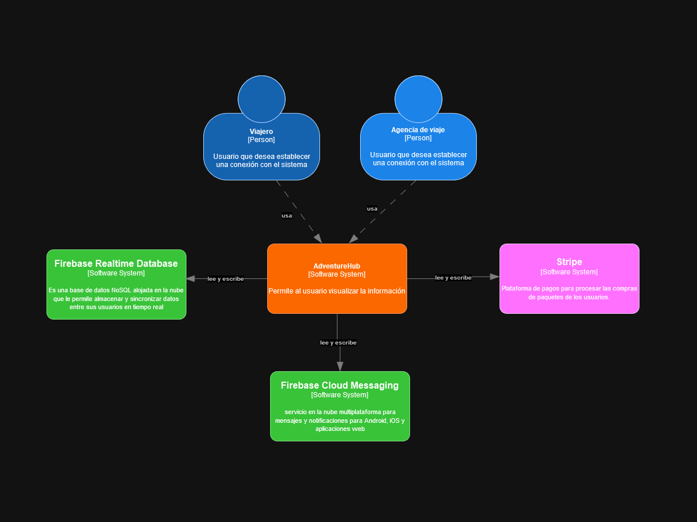

### 4.1.3. Architectural Drivers Backlog
Siguiendo las secciones previas que han abordado los Functional Drivers, Quality Attribute Drivers y todos los Constraints mencionadas, se han identificado los siguientes factores determinantes. Esto se logró al evaluar tanto la implementación de la solución tecnológica como su relevancia en el Business Core.

<table>
  <colgroup>
    <col span="1" style="width: 10%;">
    <col span="1" style="width: 25%;">
    <col span="1" style="width: 40%;">
    <col span="1" style="width: 12.5%;">
    <col span="1" style="width: 12.5%;">
  </colgroup>
  <thead>
    <tr>
      <th>DRIVER ID</th>
      <th>Título</th>
      <th>Descripción</th>
      <th>Importancia para Stakeholders (High, Medium, Low)</th>
      <th>Impacto en la Complejidad Técnica de la Arquitectura (High, Medium, Low)</th>
    </tr>
  </thead>
  <tbody>
    <tr>
      <td>DR1</td>
      <td>Experiencia del Usuario</td>
      <td>Crear una interfaz de usuario intuitiva y atractiva para que los buscadores de aventuras encuentren fácilmente información sobre destinos, actividades y paquetes de viaje, y puedan planificar sus aventuras de manera eficiente.</td>
      <td>High</td>
      <td>Medium</td>
    </tr>
    <tr>
      <td>DR2</td>
      <td>Escalabilidad del Software</td>
      <td>Asegurar que las agencias de viajes puedan publicar y gestionar fácilmente sus tours de viaje en la plataforma, incluso en momentos de alta demanda, para llegar a nuevos clientes y gestionar las reservas de manera eficiente.</td>
      <td>High</td>
      <td>High</td>
    </tr>
    <tr>
      <td>DR3</td>
      <td>Seguridad en los datos de los usuarios y las agencias de viajes</td>
      <td>Proteger la información confidencial tanto de las agencias de viajes como de los usuarios que utilizan la plataforma, incluyendo detalles de tours y datos comerciales, para garantizar la confianza al uso de la aplicación.</td>
      <td>Medium</td>
      <td>Medium</td>
    </tr>
    <tr>
      <td>DR4</td>
      <td>Motor de Búsqueda por Presupuesto</td>
      <td>Desarrollar un motor de búsqueda que permita a los usuarios buscar paquetes de viaje según su presupuesto, lo que facilitará encontrar opciones ajustadas a sus necesidades financieras.</td>
      <td>High</td>
      <td>High</td>
    </tr>
    <tr>
      <td>DR5</td>
      <td>Asistente Virtual con Inteligencia Artificial</td>
      <td>Implementación de un asistente virtual con Inteligencia Artificial para ofrecer asistencia y recomendaciones personalizadas a los viajeros que buscan aventuras, mejorando la experiencia de búsqueda y planificación.</td>
      <td>High</td>
      <td>High</td>
    </tr>
    <tr>
      <td>DR6</td>
      <td>Reservas en la Aplicación</td>
      <td>Permitir a los usuarios reservar paquetes de viaje directamente a través de la aplicación para garantizar su lugar y su itinerario, mejorando la experiencia de reserva.</td>
      <td>High</td>
      <td>High</td>
    </tr>
  </tbody>
</table>
### 4.1.4 Architectural Design Decision
<table class="tg">
<thead>
  <tr>
    <th class="tg-0pky">DRIVER ID</th>
    <th class="tg-0pky">Título del Driver</th>
    <th class="tg-0pky">Pattern 1: MVC</th>
    <th class="tg-0pky"></th>
    <th class="tg-0pky">Pattern 2: MVVM</th>
    <th class="tg-0pky"></th>
  </tr>
</thead>
<tbody>
  <tr>
    <td class="tg-0pky"></td>
    <td class="tg-0pky"></td>
    <td class="tg-0pky">Pro</td>
    <td class="tg-0pky">Con</td>
    <td class="tg-0pky">Pro</td>
    <td class="tg-0pky">Con</td>
  </tr>
  <tr>
    <td class="tg-0pky">DR1</td>
    <td class="tg-0pky">Experiencia del Usuario</td>
    <td class="tg-0pky">La separación clara entre lógica  y presentación permite una fácil  adaptación de la interfaz. </td>
    <td class="tg-0pky"> Puede requerir más trabajo manual para  actualizar las vistas cuando  cambian los modelos.</td>
    <td class="tg-0pky">El binding bidireccional puede mejorar  la interactividad y la reactividad de la interfaz.  Facilita la creación de interfaces ricas y dinámicas.</td>
    <td class="tg-0pky">Mayor complejidad en comparación  con MVC debido al binding bidireccional.</td>
  </tr>
  <tr>
    <td class="tg-0pky">DR2</td>
    <td class="tg-0pky">Escalabilidad del Software</td>
    <td class="tg-0pky">Modularidad que facilita  la escalabilidad horizontal.</td>
    <td class="tg-0pky">Puede ser menos eficiente  en sistemas con muchas  actualizaciones de vistas en tiempo real.</td>
    <td class="tg-0pky">Mejor para aplicaciones ricas en cliente  con muchas actualizaciones dinámicas.</td>
    <td class="tg-0pky">Mayor overhead debido al binding  bidireccional.</td>
  </tr>
  <tr>
    <td class="tg-0pky">DR3</td>
    <td class="tg-0pky">Seguridad en los datos de los usuarios  y las agencias de viajes</td>
    <td class="tg-0pky">El controlador actúa como un  intermediario, lo que puede mejorar  la seguridad al controlar qué datos  se muestran.</td>
    <td class="tg-0pky">Mayor riesgo si no se manejan  adecuadamente las entradas/salidas.</td>
    <td class="tg-0pky">El ViewModel puede filtrar y transformar  datos antes de que lleguen a la vista,  potencialmente mejorando la seguridad.</td>
    <td class="tg-0pky">Como el ViewModel está más orientado  a la presentación, podría existir un riesgo  si no se manejan adecuadamente las  transformaciones de datos.</td>
  </tr>
  <tr>
    <td class="tg-0pky">DR4</td>
    <td class="tg-0pky">Motor de Búsqueda por Presupuesto</td>
    <td class="tg-0pky">Fácil de adaptar la lógica de búsqueda  en el controlador.</td>
    <td class="tg-0pky">La actualización de vistas puede  no ser tan reactiva.</td>
    <td class="tg-0pky">Las búsquedas y filtros pueden reflejarse en tiempo  real en la vista gracias al binding.</td>
    <td class="tg-0pky">La lógica de filtrado puede  estar más dispersa entre el  ViewModel y el Modelo.</td>
  </tr>
  <tr>
    <td class="tg-0pky">DR5</td>
    <td class="tg-0pky">Asistente Virtual con Inteligencia Artificial</td>
    <td class="tg-0pky">Clara separación de lógica de IA  (modelo) y su presentación (vista).</td>
    <td class="tg-0pky">La comunicación entre la vista y  el modelo puede ser menos fluida.</td>
    <td class="tg-c3ow">Mayor reactividad y actualizaciones en tiempo  real en la interfaz de usuario.</td>
    <td class="tg-c3ow">La lógica del asistente puede estar dispersa  entre ViewModel y Modelo, lo que puede  complicar la implementación.</td>
  </tr>
  <tr>
    <td class="tg-0pky">DR6</td>
    <td class="tg-0pky">Reservas en la Aplicación</td>
    <td class="tg-0pky">La lógica de reserva puede gestionarse  de manera centralizada en el controlador.</td>
    <td class="tg-0pky">Puede requerir más interacciones  entre la vista y el controlador  para actualizaciones.</td>
    <td class="tg-c3ow">Las actualizaciones de estado de la reserva pueden  reflejarse en tiempo real en la vista.</td>
    <td class="tg-c3ow">Puede haber más complejidad al manejar estados en el ViewModel.</td>
  </tr>
</tbody>
</table>

### 4.1.5. Quality Attribute Scenario Refinements
<table class="tg">
<thead>
  <tr>
    <th class="tg-0pky" colspan="3">Scenario Refinement for US07 Scenario 1</th>
  </tr>
</thead>
<tbody>
  <tr>
    <td class="tg-0pky" colspan="2">Scenario</td>
    <td class="tg-0pky">Como usuario, quiero poder reservar  un paquete de viaje en la aplicación,  para poder asegurar mi lugar y mi  itinerario, se realizará en menos de 1  segundo la actualización</td>
  </tr>
  <tr>
    <td class="tg-0pky" colspan="2">Business Goals</td>
    <td class="tg-0pky">Sistema confiable, característica  principal.</td>
  </tr>
  <tr>
    <td class="tg-0pky" colspan="2">Relevant Quality Attribute</td>
    <td class="tg-0pky">Funcionalidad y Performance</td>
  </tr>
  <tr>
    <td class="tg-0pky" rowspan="6">Scenario Components</td>
    <td class="tg-0pky">Stimulus</td>
    <td class="tg-0pky">Usuario selecciona el botón  “Agendar reserva”</td>
  </tr>
  <tr>
    <td class="tg-0pky">Stimulus Source</td>
    <td class="tg-0pky">Botón en la app</td>
  </tr>
  <tr>
    <td class="tg-0pky">Environment</td>
    <td class="tg-0pky">Vista relacionada en la app</td>
  </tr>
  <tr>
    <td class="tg-0pky">Artifact (if known)</td>
    <td class="tg-0pky">Proceso Backend</td>
  </tr>
  <tr>
    <td class="tg-0pky">Response</td>
    <td class="tg-0pky">Se muestra en el mapa del sistema</td>
  </tr>
  <tr>
    <td class="tg-0pky">Response Measure</td>
    <td class="tg-0pky">&lt;1 segundo</td>
  </tr>
  <tr>
    <td class="tg-0pky" colspan="2">Questions</td>
    <td class="tg-0pky">¿Qué paquetes se mostrarán  disponibles para agendar la  reserva?</td>
  </tr>
  <tr>
    <td class="tg-0pky" colspan="2">Issues</td>
    <td class="tg-0pky">Los paquetes de viaje dependen  de las agencias que las brindan.</td>
  </tr>
</tbody>
</table>

<table class="tg">
<thead>
  <tr>
    <th class="tg-0pky" colspan="3">Scenario Refinement for US011 Scenario 1</th>
  </tr>
</thead>
<tbody>
  <tr>
    <td class="tg-0pky" colspan="2">Scenario</td>
    <td class="tg-0pky">Como usuario registrado, quiero  recibir un recibo de mi pago por  correo electrónico después de hacer  una reserva exitosa, para tener un  registro de mi transacción, en menos  de 1 segundo.</td>
  </tr>
  <tr>
    <td class="tg-0pky" colspan="2">Business Goals</td>
    <td class="tg-0pky">Sistema confiable, característica  principal.</td>
  </tr>
  <tr>
    <td class="tg-0pky" colspan="2">Relevant Quality Attribute</td>
    <td class="tg-0pky">Operabilidad y Performance</td>
  </tr>
  <tr>
    <td class="tg-0pky" rowspan="6">Scenario Components</td>
    <td class="tg-0pky">Stimulus</td>
    <td class="tg-0pky">Usuario selecciona el botón  “Pagar”</td>
  </tr>
  <tr>
    <td class="tg-0pky">Stimulus Source</td>
    <td class="tg-0pky">Botón en la app</td>
  </tr>
  <tr>
    <td class="tg-0pky">Environment</td>
    <td class="tg-0pky">Vista relacionada en la app</td>
  </tr>
  <tr>
    <td class="tg-0pky">Artifact (if known)</td>
    <td class="tg-0pky">Proceso Backend</td>
  </tr>
  <tr>
    <td class="tg-0pky">Response</td>
    <td class="tg-0pky">Se muestra en el mapa del sistema</td>
  </tr>
  <tr>
    <td class="tg-0pky">Response Measure</td>
    <td class="tg-0pky">&lt;1 segundo</td>
  </tr>
  <tr>
    <td class="tg-0pky" colspan="2">Questions</td>
    <td class="tg-0pky">¿Qué se podría hacer en caso  no se mande el correo?</td>
  </tr>
  <tr>
    <td class="tg-0pky" colspan="2">Issues</td>
    <td class="tg-0pky">El servicio de envío de correo se  tendría que desarrollar o usar un  servicio externo.</td>
  </tr>
</tbody>
</table>

<table class="tg">
<thead>
  <tr>
    <th class="tg-0pky" colspan="3">Scenario Refinement for US010 Scenario 1</th>
  </tr>
</thead>
<tbody>
  <tr>
    <td class="tg-0pky" colspan="2">Scenario</td>
    <td class="tg-0pky">Como usuario registrado, quiero  poder guardar múltiples métodos de  pago en mi perfil, para poder hacer  reservas con mayor facilidad y rapidez.</td>
  </tr>
  <tr>
    <td class="tg-0pky" colspan="2">Business Goals</td>
    <td class="tg-0pky">Sistema confiable, característica  principal.</td>
  </tr>
  <tr>
    <td class="tg-0pky" colspan="2">Relevant Quality Attribute</td>
    <td class="tg-0pky">Operabilidad y Performance</td>
  </tr>
  <tr>
    <td class="tg-0pky" rowspan="6">Scenario Components</td>
    <td class="tg-0pky">Stimulus</td>
    <td class="tg-0pky">Usuario selecciona el botón  “Agregar método de pago”</td>
  </tr>
  <tr>
    <td class="tg-0pky">Stimulus Source</td>
    <td class="tg-0pky">Botón en la app</td>
  </tr>
  <tr>
    <td class="tg-0pky">Environment</td>
    <td class="tg-0pky">Vista relacionada en la app</td>
  </tr>
  <tr>
    <td class="tg-0pky">Artifact (if known)</td>
    <td class="tg-0pky">Proceso Backend</td>
  </tr>
  <tr>
    <td class="tg-0pky">Response</td>
    <td class="tg-0pky">Se muestra en el mapa del sistema</td>
  </tr>
  <tr>
    <td class="tg-0pky">Response Measure</td>
    <td class="tg-0pky">&lt;1 segundo</td>
  </tr>
  <tr>
    <td class="tg-0pky" colspan="2">Questions</td>
    <td class="tg-0pky">¿Qué acción tomaremos si el  método de pago no es  registrado correctamente?</td>
  </tr>
  <tr>
    <td class="tg-0pky" colspan="2">Issues</td>
    <td class="tg-0pky">El método de pago podría no  registrarse correctamente.</td>
  </tr>
</tbody>
</table>

### 4.2.2. Candidate Context Discovery
Con el EventStorming realizado se utiliza la técnica de start-with-value para la identificación de aquellas partes del core del dominio que van a aportar un mayor valor a nuestro negocio. Por lo cual, se identificaron 2 principales que vendrían ser Customer Relationship & Communication, Traveling Expirience Desing and Maintenance y Traveling Expirience Booking and Tracking.

El primer dominio indentificado es Customer Relationship & Communication, el cual utiliza un asistente virtual con el que los usuarios tourist podrán interactuar y realizar consultas, crear y comprar paquetes de viaje y turismo ofrecidos en la aplicación.

				
			

El segundo dominio indentificado es Traveling Expirience Desing and Maintenance, el cual permite a los usuarios agency el poder resgistrar, actualizar y eliminar paquetes turisticos y vuelos, y a los usuarios tourist el poder elegir, comprar y ver los paquetes ofrecidos por las agencias.

				
			

El tercer dominio identificado es Traveling Expirience Booking and Tracking, el cual permitira a los usuarios agency el poder crear, remover, actulizar reservas de los paquetes y hacer seguimiento sobre el estado de estos. 

				
			

## 4.3 Software Architecture

### 4.3.1 Software Archicture System Landscape Diagram

  

