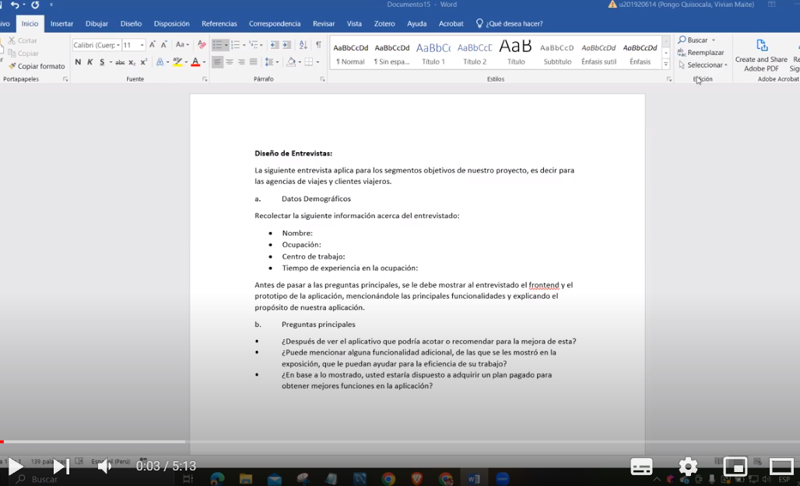
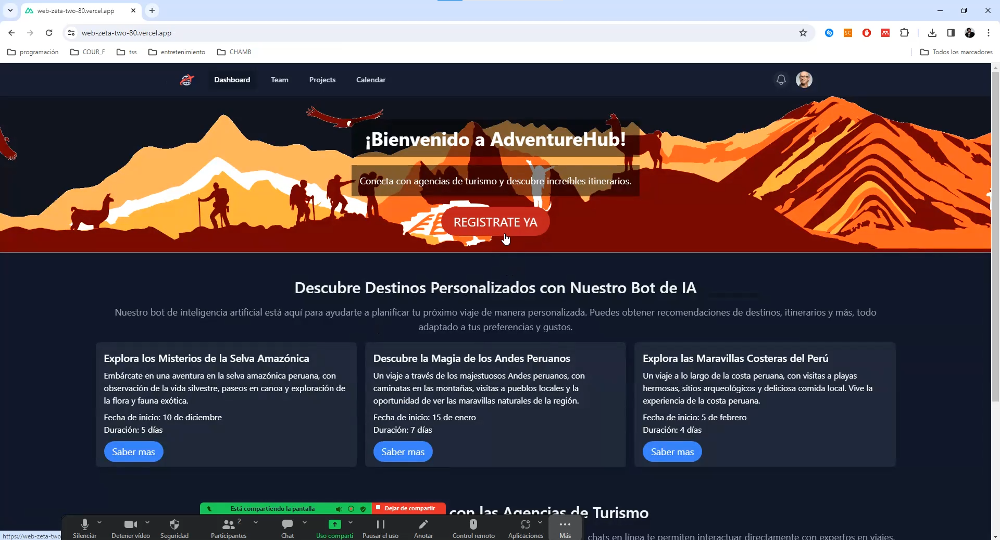

## 7.1 Software Configuration Management

A continuación, se presentará un repositorio central y organizado que servirá como guía para el desarrollo enfocado y consistente de nuestra solución.

### 7.1.1 Software Development Environment Configuration

En esta sección se incluye los links de las aplicaciones, productos de software realizadas durante el ciclo del proyecto en los programas que se utilizaron. <br>
Para ello se clasificará en las siguientes secciones:
*	Project Management
*	Requirements Management
*	Product UX/UI Design 
*	Software Development
*	Software Testing
*	Software Deployment
*	Software Documentation

<br>
Y clasificar los elementos de las secciones si es ruta de referencia (para software basado en modelos SaaS) o ruta de descarga (para productos que se ejecutan en el computador del miembro del equipo) de cada uno de los productos de software.<br><br>

<strong>Project Management</strong><br>
Es la disciplina basada en la gestión de los proyectos, la cual tiene como objetivo principal mejorar los procesos y su entorno para alcanzar los resultados esperados.

*	<strong>Pivotal Tracker:</strong> Herramienta ágil para gestionar proyectos de desarrollo de software de manera eficiente y colaborativa. Priorización automática, tablero interactivo y métricas clave. Ideal para equipos ágiles. <br>
https://www.pivotaltracker.com

<strong>Requirements Management</strong>
Es el proceso de garantizar que una organización documente verifique y satisfaga las necesidades, expectativas de sus clientes con las partes interesadas internas o externas.

*	<strong>Pivotal Tracker:</strong> Esta herramienta se define como una plataforma en la que se realiza la gestión de User Stories, agrupándoles en Epics y clasificando su presencia en el programa, por puntaje. Se usó porque permite que cada miembro del equipo comparte la misma vista en tiempo real de lo que está sucediendo con cada proyecto, ya sea aportando con diferentes secciones o corrigiendo el flujo del proyecto. <br>
https://www.pivotaltracker.com/n/projects/2678010

<strong>Product UX/UI Design </strong><br>
Esta herramienta permite desarrollar el modelo en nuestro producto de manera digital y forme parte de la vida del consumidor.  En este caso realizar un modelo de sitio web para computadoras y celulares.

* <strong>UXPressia:</strong><br> Es una herramienta en línea para el mapeo de la trayectoria del cliente que crea mapas de impacto y personas. Sus herramientas nos permitieron establecer las bases del modelado de User Persona, Empathy Map y Journey Map.
https://uxpressia.com/ 

* <strong>MIRO:</strong><br>Es una pizarra digital colaborativa en línea, que puede ser usada para la investigación, la ideación, la creación de lluvias de ideas, mapas mentales y una variedad de otras actividades colaborativas.
https://miro.com/app/dashboard/ 

* <strong>Figma:</strong><br>Es una herramienta de prototipo web y editor de gráficos vectorial, que, a diferencia de las otras herramientas, se aloja en la web, permitiendo establecer los modelos para versión en Web Browser y Mobile Browser.
https://www.figma.com/design/ 

* <strong>Lucid Chart:</strong><br> Es una herramienta de diagramación basada en la web, que permite a los usuarios colaborar y trabajar juntos en tiempo real, creando diseños UML, mapas mentales, prototipos de software y muchos otros tipos de diagrama.
https://lucid.app

* <strong>Structurizr:</strong><br> es una herramienta de diseño que soporta el modelo C4, para visualizar la arquitectura de software de nuestra solución. 
https://structurizr.com/ 

<strong>Software Development</strong><br>
Es una estructura aplicada al desarrollo de un producto de software. Se utiliza para el establecimiento de un proceso para el desarrollo de software, cada uno de los cuales describe un enfoque diferente para diferentes actividades que tienen lugar durante el proceso.

* <strong>GitHub:</strong><br> Es un repositorio comunitario cuya función es almacenar los avances de un proyecto elaborado por un grupo de personas. <br>
https://github.com/NexusNova-IOT

* <strong>WebStorm:</strong><br> Es un entorno de JetBrains, empresa desarrolladora de Software, orientado en el desarrollo web en JavaScript. Este nos ofrece facilidad en probar nuestro entorno web en navegadores como Google. Para el proyecto se implementará la ayuda de los lenguajes HTML, CSS y JavaScript.<br>
https://www.jetbrains.com/webstorm/

* <strong>Visual Studio Code:</strong><br> Es un editor potente que brinda extensiones que nos permiten personalizar y agregar funcionalidades para que la función del desarrollador sea más eficiente. Asimismo, se empleará para poder construir el backend de nuestro web Applications.<br>
https://code.visualstudio.com/ 

* <strong>HTML:</strong><br> Es un lenguaje que sirve como desarrollador de plataformas web que trabaja con hipertextos, que enlace a otros documentos. Este lenguaje ofrece herramientas para el diseño del sitio web. Asimismo, la disponibilidad de trabajar HTML junto con CSS y JavaScript. Este lenguaje será utilizado en el presente proyecto para implementar la documentación de la página web.<br>
https://www.jetbrains.com/help/webstorm/editing-html-files.html 

* <strong>CSS:</strong><br> Es un lenguaje de diseño para el entorno web. Permite elaborar el interfaz de usuario diseñada anteriormente, agregando colores, tamaños entre otros elementos. Además, se puede diseñar un estilo en CSS y compartirlo en el web elaborado en HTML. Este lenguaje se utilizará para la implementación del diseño de nuestra plataforma web.<br>
https://www.jetbrains.com/help/webstorm/style-sheets.html#ws_css_completion 

* <strong>JavaScript:</strong><br> Es un lenguaje de programación que es analizado por otros programas. Este trabaja en POO (programación orientada en objetos) para prototipos sin implementación con clases. Este programa permite realizar dinámicas para el usuario a través de la lógica de la programación. Se utilizará para la elaboración de las dinámicas de la plataforma web.<br>
https://www.jetbrains.com/help/webstorm/javascript-specific-guidelines.html 

* <strong>Java:</strong><br> Es un lenguaje de programación que es analizado por otros programas. Este es ampliamente utilizado para codificar aplicaciones web. Este programa permite realizar dinámicas para el usuario a través de la lógica de la programación. Se utilizará para la elaboración de las dinámicas de la plataforma web.<br>
https://www.java.com/es/download/ie_manual.jsp 

* <strong>TypeScript:</strong><br> Es un superset de JavaScript. Este lenguaje nos permite aplicar programas de javaScript, pero cabe resaltar que no funciona al revés. Su principal funcionalidad es que pone a disposición del desarrollador librerías y frameworks que existen para JavaScript.<br>
https://www.typescriptlang.org/ 

* <strong>Prime Vue:</strong><br>Es modulo construido por Vue, para implementar componentes Vue con un diseño basado en Material Design.<br>
https://primevue.org/

* <strong>Software Testing</strong><br>Es el acto de examinar los artefactos y el comportamiento del software bajo prueba mediante validación y verificación. 

* <strong>Lenguaje Gherkins:</strong><br> Es un DSL o Lenguaje Específico de Dominio (Domain-Specific Languaje), es decir, un lenguaje que está creado para resolver un problema. Además de ser interpretado en código, se puede agregar los users stories del programa con sus respectivas partes: Feature, Scenario, Example, Scenario Outline, Given, When, Then y And.
  
<strong>Software Deployment</strong><br>

* <strong>Github Pages:</strong><br> Servicio de Github que nos permitió alojar nuestra Landing page y nos permitirá alojar nuestro web applications.<br>
https://pages.github.com/ <br>
https://github.com/ <br>

* <strong>Netlify:</strong><br> Servicio de hosting que nos permite alojar nuestro sitio web con implementación HTTP.<br>
https://www.netlify.com/ 

<strong>Software Documentation</strong>
Es un tipo de texto escrito o ilustración que acompaña al software de computadora o está incrustado en el código fuente. La documentación explica cómo funciona el software o cómo usarlo.

* <strong>OpenAPI Specification vía Swagger:</strong><br> Es una especificación para archivos de interfaz legibles por máquina para describir, producir y visualizar servicios web RESTful. <br>
https://swagger.io/specification/ 
 
### 6.1.2 Source Code Management

A continuación, se presenta la gestión de código fuente o como es conocido por sus siglas en ingles SCM (Source Code Management). Su función principal es realizar un seguimiento de las modificaciones que el equipo realizara a lo largo del desarrollo de sus proyectos en los repositorios de código fuente. Se empleará como un sistema de control de versiones que permite dar seguimiento a los cambios que cada integrante o desarrollador realice en el proyecto. Asimismo, cabe resaltar que para el sistema de control de versiones emplearemos GitHub.

* <strong>URL de la Organización:</strong> https://github.com/WX82-06-Arquitectura-de-Swe-Emergentes
  
* <strong>URL del Repositorio del Landing Page:</strong> https://github.com/WX82-06-Arquitectura-de-Swe-Emergentes/landing-page/tree/develop

https://web-zeta-two-80.vercel.app/
  
* <strong>URL del Repositorio de Web Services:</strong> https://github.com/WX82-06-Arquitectura-de-Swe-Emergentes/backend
  
* <strong>URL del Repositorio de Frontend Web Applications:</strong>  https://github.com/WX82-06-Arquitectura-de-Swe-Emergentes/web
  

<strong>GitFlow</strong><br>
Es el modelo alternativo de creación de ramas en Git que en los últimos años se ha vuelto una herramienta indispensable para muchos desarrolladores. Este flujo de trabajo de control de versiones utiliza ramas y fue publicado y popularizado por Vincent Driessen. Su principal función es ayudar en la organización de la versión de un código, permitiendo la creación de nuevos Features y Hotfixes de manera organizada. 
 

Como se mencionó anteriormente, GitFlow trabaja con branches o ramas. A continuación, se muestran las ramas que se emplearan en el flujo de trabajo de nuestro proyecto.

* <strong>Main Branches</strong>
   * <strong>Master:</strong> Esta
es la rama principal, a partir de ella se recorrerán todas las ramas y contendrá la última versión y las anteriores creadas por los desarrolladores. Almacenara el historial de publicación oficial.

  * <strong>Develop:</strong> Esta rama puede ser creada a partir de la master Branch, contara con todos los Features estables. Esto significa que a través de esta rama el equipo podrá integrar las funciones. 

* <strong>Support Branches:</strong>
A diferencia de las ramas principales, estas branches tienen un tiempo de vida limitado, ya que se eliminar al realizar el merge con sus ramas primarias.

  * <strong>Feature:</strong> 
    * Se ramifica de develop. 
    * Debe fusionarse de nuevo en develop <br>

	Se emplean para desarrollar las nuevas funciones que se integraran en una versión siguiente. Cabe resaltar, que esta rama existe mientras este en proceso de desarrollo. Sin embargo, cuando el desarrollador culmine con esa función, se fusionará nuevamente a develop. 

<div align="center">
	
</div>


  * <strong>Release:</strong>  <br>	
    * Se ramifica de: develop
    * Debe fusionarse de nuevo en: develop/master 
  
	 Son aquellas que admiten la preparación de una nueva versión de producción. A través de esta rama, se permite corregir errores menores que surgieron en la etapa de desarrollo y preparar metadatos para su lanzamiento. Esto último genera que la develop Branch se autoriza para recibir nuevas funciones para la próxima versión, pues se generara cuando se acerque una fecha de publicación determinada. 

<div align="center">
  
</div>

  * <strong>Hotfix</strong> <br>
    * Se ramifica de: master
    * Debe fusionarse de nuevo en: develop y master
	
	Estas ramas son muy similares a las reléase branches, ya que también están destinadas para una nueva versión de producción, pero con la diferencia que se ramifican de master y no de develop. Son llamadas como ramas de mantenimiento, corrección o hotfix. Su principal función, es reparar rápidamente las publicaciones de producción. Al terminar la corrección, debe fusionarse con master y esta debe etiquetarse con un nuevo número de versión. 


<strong>Principales motivos por los que el equipo empleara GitFlow.</strong>

*	Este flujo de trabajo es ideal para el equipo, puesto que nuestro proyecto se basa en publicaciones en un determinado sprint.

*	Esta centralizado como subversión (SVN) y descentralizado, que permite que el equipo trabaje individualmente. Pues no todos tienen el mismo horario. Sin embargo, todos deben mantener las actualizaciones en el repositorio central en GitHub.
 
<div align="center">
  
</div>

<strong>Convenciones para nombrar los Features, reléase y hotfix branches:</strong>

<strong>Feature Branch:</strong> feature/name

<strong>Example: </strong>

* 1.	feature/welcome, 
* 2.	feature/about, 
* 3.	feature/myfeature
  
Antes de mostrar las convenciones para nombrar los reléase and hotfix branches. We have to mostrar cómo es que funciona el Semantic Versioning Specification. 

Este es un sistema de versiones, cuyo uso ha ido aumentando con el transcurso del tiempo por los desarrolladores. Con ello, developers pueden visualizar la extensión de los cambios en el código fuente del proyecto.

Inicialmente, la versión se basa de MAJOR.MINOR.PATCH (X.Y.Z). Asimismo, para comenzar a usar este sistema de versiones debemos declarar una API publica precisa y comprensible. Esta forma debe aumentar numéricamente según lo desarrollado por el equipo de software. 

El proyecto inicia su desarrollo con la versión 0.y.z, luego pasara a ser 1.0.0 cuando se defina la API pública. Siguientemente, se seguirán los criterios mostrados a continuación para incrementar la versión. 

Patch version (Z), debe incrementarse si solo se introducen correcciones de errores compatibles con versiones anteriores.

Minor version (Y), debe incrementarse si el equipo integra una nueva funcionalidad compatible con versiones anteriores en la API pública. Si alguna funcionalidad es obsoleta o si se introducen nuevas funcionalidades en el código privado. 

*Si se incrementa, la version del parche debe volver a 0.
Major version (X), debe incrementarse si se generan cambios deslindados a versiones anteriores en la API pública. 

*Si se incrementa, Patch version y la minor version debe volver a 0.
Existen etiquetas adicionales para los metadatos de compilación. 

<strong>Ejemplo:  MAJOR.MINOR. PATCH (X.Y.Z)</strong>

* 1.	1.9.0
* 2.	1.10.0
* 3.	2.0.0
* 4.	1.0.0-alfa
  
	<strong>Release Branch:</strong>  release-* (* se cambia por la versión semántica).

	<strong>Ejemplo:</strong> release-1.2.0

	<strong>Hotfix Branch: </strong> hotfix-* (* se cambia por la versión semántica).

	<strong>Ejemplo:</strong> hotfix-1.2.1
	<br><br>

<strong>Conventional Commits</strong><br>

El commit debe estructurarse de la siguiente manera:

	<type> [optional scope]: <description>
	[optional body]
	[optional footer(s)]

Cabe recalcar que debe estar en “lower case”.

<strong>Type: </strong>

* feat: Cuando se agrega un nuevo feature.

* fix: cuando corriges un error.

* build: cuando afectan los componentes de compilación como la herramienta de compilación, las dependencias o la version del proyecto.

* chore: modificaciones privadas del código.

* docs: commits que afectan solo a la documentación.
refractor: commits que reescriben o reestructura el código, pero no cambia el comportamiento.
perf: commits especiales que mejoran el rendimiento. 

* style: commits que no afectan el programa. (espacios en blanco, formato, puntos o comas faltantes).
test: commits que agregan pruebas.

<br><strong>Scope</strong><br>
Proporciona información contextual adicional, si bien es opcional, es bueno colocarlo para que el desarrollador lea un commit más específico. 

<br><strong>Description</strong><br>
Es una parte obligatoria del formato de los commits, siempre debemos usar imperativo y no escribir en mayúsculas. 

	[optional body]
Debe incluirse la motivación para el cambio y contrastarse con el comportamiento anterior. Es opcional y si lo usa debe usar el imperativo y es ideal para mencionar los identificadores de problemas y sus relaciones.

	[optional footer(s)]
Cualquier información sobre cambios importantes. Es opcional, puede incluir referencia al problema por su id y en esta sección se incluyen los BREAKING CHANGES: seguido de un espacio o dos satos de línea. 

<strong> Ejemplos: </strong>
* 1.	feat(welcome): add welcome section
* 2.	build(release): bump version to 1.0.0
* 3.	style: remove empty line
* 4.	feat(sign up): add the button to sign up
* 5.	feat ! : send an-email to the costumer when product is shipped
* 6.	feat: remove ticket list endpoint

<br>

### 6.1.3 Source Code Style Guide & Conventions

En esta sección se mostrarán las pautas, convenciones, estilos y
principios que se utilizarán para cada uno de los lenguajes que se
emplearán en la creación de nuestra aplicación, LifeTravel. La práctica
de este conjunto de reglas es de suma importancia, ya que estas tienen
el propósito de conservar la calidad estructural del software, dar una
mayor legibilidad al código fuente y facilitar el mantenimiento del
código.

Dado que en este proyecto se utilizarán HTML, CSS y JavaScript para la
codificación de la plataforma web y Gherkins para el proceso de prueba
del programa; a continuación, se nombrarán y describirán las reglas y
recomendaciones generales que tomaremos en cuenta al momento de usarlos.

**Nomenclatura General**

A los nombres de las variables, objetos, elementos y funciones que se
utilicen, se les designarán términos en inglés que estén relacionados y
puedan describir a lo que están representando. No se usarán mayúsculas
porque de acuerdo con W3Schools (s.f.), la mezcla de estas con las
letras minúsculas luce mal y, además, el uso exclusivo de minúsculas
otorga mayor legibilidad al código.

Ejemplo de nomenclatura estándar según Google (s.f.):

.gallery {}

.video {}

.login {}

**Sangría**

En el momento de utilizar HTML, CSS y/o JavaScript se aplicará un
espaciado antes de cada línea que se encuentre dentro de un bloque. Este
espacio debe ser de dos y según W3Schools (s.f.) no se debe hacer uso de
la tecla "Tabulación".

Ejemplo de nomenclatura estándar de la sangría en HTML según W3Schools
(s.f.):

> \<table\>\
>   \<tr\>\
>     \<th\>Name\</th\>\
>     \<th\>Description\</th\>
>
> \</tr\>\
> \</table\>

Ejemplo de nomenclatura estándar de la sangría en CSS según W3Schools
(s.f.):

> html {\
>   background: #fff;\
>   color: #404;\
> }

Ejemplo de nomenclatura estándar de la sangría en JavaScript según
W3Schools (s.f.):

> function toCelsius(fahrenheit) {\
>   return (5 / 9) \* (fahrenheit - 32);\
> }

Seguidamente, explicaremos las reglas específicas que se necesitan en
cada lenguaje para entender el código de nuestro programa, LifeTravel.

**HTML**

Llamado así por las siglas del nombre en inglés HyperText Markup
Language. HTML es un lenguaje de marcado que define la estructura de una
página web. Además, cuenta con funciones capaces de determinar el
comportamiento de distintas partes del contenido de la página, tales
como el cambiar el tamaño del texto, aplicar cursiva, entre otros.
Nosotros emplearemos HTML5, y las características y pautas a seguir para
hacer uso de este lenguaje son las siguientes:

-   **Declare Document Type**

> El tipo de documento debe declararse en la primera línea de código. De
> acuerdo con Google (s.f.) HTML5 es de preferencia la mejor sintaxis
> para todo documento HTML, para declararla sólo es necesario copiar lo
> siguiente:
>
> \<!DOCTYPE html\>

-   **Blank Lines**

> Cada vez que, luego de un bloque, lista o tabla de gran longitud se
> inicie uno nuevo, se debe saltar la siguiente línea y dejarla en
> blanco para brindar mayor legibilidad y amenidad, así manifiesta
> W3Schools (s.f.).
>
> Ejemplo:
>
> \<body\>\
> \
> \<h1\>Famous Cities\</h1\>\
> \
> \<h2\>Tokyo\</h2\>\
> \<p\>Tokyo is the capital of Japan, the center of the Greater Tokyo
> Area, and the most populous metropolitan area in the world.\</p\>\
> \
> \<h2\>London\</h2\>\
> \<p\>London is the capital city of England. It is the most populous
> city in the United Kingdom.\</p\>\
> \
> \<h2\>Paris\</h2\>\
> \<p\>Paris is the capital of France. The Paris area is one of the
> largest population centers in Europe.\</p\>\
> \
> \</body\>

-   **Quote Attribute Values**

> Para los valores de los atributos se utilizan comillas dobles
> alrededor. De acuerdo con W3Schools (s.f.) Aunque esta característica
> no sea obligatoria, le da más legibilidad al código y es muy frecuente
> entre los desarrolladores.
>
> Ejemplo:\
> \<table class=\"striped\"\>

-   **Multimedia Fallback**

> Asegurar un acceso alterno a los objetos multimedia por si este
> fallara al cargar. De la misma forma, según la W3Schools (s.f.), es
> recomendable añadir las dimensiones del elemento porque así los
> navegadores guardan el espacio que utilizará antes de comenzar a
> cargarlo.
>
> Ejemplo:
>
> \

-   **Never Skip the \<tittle\> Element**

> El elemento \<tittle\> permite que las páginas aparezcan en la lista
> de resultados al momento de buscar en un navegador web. Asimismo, esta
> es la que da el nombre de la página si se la añade a favoritos.
>
> Ejemplo:
>
> \<title\>HTML Style Guide and Coding Conventions\</title\>

-   **HTML Line-Wrapping**

> El hecho de que en un documento HTML no haya un límite de palabras por
> línea, no quiere decir que sea recomendable generar líneas muy
> extensas de código. Al contrario, esto dificulta la lectura del
> código. Para pasar a la siguiente línea es necesario utilizar al menos
> cuatro espacios para diferenciar de elementos hijos.
>
> Ejemplo según Google (s.f.):
>
> \<button mat-icon-button color=\"primary\" class=\"menu-button\"
>
> (click)= \"openMenu()\"\>
>
> \<mat-icon\>menu\</mat-icon\>
>
> \</button\>

**CSS**

Llamado así por las siglas del nombre en inglés Cascading Style Sheets.
CSS es un lenguaje de marcado que se centra en definir y mejorar la
presentación de un documento que se basa en HTML. Las pautas que a
seguir al momento de usar CSS son las siguientes:

-   **Shorthand Properties**

> Hay que utilizar abreviación de propiedades, declarar los campos de
> los elementos en la menor cantidad de líneas posibles. De acuerdo con
> Google (s.f.), esto aumenta la eficacia del código y lo hace más
> entendible. De la misma manera, debemos evitar el colocar las unidades
> luego del valor cero.
>
> Ejemplo:
>
> border-top: 0;
>
> font: 100%/1.6 palatino, georgia, serif;
>
> padding: 0 1em 2em;

-   **Declaration Stops**

> Hay que colocar un punto y coma luego de cada declaración al igual que
> gran parte de lenguajes de programación. Según Google (s.f.). esta
> característica ayuda a que haya más consistencia en el código
>
> Ejemplo:
>
> html {\
>   background: #fff;\
>   color: #404;\
> }

-   **Property Name Stops**

> Debe existir un espacio entre los dos puntos que están luego del
> nombre de una propiedad y el valor ingresado. Siempre solo un espacio
> luego de los dos puntos, mas no antes.
>
> Ejemplo estándar según Google (s.f.):
>
> html {\
>   background: #fff;\
>   color: #404;\
> }

-   **Declaration Block Separation**

> El uso de un separador de un espacio es necesario luego del nombre de
> un elemento seleccionado y la llave que inicia un bloque. Además, esta
> llave tiene que estar en la misma línea.
>
> Ejemplo estándar según Google (s.f.):
>
> html {\
>   background: #fff;\
>   color: #404;\
> }

-   **CSS Quotation Marks**

> No se deben emplear las comillas dobles (""), solo están permitidas
> las simples ('') para el uso exclusivo de selectores de atributos y
> valores de propiedades.
>
> Ejemplo estándar según Google (s.f.):
>
> html {\
>   font-family: 'open sans', arial, sans-serif;\
> }

**JavaScript**

Es un lenguaje de programación que otorga la posibilidad de indicar
exactamente las acciones que debe ejecutar el navegador, indicando el
orden de las tareas y el número de veces que se realizarán. Las
indicaciones para usar JavaScript en nuestro proyecto son las
siguientes:

-   **Spaces around operators**

> Se debe colocar un espacio alrededor de cada operador matemático que
> se introduzca en el código. Esto también aplica a las comas.
>
> Ejemplo estándar según W3Schools (s.f.):
>
> let x = y + z;\
> const myArray = \[\"Volvo\", \"Saab\", \"Fiat\"\];

-   **Simple Statement's End**

> Una indicación simple debe terminar en un punto y coma, esto se cumple
> también en muchos otros lenguajes de programación.
>
> Ejemplo estándar según W3Schools (s.f.):
>
> let x = y + z;\
> const myArray = \[\"Volvo\", \"Saab\", \"Fiat\"\];

-   **Beginning and End of a Function**

> Un bloque de función debe contar con una llave al final de la primera
> línea, para que el cierre de esta se encuentre sola en la última. Una
> función termina en llave y no en punto y coma. Lo mismo aplica para
> condicionales o bucles.
>
> Ejemplo estándar según W3Schhol (s.f):
>
> function toCelsius(fahrenheit) {\
>   return (5 / 9) \* (fahrenheit - 32);\
> }

-   **Object Rules**

> Para la construcción de un objeto, al igual que en una función, se
> comienza con una llave al final de la primera línea, pero, esta vez,
> la llave de cierre debe estar acompañada de un punto y coma. Para las
> propiedades, se colocan dos puntos y un espacio para indicar su valor,
> el cual debe estar entre comillas dobles si este es un *string*.
>
> Ejemplo estándar según W3School (s.f.):
>
> const person = {\
>   firstName: \"John\",\
>   lastName: \"Doe\",\
>   age: 50,\
>   eyeColor: \"blue\"\
> };

**Gherkin**

Es un Lenguaje Específico de Dominio (DSL por sus siglas en inglés) que
tiene como objetivo la resolución de un problema en específico. Para
ello, se generan casos para la validación de la característica en
distintos escenarios. Gherkin cuenta con múltiples elementos, de los
cuales, los más famosos y, además, más utilizados
son *Feature, Scenario, Example, Scenario, Given, When* y *Then.* Las
indicaciones para tomar en cuenta en el uso de Gherkin en nuestro código
son las siguientes.

-   **Discernible Given-When-Then Blocks**

> Aplicar sangría para los elementos que indiquen pasos a seguir del
> escenario. En el caso de *And*, aplicar dos veces. De acuerdo con
> Keiblinger (2021), Esto ayuda a detectar rápidamente las partes que
> forman un escenario.
>
> Ejemplo:
>
> Scenario: Ingreso los requisitos con claridad
>
> Given que en el formulario de ingreso de oferta laboral
>
> When escribo claramente los requisitos
>
> Then se mostrará el mensaje
>
> And mi oferta solo aparecerá a quienes cumplan con estos
>
> And se habilita la opción

-   **Step with Tables**

> Según Keiblinger (2021), para las partes del escenario que necesiten
> la introducción de valores, hay que agregar una tabla o crear un
> propio formulario que recree esa parte del escenario. Antes de esta
> representación se deben colocar dos puntos.
>
> Ejemplo:
>
> Then se mostrará el mensaje:
>
> \| mensaje \|
>
> \| Se completaron los requisitos adecuadamente \|

-   **Reducing Noise**

> Con el fin de reducir la acumulación de demasiadas líneas de código en
> un escenario, se deben colocar valores por defecto dentro de los pasos
> para los campos que no sean muy relevantes para este. Los valores
> "estándar" que coloquemos, deben ir entre comillas simples. De acuerdo
> con Keiblinger (2021), esta acción reduce considerablemente el tamaño
> del código.
>
> Ejemplo:
>
> When escribo claramente los requisitos 'dominio en C'

-   **Scenarios Separator**

> Para la separación de dos escenarios, se debe insertar un salto de
> línea y, según Keiblinger (2021), de ser posible, hay que agregar una
> línea de comentario para facilitar la visualización de estos. De esta
> forma se halla rápidamente el inicio y fin de un escenario.
>
> Ejemplo:
>
> #\-\-\-\-\-\-\-\-\-\-\-\-\-\-\-\-\-\-\-\-\-\-\-\-\-\-\-\-\-\-\-\-\-\-\-\-\-\-\-\-\-\-\-\-\-\-\-\-\-\-\-\-\-\-\-\-\-\-\-\-\-\-\-\-\-\-\-\-\-\-\-\-\-\-\-\-\-\-\-\-\-\--
>
> Scenario: Ingreso los requisitos con claridad
>
> Given que en el formulario de ingreso de oferta laboral
>
> When escribo claramente los requisitos
>
> Then se mostrará el mensaje
>
> And mi oferta solo aparecerá a quienes cumplan con estos
>
> And se habilita la opción
>
> #\-\-\-\-\-\-\-\-\-\-\-\-\-\-\-\-\-\-\-\-\-\-\-\-\-\-\-\-\-\-\-\-\-\-\-\-\-\-\-\-\-\-\-\-\-\-\-\-\-\-\-\-\-\-\-\-\-\-\-\-\-\-\-\-\-\-\-\-\-\-\-\-\-\-\-\-\-\-\-\-\-\--
>
> Scenario: Ingreso los requisitos con claridad
>
> Given que en el formulario de ingreso de oferta laboral
>
> When escribo claramente los requisitos
>
> Then se mostrará el mensaje
>
> And mi oferta solo aparecerá a quienes cumplan con estos
>
> And se habilita la opción

**TypeScript**

El equipo usara los siguientes estilos para determinadas categorías:

**UpperCamelCase:** clase/interfaz/tipo/enum/decorador/parámetros de
tipo

**lowerCamelCase**: variable / parámetro / función / método / propiedad
/ alias de módulo

**CONSTANT_CASE:** valores constantes globales, incluidos los valores de
enumeración

\*Nunca se utilizan identificadores privados.

-   [Variables y Funciones]{.underline}

> **Mala Nomenclatura:**

-   let RandomName: string = 'Juan';

-   function RandomFunction() {}

> **Buena Nomenclatura:**

-   let randomName: string = 'Juan';

-   function randomFunction() {}

```{=html}
<!-- -->
```
-   [Clases]{.underline}

> **Mala Nomenclatura:**

-   class view{}

> **Buena Nomenclatura:**

-   class View{}

> [Propiedades y métodos de la clase]{.underline}
>
> **Mala Nomenclatura:**

-   class test{

> Name: string;
>
> GetFullName(){}
>
> }
>
> **Buena Nomenclatura:**

-   class test{

> name: string;
>
> getFullName(){}
>
> }

-   [Interfaces]{.underline}

> No emplear el prefijo I para nombrar interfaces
>
> **Mala Nomenclatura:**

-   interface IPerson{

> Name:string;
>
> }
>
> **Buena Nomenclatura:**

-   interface Person{

> name:string;
>
> }

-   [Enums]{.underline}

> No emplear el prefijo I para nombrar interfaces
>
> **Mala Nomenclatura:**

-   enum clientType{

> person = "p";
>
> business = "b";
>
> }
>
> **Buena Nomenclatura:**

-   enum ClientType{

> Person = "P";
>
> Age = "A";
>
> }

-   [Visibility]{.underline}

> Restringir la visibilidad de propiedades, métodos y tipos ayudaran a
> mantener el código desacoplado.
>
> **Mala Nomenclatura:**

-   enum clientType{

> person = "p";
>
> business = "b";
>
> }
>
> **Buena Nomenclatura:**

-   enum ClientType{

> Person = "P";
>
> Age = "A";
>
> }

-   [Getters and Setters]{.underline}

> Se pueden utilizar los getters y setters para los miembros de la
> clase. También son útiles como medio para restringir la visibilidad de
> los detalles de implementación internos, aplicando la Programación
> Orientada a Objetos;
>
> **Nomenclatura:**

-   Class Foo {

> constructor(private readonly someService:SomeService) {}
>
> get someMember():string{
>
> return this.someService.someVariable;
>
> }
>
> set someMember(newValue:string){
>
> this.someService.someVariable = newValue;
>
> }

-   [Variables]{.underline}

> Uso de const o let para declarar variables. Utilice const de forma
> predeterminada, a menos que sea necesario reasignar una variable.
>
> No usar var para declarar variables.
>
> **Nomenclatura:**

-   const foo = otherValue; // Use if \"foo\" never changes.

-   let bar = someValue; // Use if \"bar\" is ever assigned into later
    on.

```{=html}
<!-- -->
```
-   [Imports Nomenclatura]{.underline}

> **Module**: import \* as foo from \'\...\';
>
> **Destructuring**: import {SomeThing} from \'\...\';
>
> **Default**: import SomeThing from \'\...\';
>
> **Side-effect:** import \'\...\'; Only to import libraries for their
> side-effects on load (such as custom elements)

**Java**

-   [Identificadores]{.underline}

Con este nombre, se identifica una variable, método, función o clase.
Para color un nombre, este debe ser significativo, de modo que el código
sea lo más legible posible.

<br>


| Tipo de identificador     | Convención             | Ejemplo            |
|--------------------------|------------------------|--------------------|
| Nombre de una clase      | Comienza por letra mayúscula | String, Rectángulo, CinematicaApplet |
| Nombre de función        | Comienza con letra minúscula | calcularArea, getValue, setColor |
| Nombre de variable       | Comienza por letra minúscula | area, color, appletSize |
| Nombre de constante      | En letras mayúsculas    | PI, MAX_ANCHO       |


-   [Comentarios]{.underline}

Con los comentarios, se añade al código cierta explicación de la
funcionalidad, para que el trabajo en equipo sea más entendible y
eficiente.

Una sola línea: //This is a function to get the fullname of the person.

Varias lines de código: /\* ....... \*/

-   [Variables]{.underline}

Es un nombre en la que se guarda el valor asignado en la memoria del
ordenador.

Todas las variables se deben declarar antes de usarlas.

Tipos: De instancia.

De clase.

Locales.

> Ejemplo 1:
>
> class Circulo{
>
> static final double PI=3.1416; //variable de clase
>
> double radio; //variable de instancia
>
> }
>
> Ejemplo 2:
>
> class Circulo{
>
> double calcularArea(){
>
> double area=PI\*radio\*radio; //area es una variable local para la
> presente función de la clase Circulo.
>
> return area;
>
> }
>
> }

Delante de cada variable, puede haber un tipo de variable los cuales
pueden ser los siguientes:

-   Un tipo de dato primitivo

-   El nombre de una clase

-   Un array

> Ejemplo: int x=0;
>
> int\[\] datos;
>
> Cabe resaltar, que también usaremos valores constantes. Cuando
> declaremos una variable de tipo final, se inicializa y si se intenta
> modificarla mostrara error.
>
> Ejemplo: final double PI=3.141592653589793;

-   [Palabras reservadas]{.underline}

    -   **Tipos de datos**: boolean, float, double, int, char

    -   **Sentencias condicionales**: if, else, switch

    -   **Sentencias iterativas**: for, do, while continue

    -   **Tratamiento de las excepciones**: try, catch, finally, throw

    -   **Estructura de datos**: class, interface, implements, extends

    -   **Modificadores y control de acceso**: public, private,
        protected.

    -   **Otra**s: super, null, this.

-   [Override]{.underline}

Siempre usado, se marca con la anotación \@Override, siempre que sea
legal. Esto incluye un método de clase que anula un método de
superclase. Se da cuando implementamos un método de interfaz.

-   [Método Static]{.underline}

Un método **static** en Java es un método que pertenece a la clase y no
al objeto. Un método static solo puede acceder a variables o tipos de
datos declarados como static.

> public class SingletonTest {
>
>  
>
>     private static SingletonTest instance = null;
>
>  
>
>     protected SingletonTest() {
>
>     }
>
>  
>
>     public static SingletonTest getInstance() {
>
>         if (instance == null) {
>
>             instance = new SingletonTest();
>
>         }
>
>  
>
>         return instance;
>
>     }
>
> }

### 6.1.4 Software Deployment Configuration

En esta sección se explicará los pasos realizados para el despliegue de cada unos de nuestros proyectos realizados.

**Web Application**

Para el despliegue de la landing page se usara GitHub Pages, ya que es una herramienta que nos permite alojar sitios web estáticos de forma gratuita. Para ello, se debe seguir los siguientes pasos:

**1.  Ingresar al repositorio en la terminal y correr `npm run build`.**

<div align="center">
  
</div>

<br>

**2.  Ir a netlify.app.**

<div align="center">
  
</div>

<br>

**3.  Llevar la carpete `dist` para el correcto despliegue.**

<div align="center">
  
</div>

<br>


**Back-End:**

**1.  Crear un Web App En Azure y configurar el SDK.**

<div align="center">
  
</div>

<br>

**2.  Configurar el Repositorio a usar para desplegar con GitHub Actions.**

<div align="center">
  
</div>

<br>

**3.  Esperar la compilacion del proyecto en el dashboard.**

<div align="center">
  
</div>

<br><br>


## 7.2 Landing Page, Services & Applications Implementation
### 7.2.1 Sprint 1
En esta sección, documentaremos y explicaremos el progreso del Sprint 1 en términos de desarrollo del producto y colaboración del equipo. Abordaremos varios aspectos clave, incluyendo la planificación del sprint, el backlog del sprint, la evidencia de desarrollo para la Revisión del Sprint.
#### 6.2.1.1 Sprint Planning 1
En esta sección, nos sumergiremos en los detalles del Sprint Planning Meeting 1. Comenzaremos con una introducción que establecerá el contexto y la importancia de esta reunión. Luego, exploraremos los elementos clave de la reunión, incluyendo la agenda, los objetivos, y cómo se prepara el equipo para el sprint.
<table>
  <tr>
    <th>Sprint #</th>
    <th>Sprint 1</th>
  </tr>
  <tr>
    <td colspan="2">Sprint Planning Background</td>
  </tr>
  <tr>
    <td>Date</td>
    <td>2023-10-24</td>
  </tr>
  <tr>
    <td>Time</td>
    <td>11:00 PM</td>
  </tr>
  <tr>
    <td>Location</td>
    <td>Reunión virtual mediante Discord</td>
  </tr>
  <tr>
    <td>Prepared By</td>
    <td>Moran Moreno, Ivan</td>
  </tr>
  <tr>
    <td>Attendees</td>
    <td>Pongo Quisocala, Vivian Maite / Moran Moreno, Ivan / Chumpitaz Paredes, Alessandro Paris / Cuentas Mariano, Patrick Johan / Nuñez Melgarejo, Mauricio Oscar / Vela Sarazú, Josmar / Castillo Rengifo, Renato Clotario / Bustillos Alayo, Miguel Angel / Palomino Medina, Oscar Enrique</td>
  </tr>
  <tr>
    <td>Sprint n -1 Review Summary</td>
    <td>No aplica</td>
  </tr>
  <tr>
    <td>Sprint n -1 Retrospective Summary</td>
    <td>No aplica</td>
  </tr>
  <tr>
    <td colspan="2">Sprint 1 Goal</td>
  </tr>
  <tr>
    <td>Sprint 1 Goal</td>
    <td>Desarrollar una versión inicial de la landing page, la web application y los web services que permita atraer visitantes a nuestro sitio web y brinde funcionalidades básicas para los usuarios, incluyendo el la vista de destinos, dashboard para administrarlos por parte de la agencia y compra de estos mismos.<br>
      Métrica de Cumplimiento: Para evaluar el cumplimiento de este sprint, utilizaremos las siguientes métricas:<br>
      1. Número de visitantes a la landing page: Mediremos cuántos visitantes llegan a nuestra landing page durante el período del sprint. El objetivo será atraer al menos 37 visitantes nuevos.<br>
      2. Funcionalidades implementadas en la web application: Realizaremos un seguimiento de las funcionalidades clave implementadas en la web application y estableceremos un objetivo de cuántas de estas funcionalidades deben estar listas al final del sprint. Por ejemplo, podríamos tener como objetivo tener implementadas al menos 3 funcionalidades esenciales, incluyendo el filtrado de destinos turísticos y la promoción de viajes turísticos.
</tr>

  <tr>
    <td>Sprint 1 Velocity</td>
    <td>21</td>
  </tr>
  <tr>
    <td>Sum of Story Points</td>
    <td>20</td>
  </tr>
</table>

#### 7.2.1.2 Sprint Backlog 1
En esta sección, nos sumergiremos en el Sprint Backlog 1, que es una parte esencial de la planificación y ejecución del sprint. Comenzaremos con una introducción que destacará el propósito y la importancia del backlog del sprint en el contexto del Sprint 1.
<table>
<thead>
  <tr>
    <th colspan="2">User Story</th>
    <th colspan="6">Work-Item / Task</th>
  </tr>
</thead>
<tbody>
  <tr>
    <td>Id</td>
    <td>Title</td>
    <td>Id</td>
    <td>Title</td>
    <td>Description</td>
    <td>Estimation (Hours)</td>
    <td>Assigned to</td>
    <td>Status (To-do / InProcess / ToReview / Done)</td>
  </tr>
  <tr>
    <td rowspan="3">US06</td>
    <td rowspan="3">Navegación en la landing page (3)<br></td>
    <td>US06-1</td>
    <td>Diseño de la navegación</td>
    <td>Implementar el diseño de la navegación</td>
    <td>1</td>
    <td>Miguel Angel</td>
    <td>Done</td>
  </tr>
  <tr>
    <td>US06-2</td>
    <td>Implementar botones de navegación</td>
    <td>Agregar botones de navegación y establecer sus rutas</td>
    <td>1</td>
    <td>Miguel Angel</td>
    <td>Done</td>
  </tr>
  <tr>
    <td>US06-3</td>
    <td>Pruebas de navegación</td>
    <td>Realizar pruebas de navegación para garantizar la funcionalidad correcta</td>
    <td>1</td>
    <td>Alessandro Chumpitaz</td>
    <td>Done</td>
  </tr>
  <tr>
    <td rowspan="3">US04</td>
    <td rowspan="3">Visualización de planes y precios (3)</td>
    <td>US04-1</td>
    <td>Diseño de la página de planes</td>
    <td>Diseño de la página de planes</td>
    <td>1</td>
    <td>Patrick Cuentas</td>
    <td>Done</td>
  </tr>
  <tr>
    <td>US04-2</td>
    <td>Integrar datos de precios</td>
    <td>Integrar datos de precios</td>
    <td>1</td>
    <td>Patrick Cuentas</td>
    <td>Done</td>
  </tr>
  <tr>
    <td>US04-3</td>
    <td>Pruebas de visualización de precios</td>
    <td>Pruebas de visualización de precios</td>
    <td>1</td>
    <td>Oscar Nuñez</td>
    <td>Done</td>
  </tr>
  <tr>
    <td rowspan="2">US05</td>
    <td rowspan="2">Visualización al equipo de desarrollo (2)</td>
    <td>US05-1</td>
    <td>Diseño de la sección de equipo</td>
    <td>Diseñar la sección que muestra al equipo</td>
    <td>1</td>
    <td>Ivan Moran</td>
    <td>Done</td>
  </tr>
  <tr>
    <td>US05-2</td>
    <td>Integrar información del equipo</td>
    <td>Conectar la página con la base de datos para mostrar los precios</td>
    <td>4</td>
    <td>Vivian Pongo</td>
    <td>To-do</td>
  </tr>

  <tr>
    <td>US07-2</td>
    <td>Implementar formulario de contacto</td>
    <td>Crear un formulario funcional para permitir el contacto</td>
    <td>2</td>
    <td>Oscar Palomino</td>
    <td>To-do</td>
  </tr>
  <tr>
    <td rowspan="3">US12</td>
    <td rowspan="3">Promoción de viajes turísticos (3)</td>
    <td>US12-1</td>
    <td>Diseño de la sección de promoción</td>
    <td>Diseñar la sección que promociona los viajes turísticos</td>
    <td>2</td>
    <td>Renato Castillo</td>
    <td>Done</td>
  </tr>
  <tr>
    <td>US12-2</td>
    <td>Integrar información de promoción</td>
    <td>Conectar la página con la base de datos para mostrar la información de promoción</td>
    <td>4</td>
    <td>Ivan moran</td>
    <td>To-do</td>
  </tr>
  <tr>
    <td>US12-3</td>
    <td>Pruebas de promoción de viajes</td>
    <td>Verificar que la sección de promoción se muestre correctamente</td>
    <td>2</td>
    <td>Josmar Vela</td>
    <td>In Process</td>
  </tr>
  <tr>
    <td rowspan="2">US09</td>
    <td rowspan="2">Filtrado de destinos turísticos (4)</td>
    <td>US09-1</td>
    <td>Diseño de la sección de filtrado</td>
    <td>Diseñar la sección que permite filtrar destinos turísticos</td>
    <td>2</td>
    <td>Renato Castillo</td>
    <td>Done</td>
  </tr>
  <tr>
    <td>US09-2</td>
    <td>Implementar opciones de filtrado</td>
    <td>Agregar opciones de filtrado y conectarlas con la base de datos</td>
    <td>4</td>
    <td>Mauricio Nuñez</td>
    <td>To-do</td>
  </tr>
</tbody>
</table>

#### 7.2.1.3. Development Evidence for Sprint Review.
A continuación, se brinda una visión general de las contribuciones realizadas en dos repositorios del proyecto, incluyendo detalles como la rama empleada, el identificador del commit, el mensaje del commit y su cuerpo, además de la fecha en que se llevaron dichos commits. 

**BackEnd Commits**

<div align="center">
  
</div>

<br>

**FrontEnd Commits**

<div align="center">
  
</div>

<br>

**Mobile Commits**

<div align="center">
  
</div>

<br>


#### 7.2.1.4. Testing Suite Evidence for Sprint Review.

Para este sprint, no se han realizado las actividades requeridas en la sección de pruebas. Es decir, no se han creado archivos .feature ni se ha identificado la relación con User Stories o clases.

#### 7.2.1.5. Execution Evidence for Sprint Review.

##### Landing Page

Para este Sprint 1, se realizó la versión final del Landing Page que contiene las siguientes vistas:

###### VISTA GENERAL
Cuando el visitante ingrese a nuestro landing page, se mostrará lo siguiente:
<div align="center">
  
</div>
<br>


###### ABOUT US
En esta sección los visitantes podrán conocer en términos generales sobre AdventureHub.
<div align="center">
  
</div>
<br>

###### CHARACTERISTICS
En esta sección los visitantes podrán conocer las características de nuestra plataforma AdventureHub. Se presentan las características de la aplicación web, móvil.
<div align="center">
  
</div>
<br>
<div align="center">
  
</div>


###### SUBSCRIPTIONS
En esta sección los visitantes podrán conocer la información de las subscripciones de nuestra plataforma AdventureHub. 
<div align="center">
  
</div>
<br>


###### CONTACT US
En esta sección los visitantes podrán conocer la información necesaria para contactar al equipo desarrollador de AdventureHub. 
<div align="center">
  
</div>
<br>


##### Mobile Application

Para este Sprint 1, se realizó la primera versión de nuestro Mobile App que contiene las siguientes vistas:

###### LISTADO GENERAL
En esta sección los visitantes podrán conocer los paquetes turisticos ofrecido por las agencias. 
<div align="center">
  
</div>

###### PERFIL DE USUARIO

Vista de Perfil del Usuario con sus configuraciones

<div align="center">
  
</div>


+ <strong> Vista de Ayuda y Soporte</strong>

<div align="center">
  
</div>


+ <strong> PAGO Y VISTA </strong>

Aca se visualiza el PopUp de Pago y la vista de los paquetes turisticos

<div align="center">
  
</div>

+ <strong> VISTA INFORMACION PAQUETE </strong>


Al darle clic a la región Sierra, se mostrará un listado de los paquetes turísticos que correspondan a la región Sierra.
<div align="center">
  
</div>

Mensaje de Confirmacion de Reserva

<div align="center">
  
</div>

+ <strong> CHAT ENTRE AGENCIAS Y USUARIOS </strong>


<div align="center">
  
</div>


#### 7.2.1.6. Services Documentation Evidence for Sprint Review.

+ <strong> Swagger Documentation For Controllers </strong>


<div align="center">
  
</div>

+ <strong> Swagger Request Documentation </strong>


<div align="center">
  
</div>

#### 7.2.1.7. Software Deployment Evidence for Sprint Review.
  En este Sprint, se llevaron a cabo una serie de actividades relacionadas con el despliegue de Landing Page y Web Application. Estas actividades abarcaron la creación de la página a la cuál pueden acceder los visitantes para que pueden conocer Life Travel y luego si desean convertirse en usuarios. Por otro lado, se desarrolló la primera versión del Web Application, que por el momento obtiene data de un json web server o fake api. Ahora, continuamos con la evidencia de despliegue. 

  <strong>Evidence Deployment Landing Page</strong>
  
  En este sprint, se puede evidenciar el cuadro de acciones en nuestro repositorio de Landing Page en GitHub. Esto está relacionado a GitHub Pages, donde estamos hosteando nuestro Landing Page.
  <div align="center">
  
  </div>
  
  <strong>Evidence Web Application</strong>

  A continuación se presenta una imagen donde se evidencia la url brindada por Firebase y que se muestra el Home de nuestro Web Application, donde mostramos los paquetes turísticos, también hemos implementado el toolbar y navigation bar, search packages por región y un filtrado de paquetes por la región seleccionada.
<div align="center">
  
  </div>


#### 6.2.1.8. Team Collaboration Insights during Sprint

A continuación, se presenta la colaboración en equipo que se ha registrado en GitHub tanto en la seccion de analíticos como en los commits. Se presentará quiénes son los alumnos que participarón y algunos de los commits que realizaron.

<strong>Analíticos de GitHUb</strong>

  + Web Services
      + Contributors
          <div align="center">
        
        </div>
        En esta imagen, se evidencia los integrantes que han contribuido en el desarrollo del Landing Page. Se evidencia que todo el equipo ha participado.
      


  + Web Application

      + Contributors
          <div align="center">
          
        </div>
        En esta imagen, se evidencia los integrantes que han contribuido en el desarrollo del Web Application. Se evidencia que todo el equipo ha participado.
      
### 7.3. Validation Interviews

### 7.3.1. Diseño de Entrevistas

### 7.3.2. Registro de Entrevistas

<strong>Segmento Cliente</strong><br>

<table style="undefined;table-layout: fixed; width: 910px">
<colgroup>
<col style="width: 220px">
<col style="width: 700px">
</colgroup>
<thead>
  <tr>
    <th colspan="2">Entrevista #1<br></th>
  </tr>
</thead>
<tbody>
  <tr>
    <td>Nombre</td>
    <td>José</td>
  </tr>
  <tr>
    <td>Apellidos</td>
    <td>Moreno</td>
  </tr>
  <tr>
    <td>Edad</td>
    <td>24 años</td>
  </tr>
  <tr>
    <td>Distrito</td>
    <td>Rimac</td>
  </tr>
  <tr>
    <td>Aplicaciones Usadas</td>
    <td>Zoom</td>
  </tr>
  <tr>
    <td>Motivacion</td>
    <td>Viajes familiares</td>
  </tr>
  <tr>
    <td>Frustracion</td>
    <td>Gastar mucho tiempo en planificar viajes y buscar precios accesibles</td>
  </tr>
  <tr>
    <td>Tecnologias</td>
    <td>Laptop Windows y Smarthphone Android</td>
  </tr>
  <tr>
    <td colspan="2">Evidencia
			<div align="center">
				
			</div>
		</td>
  </tr>
  <tr>
    <td>Link</td>
    <td>
		<p><a target="_blank"  href="https://upcedupe-my.sharepoint.com/:v:/g/personal/u201611746_upc_edu_pe/EeywbWf3g_ZCp_lszGHtZRABJrmPoce7rmDaaa0XphA3wg?e=iJlZ1F" title="Title">Microsoft Stream</p>
		</td>
  </tr>
  <tr>
    <td>Duracion<br></td>
    <td>
		00:00 min - 6: 41 min
		</td>
  </tr>
  <tr>
    <td>Resumen</td>
    <td>
	    El entrevistado José Carlos Moreno, un estudiante de ingeniería de software de la UPC, después de observa las funcionalidades del sistema, se le pide que brinde recomendaciones para mejorarlo. Él propone la inclusión de notificaciones sobre nuevas promociones y disponibilidad de cupos, así como cambiar la paleta de colores para que se ajuste más al estilo de la aplicación de viajes. En cuanto a características adicionales, José Carlos sugiere la implementación de un mensaje de "agotado" para los paquetes sin cupos, evitando que el usuario realice acciones innecesarias. También se plantea la posibilidad de adquirir un plan de pago para acceder a funciones extras, mostrando su disposición a pagar por mejoras en futuras actualizaciones de la aplicación.
    </td>
  </tr>
</tbody>
</table>

**Segmento agencias de viaje**

| Entrevista #2 |  |  
|----------|----------|
| Nombre    | Luis   | 
| Apellidos    | Martinez Flores   | 
| Edad    | 23   |
| Distrito   | Rimac   | 
| Aplicaciones Usadas    | Zoom   | 
| Motivacion    | Conseguir un aumento o bono en su trabajo  |
| Frustración    | La baja venta de paquetes de viajes   |
| Tecnologias   | Laptop Windows y Smarthphone Android   | 
| Evidencia    |   | 
| Link  | https://youtu.be/7BM5XkPENPY   |
| Duración    | 5:13   | 
| Resumen  | Luis Martínez, de 23 años, trabaja como agente en la agencia de viajes Viaja Perú. Actualmente, reside en la ciudad de Lima y está soltero. Luis muestra preferencia por el sistema operativo Android y es usuario recurrente de redes sociales como Instagram, Facebook y WhatsApp. En cuanto a su labor como agente de viajes, menciona que suele recibir alrededor de 10 consultas diarias, pero la conversión de contactos en compradores finales es relativamente baja en comparación con el número inicial de personas contactadas. Respecto a la plataforma mostrada en la entrevista, Luis no tiene grandes quejas sobre sus funcionalidades. No obstante, sugiere la incorporación de colores más claros o la opción de un tema con fondo blanco. Además, recomienda aumentar el tamaño de la letra para facilitar la lectura sin forzar la vista.|


<br></br>

| Entrevista #3 |  |  
|----------|----------|
| Nombre    | Mirajha Lilem   | 
| Apellidos    | Rivera Mendoza   | 
| Edad    | 27   |
| Distrito   | Santiago de Surco  | 
| Aplicaciones Usadas    | Zoom   | 
| Motivacion    | Conseguir incremento de clientes  |
| Frustración    | Disminución de Cantidad de clientes   |
| Tecnologias   | Windows y android  | 
| Evidencia    | | 
| Link  | https://upcedupe-my.sharepoint.com/:v:/g/personal/u201822717_upc_edu_pe/EdJljAx2nK9GgbMlDw4bXvkB2koTATRkM_GzhAaTyg0rzQ?e=YvwBdC&nav=eyJyZWZlcnJhbEluZm8iOnsicmVmZXJyYWxBcHAiOiJTdHJlYW1XZWJBcHAiLCJyZWZlcnJhbFZpZXciOiJTaGFyZURpYWxvZy1MaW5rIiwicmVmZXJyYWxBcHBQbGF0Zm9ybSI6IldlYiIsInJlZmVycmFsTW9kZSI6InZpZXcifX0%3D  |
| Duración    | 7:06   | 
| Resumen  | Mirajha Lilem Rivera, de 27 años, trabaja como asistente en una agencia de viajes y reservación de vuelos en Perú, actualmente vive y labura en el distrito de Santiago de Surco. Lilem Cree que la aplicación web es fácil de usar y cree que los clientes podrían usarlo de forma intuitiva. Sin embargo, cree que deberíamos añadir entre las recomendaciones que brindaremos, el clima y mejores comidas de la zona a la que viajarán, para que de este modo también se le facilite a los clientes la estadía y prevean lo necesario para dicho viaje. |

<br></br>


| Entrevista #4 |  |  
|----------|----------|
| Nombre    | Luis   | 
| Apellidos    | Martinez Flores   | 
| Edad    | 23   |
| Distrito   | Cell 2   | 
| Aplicaciones Usadas    | Cell 5   | 
| Motivacion    | Cell 8   |
| Frustración    | 23   |
| Tecnologias   | Cell 2   | 
| Evidencia    | Cell 5   | 
| Link  | Cell 8   |
| Duración    | Cell 5   | 
| Resumen  | Cell 8   |

<br></br>


| Entrevista #2 |  |  
|----------|----------|
| Nombre    | Luis   | 
| Apellidos    | Martinez Flores   | 
| Edad    | 23   |
| Distrito   | Cell 2   | 
| Aplicaciones Usadas    | Cell 5   | 
| Motivacion    | Cell 8   |
| Frustración    | 23   |
| Tecnologias   | Cell 2   | 
| Evidencia    | Cell 5   | 
| Link  | Cell 8   |
| Duración    | Cell 5   | 
| Resumen  | Cell 8   |

<br></br>


| Entrevista #2 |  |  
|----------|----------|
| Nombre    | Luis   | 
| Apellidos    | Martinez Flores   | 
| Edad    | 23   |
| Distrito   | Cell 2   | 
| Aplicaciones Usadas    | Cell 5   | 
| Motivacion    | Cell 8   |
| Frustración    | 23   |
| Tecnologias   | Cell 2   | 
| Evidencia    | Cell 5   | 
| Link  | Cell 8   |
| Duración    | Cell 5   | 
| Resumen  | Cell 8   |


<br></br>


### 7.3.3. Evaluaciones según heurísticas

#### 7.3.3.1. Escala de severidad

Los errores serán puntuados tomando en cuenta la siguiente escala de severidad.

| Nivel | Descripción |
| --- | --- |
| **1** | Problema superficial: puede ser fácilmente superado por el usuario u ocurre con muy poca frecuencia. No necesita ser arreglado a no ser que exista disponibilidad de tiempo. |
| **2** | Problema menor: puede ocurrir un poco más frecuentemente o es más difícil de superar por los usuarios. Se le debería asignar una prioridad baja resolverlo de cara al siguiente release. |
| **3** | Problema mayor: ocurre frecuentemente o los usuarios no son capaces de resolverlos. Es importante que sean corregidos y se les debe asignar una prioridad alta. |
| **4** | Problema muy grave: un error de gran impacto que impide al usuario continuar con el uso de la herramienta. Es imperativo que sea corregido antes del lanzamiento. |


#### 7.3.3.2. Tabla de resumen

Los errores registrados serán resumidos en la siguiente tabla

| # | Problema | Escala de severidad | Heurística / Principio violado (a) |
| --- | --- | --- | --- |
| 1 | Desorden en los textos del aplicativo | 1 | Principio de Inclusive Design violado: Sé consistente |
| 2 | Desorden en la sección de la lista de datos en vistas mas pequeñas | 1 | Principio de Inclusive Design violado: Sé consistente |
| 3 | Falta de alineación en ciertos elementos del formulario | 2 | Principio de Inclusive Design violado: Considera la situación del usuario |


#### 7.3.3.3. Descripción del problema

En esta sección mostramos un cuadro de evaluación considerando los principios y heurísticas para nuestro proyecto.

| Problema #1: | Desorden en los textos del aplicativo | Escala de severidad: | 1 |
| --- | --- | --- | --- |
| Heurística / Principio violado (a): | Principio de Inclusive Design violado: Sé consistente |
| Descripción: |
| Se detalla que hay cierto nivel de desorden en los textos del aplicativo |
| Alternativa de solución: |
| Se desarrolló una mejor agrupación de los elementos para que estos tengan una mejor organización. |


| Problema #2: | Descuadre en el alineamiento de la entrada de los campos del formulario | Escala de severidad: | 1 |
| --- | --- | --- | --- |
| Heurística / Principio violado (a): | Principio de Inclusive Design violado: Sé consistente |
| Descripción: |
| Se detalla que hay cierto nivel de desorden de los componentes de la entrada de los campos del formulario. |
| Alternativa de solución: |
| Se desarrolló una mejor agrupación de los elementos para que estos tengan una mejor organización. |


| Problema #3: | Falta de contraste con el fondo en el texto en la entrada de los campos del formulario | Escala de severidad: | 2 |
| --- | --- | --- | --- |
| Heurística / Principio violado (a): | Principio de Inclusive Design violado: Considera la situación del usuario |
| Descripción: |
| Existen algunos problemas de contraste con respecto a los campos de entrada de datos del formulario para todas las vistas. |
| Alternativa de solución: |
| Se cambió el color del texto para que el usuario pueda visualizar el contenido que escribe dentro de los del formulario y sea consistente con el fondo. |

### 7.4. About The Product

<div align="center">
	
</div>

Link: https://upcedupe-my.sharepoint.com/:v:/g/personal/u201913455_upc_edu_pe/EQjjstdNOzZNkMe1uMUDe9IBxCuoRE-urmlNKyyVGgyPBw?e=6otZ9d
