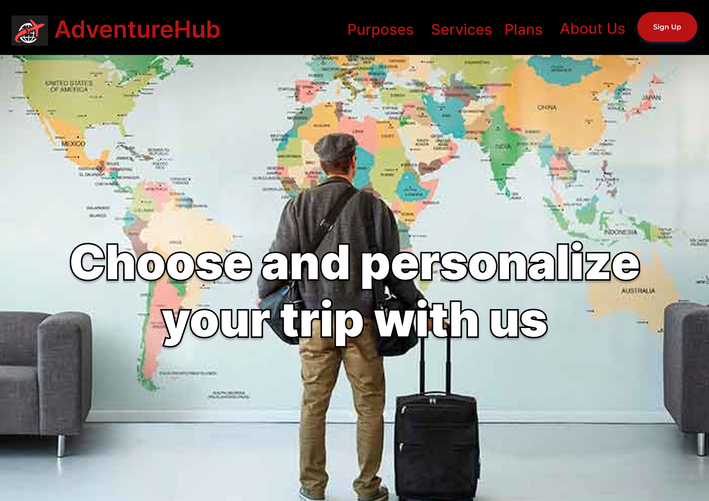
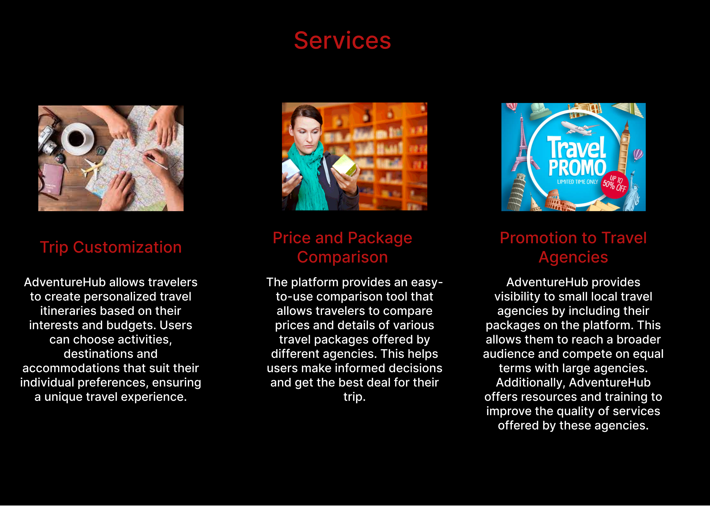
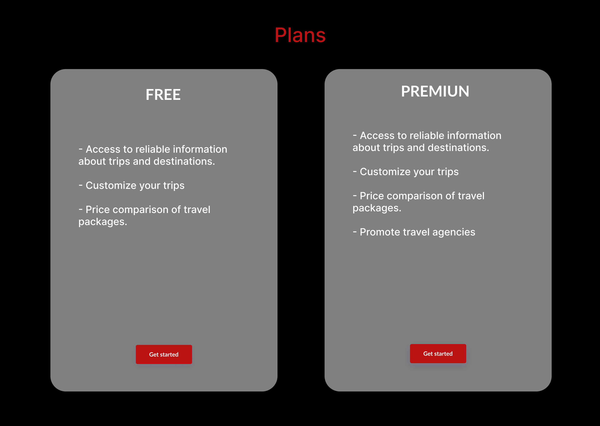
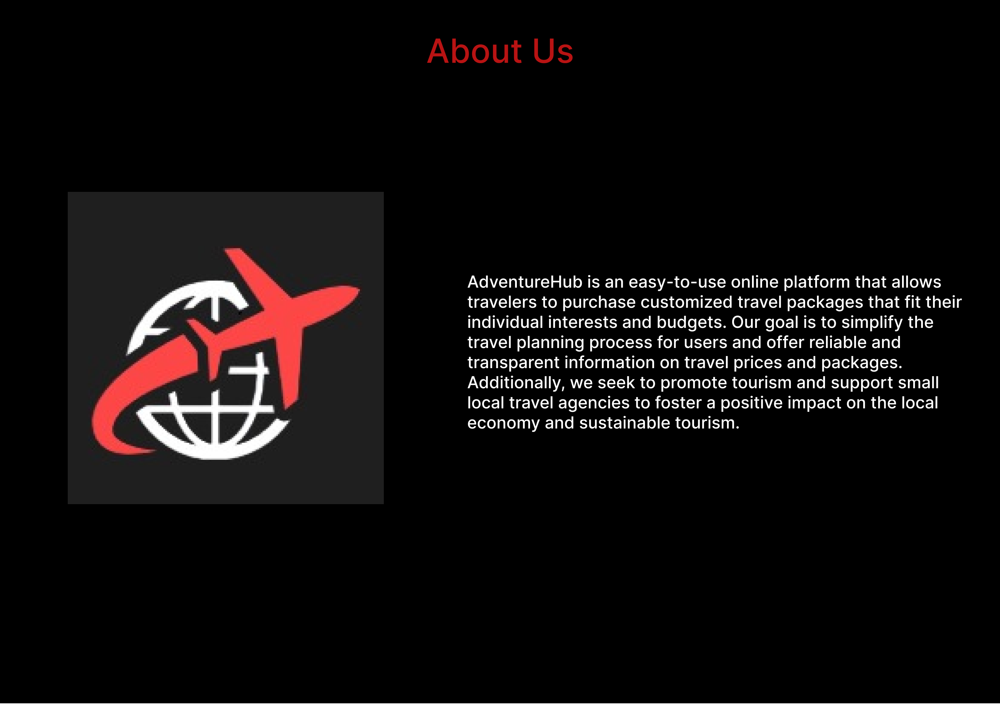

## 6.1. Style Guidelines.
### 6.1.1. General Style Guidelines.

#### Typography
Aquí, definimos las tipografías que reflejan nuestra identidad y proporcionaremos pautas sobre tamaños y estilos de fuente para garantizar una presentación coherente en todas nuestras comunicaciones escritas.

La tipografía utilizada será Poppins, que incluye las variantes Regular, Medium, Semi-Bold y Bold. El tamaño de la letra varió entre 1 rem (16 px), 1.5 rem (24 px), 2 rem (32 px) y 3 rem (48 px)." Asimismo, para los iconos utilizaremos los iconos de Angular Material.

**Poppins - Google fonts**

[](https://fonts.google.com/specimen/Poppins)

Referencia:  https://fonts.google.com/specimen/Poppins

**Mat - icons**

[](https://www.angularjswiki.com/angular/angular-material-icons-list-mat-icon-list/)

Referencia: https://www.angularjswiki.com/angular/angular-material-icons-list-mat-icon-list/ 
#### Colors
En esta sección, especificamos los colores de nuestra paleta y cómo se deben aplicar en diferentes contextos, asegurando que nuestra marca sea reconocible y atractiva.

Hesterbeg, menciona que es vital definir una paleta de colores que contribuya a crear una apariencia y sensación consistente para la marca (2022).
El equipo ha seleccionado una paleta de colores que consta de los siguientes elementos:

- **Primary**: Este color se utilizará para las barras superiores e inferiores de la aplicación. Coincidirá con el tono predominante en el logotipo de la empresa. El código HEX seleccionado es #10141E, y su equivalente en RGB es 16, 20, 30.


- **Primary Variant**: Para teñir la barra de notificaciones, emplearemos una variación del color principal. Es el color HEX #161D2F, que en RGB se expresa como 22, 29, 47.


- **Secondary**: Los botones flotantes de la aplicación se resaltarán con este color. Para este propósito, hemos seleccionado el código HEX seleccionado es #FC4747, y su equivalente en RGB es 252, 71, 71.


- **Background**: Este color será el fondo general de la aplicación. En este caso, utilizaremos un tono oscuro con el código HEX seleccionado es #10141E, y su equivalente en RGB es 16, 20, 30.


- **Surface**: Los contenedores de publicaciones de empresas o al revisar perfiles de choferes se complementarán con este color. Igualmente, hemos optado por el código HEX #5A698F, que en RGB se traduce como 90, 105, 143.


- **Error**: Cuando el usuario realice una operación incorrecta o ingrese datos erróneos, se mostrará este color. El color seleccionado para estas situaciones es el amarillo con el código HEX #FFD700, y su equivalente en RGB es 255, 215, 0.


- **Colores "On"**: Estos colores se utilizan para letras, números, símbolos, etc., según el contexto. Para los apartados Primary, Secondary, Background y Surface, emplearemos el color negro con el código HEX #000000, que en RGB se representa como 0, 0, 0. En cuanto al apartado Error, utilizaremos el color blanco con el código HEX #FFFFFF, que en RGB es 255, 255, 255.


#### Spacing
- **Botones**: Establecemos un margen interior (padding) de 1 rem (16 px) en la dirección vertical y de 2 rem (32 px) en la horizontal.
- **Márgenes entre texto**: Mantenemos un margen de 1 rem (16 px) entre elementos de texto.
- **Márgenes entre elementos**: Garantizamos un margen de 1.5 rem (24 px) entre distintos elementos.
- **Márgenes entre secciones**: Fijamos un margen de 6 rem (72 px) para separar claramente las diferentes secciones de contenido.
#### Dimensions
En esta sección, describiremos los diferentes tonos que utilizamos, desde la emoción por explorar hasta el compromiso con la responsabilidad social, y proporcionaremos ejemplos de cómo aplicarlos en nuestra comunicación escrita. A continuación, se presentarán el lenguaje y tonos que usamos para nuestros segmentos objetivo.

- **Agencia de viajes**: Nuestra comunicación hacia empresas de experiencias turísticas se caracteriza por su concisión y formalidad. Priorizamos la presentación de hechos y datos que respalden la eficacia de nuestra solución. Nuestra intención es motivar a estas empresas a considerar y adoptar nuestra propuesta.

- **Usuario turista**: En contraste, cuando nos dirigimos a los usuarios viajeros, empleamos un lenguaje sencillo y cautivador. Buscamos evocar emociones y crear una experiencia a través de las palabras. Nos esforzamos por brindar información clara y evitar cualquier ambigüedad en las opciones que ofrecemos a los viajeros.

### 6.1.2. Web, Mobile & Devices Style Guidelines.
## 6.2. Information Architecture.
### 6.2.2. Labeling Systems.
### 6.2.3. Searching Systems.
En la sección de sistemas de navegación se implementarán sistemas de búsqueda que faciliten al usuario la navegación por la aplicación.
- Lista de anuncios de los paquetes de viaje.
- Búsqueda de paquetes de viaje por presupuesto dentro de un rango establecido.
- Búsqueda de paquetes de viaje según temporada del año.
- Búsqueda de paquetes de viaje según el destino seleccionado.
- Búsqueda de transacciones de pago para los administradores.	
- Lista de notificaciones sobre los actualizaciones de las reservas, entre otras actualizaciones dentro de la aplicación.

### 6.2.4. SEO Tags and Meta Tags.
Esta sección se refiere a las etiquetas con la que llegaremos y proporcionaremos información a nuestros usuarios.<br>

<strong>Meta Tags</strong><br>
Son etiquetas en código HTML usados para proporcionar información de la página web. Lo cual también ayuda en el SEO y en la forma que los motores de búsqueda encuentran las páginas web para mostrarlas como resultados.

```html
<title> AdventurHub </title>
<meta name=”description” content=”AdventurHub es una aplicación  para reservar paquetes de viaje”>
<meta name=”keywords” content=”paquetes de viaje, turismo, vacaciones, vuelos, hoteles”>
<meta name=”author” content=”AdventureHub”>
```

<strong>SEO Tags</strong><br>
Las cuales son etiquetas que mejoran la visibilidad y clasificación de los sitio web en los motores de búsqueda. Dicho lo mencionado, ayuda a atraer nuevos usuarios y aumenta la relevancia de nuestro contenido en la redes.
```html
<h1>Adventure Hub </h1>
<h2>Purposes </h2>
<h2>Services</h2>
<h2>Plans</h2>
<h2>About us</h2>
```

### 6.2.5. Navigation Systems.
Los sistemas de navegación dentro de la aplicación serán los siguientes.
- Menú de navegación desplegable para móvil.<br>
  Este menú será mostrado en todo momento para que así cualquier usuario pueda navegar entre secciones.
- Menú de navegación estático para escritorio.<br>
 El cual es una alternativa a la forma desplegable para navegar fácilmente en pantallas más grandes.
- Tarjeta y listas.<br>
 Será la manera para la organización de datos resaltantes o repetitivos, así como la organización de información relacionada en caso de tarjetas y listas en caso de    múltiples enunciados relacionados como en paquetes de viaje.

## 6.3. Landing Page UI Design.
### 6.3.1. Landing Page Wireframe.
### 6.3.2. Landing Page Mock-up.

<div align="center">
				
</div>

<div align="center">
				
</div>

<div align="center">
				
</div>

<div align="center">
				
</div>

<div align="center">
				
</div>

## 6.4. Applications UX/UI Design.
### 6.4.1. Applications Wireframes.
### 6.4.2. Applications Wireflow Diagrams.
### 6.4.2. Applications Mock-ups.
### 6.4.3. Applications User Flow Diagrams.
## 6.5. Applications Prototyping.
