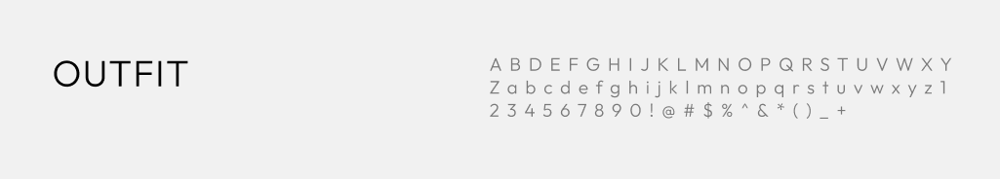
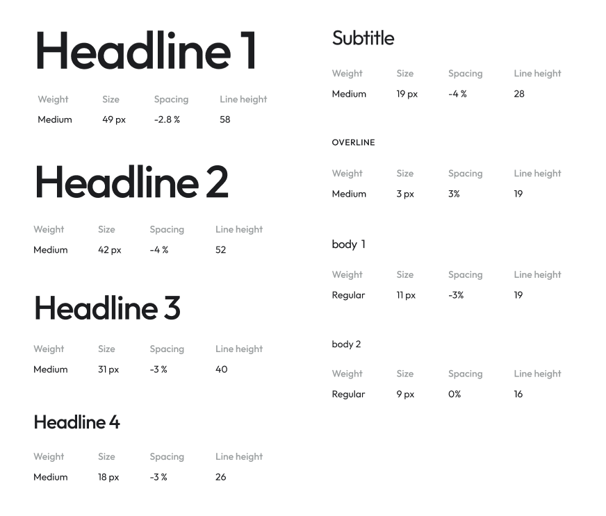
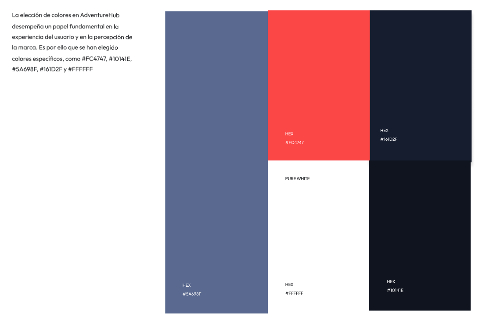
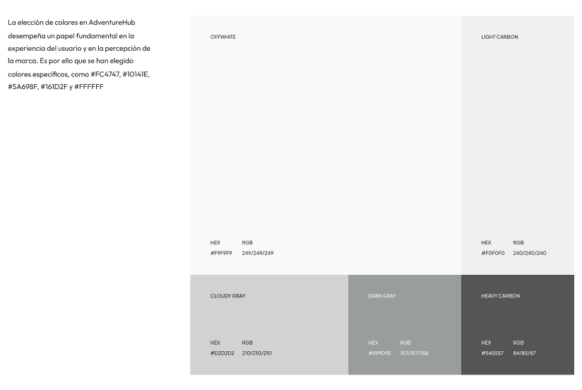
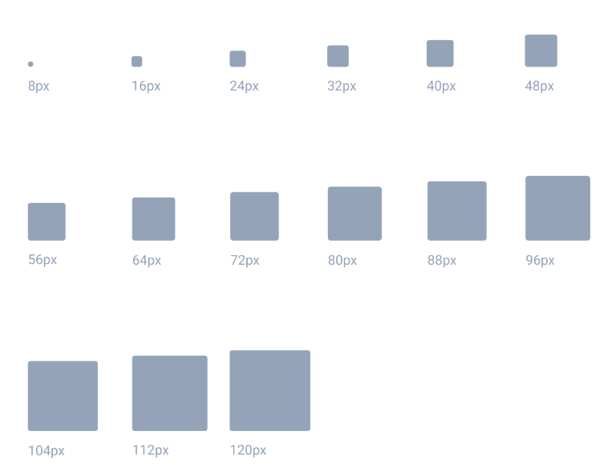

## 6.1. Style Guidelines.
### 6.1.1. General Style Guidelines.

El branding desempeña un papel crucial en AdventureHub al transmitir su personalidad distintiva, que combina una energía aventurera con profesionalismo y confianza. Para construir esta identidad de marca de manera efectiva, hemos empleado Figma, una herramienta de diseño y colaboración. A través de una plantilla, hemos creado y mantenido de forma coherente elementos clave de diseño, como, la paleta de colores, la tipografía y otros aspectos visuales. Esta elección nos ha permitido trabajar de manera colaborativa y en tiempo real, asegurando que nuestra marca sea uniforme en todas las interacciones con los usuarios.

#### Lenguaje aplicado

La plataforma web y móvil de AdventureHub utilizará un lenguaje coloquial en la interfaz. Esta elección tiene varios beneficios significativos. En primer lugar, el lenguaje coloquial crea un ambiente acogedor y cercano para los usuarios, lo que les permite sentirse más cómodos y conectados con la plataforma.


#### Typography:

AdventureHub ha seleccionado la fuente "Outfit" para garantizar una experiencia de lectura óptima en toda la plataforma. La fuente "Outfit" se utilizará en sus variaciones "Light" y "Medium", y se ajustará según el contraste con los colores de fondo para mejorar la legibilidad. Además, hemos establecido tamaños de fuente específicos para las secciones de "Heading" y "Body" para garantizar una jerarquía tipográfica coherente. Es importante destacar que la fuente "Outfit" es de código abierto y fue creada por On Brand Investments Pty Ltd, lo que refuerza nuestro compromiso con el acceso abierto y la calidad en el diseño tipográfico.

[]()



#### Colors:

La elección de colores en AdventureHub desempeña un papel fundamental en la experiencia del usuario y en la percepción de la marca. Es por ello que se han elegido colores específicos, como #FC4747, #10141E, #5A698F, #161D2F y #FFFFFF, ya que pueden ser beneficiosos para la plataforma. Estos colores no solo reflejan la personalidad enérgica que llama a la aventura, sino también la profesionalidad y la confianza que son fundamentales para la marca. Son una parte integral de la identidad de AdventureHub, comunicando su estilo y los valores que representa. Esta elección de colores ayuda a diferenciar a AdventureHub de la competencia y a establecer una conexión emocional sólida con los usuarios.

* Destacar llamadas a la acción: El color #FC4747 es un tono de rojo brillante y enérgico que puede utilizarse para resaltar elementos de acción importantes, como botones de "Reservar ahora" o "Explorar aventuras". Este color es conocido por atraer la atención de los usuarios y alentar la interacción.

* Elegancia y profesionalismo: Los colores #10141E y #161D2F son tonos de gris oscuro y azul oscuro, respectivamente. Estos colores transmiten una sensación de elegancia, sofisticación y profesionalismo. Pueden utilizarse para el fondo de la plataforma, lo que proporciona un telón de fondo neutro que resalta el contenido y las imágenes de aventuras.

* Confianza y serenidad: El color #5A698F es un azul más claro que transmite confianza, serenidad y fiabilidad. Puede ser adecuado para elementos de navegación, encabezados y otros aspectos de la interfaz que deben generar confianza en los usuarios mientras exploran las opciones de viaje.

* Legibilidad y accesibilidad: El color #FFFFFF representa el blanco puro y se utiliza comúnmente para el texto sobre fondos oscuros. Este contraste mejora la legibilidad del contenido, lo que es fundamental para que los usuarios puedan consumir información de manera efectiva.

<br>

[]()

[]()

#### Spacing

El espaciado es un elemento crítico en el diseño, ya que afecta directamente a la legibilidad, la organización y la apariencia general de una interfaz. En AdventureHub, prestamos una atención cuidadosa al espaciado para garantizar una experiencia visualmente agradable y fácil de usar.

[]()


### 6.1.2. Web, Mobile & Devices Style Guidelines.
## 6.2. Information Architecture.
### 6.2.2. Labeling Systems.

En la sección de etiquetas generamos familiaridad con nuestros usuarios. Por ello, usaremos etiquetas que sean fácilmente reconocibles.
<table class="tg">
<thead>
  <tr>
    <th class="tg-0lax"><span style="font-weight:400;font-style:normal;text-decoration:none;color:#000;background-color:transparent">Etiqueta</span></th>
    <th class="tg-0lax"><span style="font-weight:400;font-style:normal;text-decoration:none;color:#000;background-color:transparent">Nota de alcance</span></th>
  </tr>
</thead>
<tbody>
  <tr>
    <td class="tg-0lax"><span style="font-weight:400;font-style:normal;text-decoration:none;color:#000;background-color:transparent">AdventureHub</span></td>
    <td class="tg-0lax"><span style="font-weight:400;font-style:normal;text-decoration:none;color:#000;background-color:transparent">Etiqueta principal que muestra el nombre de la aplicación.</span></td>
  </tr>
  <tr>
    <td class="tg-0lax"><span style="font-weight:400;font-style:normal;text-decoration:none;color:#000;background-color:transparent">Purpose</span></td>
    <td class="tg-0lax"><span style="font-weight:400;font-style:normal;text-decoration:none;color:#000;background-color:transparent">Sección sobre nuestro direccionamiento con la aplicación.</span></td>
  </tr>
  <tr>
    <td class="tg-0lax"><span style="font-weight:400;font-style:normal;text-decoration:none;color:#000;background-color:transparent">Services</span></td>
    <td class="tg-0lax"><span style="font-weight:400;font-style:normal;text-decoration:none;color:#000;background-color:transparent">Sección de los servicios que ofrecemos</span></td>
  </tr>
  <tr>
    <td class="tg-0lax"><span style="font-weight:400;font-style:normal;text-decoration:none;color:#000;background-color:transparent">Plans</span></td>
    <td class="tg-0lax"><span style="font-weight:400;font-style:normal;text-decoration:none;color:#000;background-color:transparent">Sección sobre los planes de suscripción</span></td>
  </tr>
  <tr>
    <td class="tg-0lax"><span style="font-weight:400;font-style:normal;text-decoration:none;color:#000;background-color:transparent">About Us</span></td>
    <td class="tg-0lax"><span style="font-weight:400;font-style:normal;text-decoration:none;color:#000;background-color:transparent">Sección sobre información de nuestra organización</span></td>
  </tr>
</tbody>
</table>

### 6.2.3. Searching Systems.
En la sección de sistemas de navegación se implementarán sistemas de búsqueda que faciliten al usuario la navegación por la aplicación.
- Lista de anuncios de los paquetes de viaje.
- Búsqueda de paquetes de viaje por presupuesto dentro de un rango establecido.
- Búsqueda de paquetes de viaje según temporada del año.
- Búsqueda de paquetes de viaje según el destino seleccionado.
- Búsqueda de transacciones de pago para los administradores.	
- Lista de notificaciones sobre los actualizaciones de las reservas, entre otras actualizaciones dentro de la aplicación.

### 6.2.4. SEO Tags and Meta Tags.
Esta sección se refiere a las etiquetas con la que llegaremos y proporcionaremos información a nuestros usuarios.<br>

<strong>Meta Tags</strong><br>
Son etiquetas en código HTML usados para proporcionar información de la página web. Lo cual también ayuda en el SEO y en la forma que los motores de búsqueda encuentran las páginas web para mostrarlas como resultados.

```html
<title>AdventurHub • Planifica y construye tu próxima nueva experiencia de viaje</title>
<meta name=”description” content=”AdventurHub es una aplicación  para reservar paquetes de viaje”>
<meta name=”keywords” content=”paquetes de viaje, turismo, vacaciones, vuelos, hoteles”>
<meta name=”author” content=”AdventureHub”>
```

<strong>SEO Tags</strong><br>
Las cuales son etiquetas que mejoran la visibilidad y clasificación de los sitio web en los motores de búsqueda. Dicho lo mencionado, ayuda a atraer nuevos usuarios y aumenta la relevancia de nuestro contenido en la redes.
```html
<h1>¡Bienvenido de Adventure Hub! </h1>
<h2>Explora</h2>
<h2>Quiero viajar</h2>
<h2>Planes</h2>
<h2>Acerda de nosotros</h2>
```

### 6.2.5. Navigation Systems.
Los sistemas de navegación dentro de la aplicación serán los siguientes.
- Menú de navegación desplegable para móvil.<br>
  Este menú será mostrado en todo momento para que así cualquier usuario pueda navegar entre secciones.
- Menú de navegación estático para escritorio.<br>
 El cual es una alternativa a la forma desplegable para navegar fácilmente en pantallas más grandes.
- Tarjeta y listas.<br>
 Será la manera para la organización de datos resaltantes o repetitivos, así como la organización de información relacionada en caso de tarjetas y listas en caso de    múltiples enunciados relacionados como en paquetes de viaje.

## 6.3. Landing Page UI Design.
### 6.3.1. Landing Page Wireframe.

El "Landing Page Wireframe" es una guía visual de utilizamos para esbozar y planificar la estructura de nuestra Landing page. Creamos representaciones gráficas simples y esquemáticas, sin incluir detalles visuales o de diseño completos. Nos permitieron organizar los elementos, como el encabezado, el contenido principal y los botones de call-to-action, sin preocuparnos por los colores o las imágenes específicas en ese momento. 

<div align="center">
				
</div>

### 6.3.2. Landing Page Mock-up.

El "Landing Page Mock-up" es una una herramienta que utilizamos para visualizar y diseñar la apariencia final de nuestra Landing page. Creamos representaciones gráficas más detalladas y realistas, incluyendo elementos visuales y de diseño específicos. Esto nos permitió diseñar con precisión el aspecto del encabezado, el contenido principal, los botones call-to-action y otros elementos visuales clave, como colores y tipografía.


<div align="center">
				
</div>

<div align="center">
				
</div>

<div align="center">
				
</div>

<div align="center">
				
</div>

<div align="center">
				
</div>

## 6.4. Applications UX/UI Design.
### 6.4.1. Applications Wireframes.

<div align="center">
        <h3>Login</h1>
				
</div>
<div align="center">
        <h3>Sign Up</h1>
				
</div>
<div align="center">
        <h3>Home</h1>
				
</div>
<div align="center">
        <h3>Package Details</h1>
				
</div>
<div align="center">
        <h3>Chat List</h3>
				
</div>
<div align="center">
        <h3>Chat Conversation</h3>
				
</div>
<div align="center">
        <h3>Payment Process</h3>
				
</div>
<div align="center">
        <h3>Payment Success</h3>
				
</div>
<div align="center">
        <h3>Payment Failed</h3>
				
</div>
<div align="center">
        <h3>Booking View</h3>
				
</div>
<div align="center">
        <h3>Profile View</h3>
				
</div>
<div align="center">
        <h3>Profile - View Privacy Policies</h3>
				
</div>
<div align="center">
        <h3>Profile - Notification Manager</h3>
				
</div>
<div align="center">
        <h3>Profile - Help & Support</h3>
				
</div>

### 6.4.2. Applications Wireflow Diagrams.

<div align="center">
        <h3>User Goal 1: Como viajero necesito ingresar a mi cuenta</h3>
				
</div>
<div align="center">
        <h3>User Goal 2: Como viajero necesito crear una cuenta</h3>
				
</div>
<div align="center">
        <h3>User Goal 3: Como viajero necesito crear reservar un paquete de viaje</h3>
				
</div>
<div align="center">
        <h3>User Goal 4: Como viajero necesito mantener contacto con la agencia con la que reserve mi viaje</h3>
				
</div>

### 6.4.2. Applications Mock-ups.

<div align="center">
        <h3>Login</h1>
				
</div>
<div align="center">
        <h3>Sign Up</h1>
				
</div>
<div align="center">
        <h3>Home</h1>
				
</div>
<div align="center">
        <h3>Package Details</h1>
				
</div>
<div align="center">
        <h3>Chat List</h3>
				
</div>
<div align="center">
        <h3>Chat Conversation</h3>
				
</div>
<div align="center">
        <h3>Payment Process</h3>
				
</div>
<div align="center">
        <h3>Payment Success</h3>
				
</div>
<div align="center">
        <h3>Payment Failed</h3>
				
</div>
<div align="center">
        <h3>Booking View</h3>
				
</div>
<div align="center">
        <h3>Profile View</h3>
				
</div>
<div align="center">
        <h3>Profile - View Privacy Policies</h3>
				
</div>
<div align="center">
        <h3>Profile - Notification Manager</h3>
				
</div>
<div align="center">
        <h3>Profile - Help & Support</h3>
				
</div>

### 6.4.3. Applications User Flow Diagrams.

<div align="center">
        <h3>User Goal 1: Como viajero necesito ingresar a mi cuenta</h3>
				
</div>
<div align="center">
        <h3>User Goal 2: Como viajero necesito crear una cuenta</h3>
				
</div>
<div align="center">
        <h3>User Goal 3: Como viajero necesito crear reservar un paquete de viaje</h3>
				
</div>
<div align="center">
        <h3>User Goal 4: Como viajero necesito mantener contacto con la agencia con la que reserve mi viaje</h3>
				
</div>

## 6.5. Applications Prototyping.
