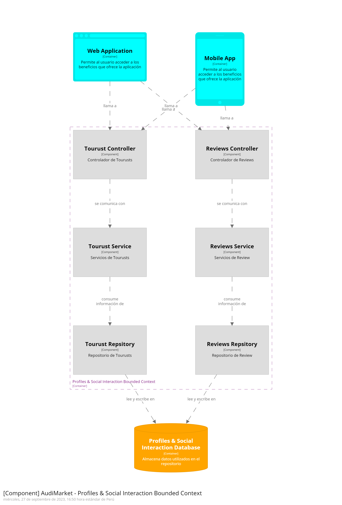

## 5.1. Bounded Context: Identity and Access Management

Presentamos el bounded context de Identity and Access Management, en el cual se abordan las capas relacionadas a la identidad y autorización de los usuarios en el uso del sistema. A continuación se detallaran sus principales componentes:

### 5.1.1. Domain Layer.
En esta sección se identifican las clases más importantes de este Bounded Context.
<table class="tg">
<thead>
  <tr>
    <th class="tg-0lax">Class</th>
    <th class="tg-0lax">Attributes</th>
    <th class="tg-0lax">Description</th>
  </tr>
</thead>
<tbody>
  <tr>
    <td class="tg-0lax" rowspan="9">User</td>
    <td class="tg-0lax">Id</td>
    <td class="tg-0lax">Id del viajero</td>
  </tr>
  <tr>
    <td class="tg-0lax">Email</td>
    <td class="tg-0lax">Nombre de perfil del viajero</td>
  </tr>
  <tr>
    <td class="tg-0lax">Password</td>
    <td class="tg-0lax">Apellido para el perfil del viajero</td>
  </tr>
  <tr>
    <td class="tg-0lax">Username</td>
    <td class="tg-0lax">Breve identificador del viajero</td>
  </tr>
  <tr>
    <td class="tg-0lax">Email</td>
    <td class="tg-0lax">Correo del viajero</td>
  </tr>
  <tr>
    <td class="tg-0lax">Password</td>
    <td class="tg-0lax">Contraseña de la cuenta del viajero</td>
  </tr>
  <tr>
    <td class="tg-0lax">PhotoUrl</td>
    <td class="tg-0lax">Foto o Imagen de perfil del viajero</td>
  </tr>
  <tr>
    <td class="tg-0lax">PhoneNumber</td>
    <td class="tg-0lax">Numero de teléfono del viajero</td>
  </tr>
  <tr>
    <td class="tg-0lax">SocialMedia</td>
    <td class="tg-0lax">Redes sociales del viajero</td>
  </tr>
</tbody>
</table>

### 5.1.2. Interface Layer.
En esta sección se identifican las clases que conforman la capa de Interface/Persentation Layer. En ese caso la clase Controller.
<table class="tg">
<thead>
  <tr>
    <th class="tg-0lax"></th>
    <th class="tg-0lax">Methods</th>
    <th class="tg-0lax">Description</th>
  </tr>
</thead>
<tbody>
  <tr>
    <td class="tg-0lax" rowspan="5">AuthController</td>
    <td class="tg-0lax">getUserMobileToken(String username)</td>
    <td class="tg-0lax">Obtiene el token del usuario</td>
  </tr>
  <tr>
    <td class="tg-0lax">updateUserMobileToken(String email, UpdateUserResource resource)</td>
    <td class="tg-0lax">Actualiza el token del usuario</td>
  </tr>
  <tr>
    <td class="tg-0lax">updateUserEmail(String currentEmail, UpdateEmailResource resource)</td>
    <td class="tg-0lax">Actualiza el email del usuario</td>
  </tr>
  <tr>
    <td class="tg-0lax">login(AuthCredentialsResource resource)</td>
    <td class="tg-0lax">Inicializa al usuario en la aplicación</td>
  </tr>
  <tr>
    <td class="tg-0lax">register(AuthCredentialsResource credentials)</td>
    <td class="tg-0lax">Registra al usuario en la aplicación</td>
  </tr>
</tbody>
</table>

### 5.1.3. Application Layer.
Se identifican las clases que manejan los flujos de procesos del negocio que se manejan en la clase  controlador.
<table class="tg">
<thead>
  <tr>
    <th class="tg-0lax"></th>
    <th class="tg-0lax">Methods</th>
    <th class="tg-0lax">Description</th>
  </tr>
</thead>
<tbody>
  <tr>
    <td class="tg-0lax" rowspan="5">AuthServiceImpl</td>
    <td class="tg-0lax">getUserMobileToken(String username)</td>
    <td class="tg-0lax">Obtiene el token del usuario</td>
  </tr>
  <tr>
    <td class="tg-0lax">updateUserMobileToken(String email, String mobile_token)</td>
    <td class="tg-0lax">Actualiza el token del usuario</td>
  </tr>
  <tr>
    <td class="tg-0lax">updateUserEmail(String currentEmail, String newEmail)</td>
    <td class="tg-0lax">Actualiza el email del usuario</td>
  </tr>
  <tr>
    <td class="tg-0lax">login(AuthCredentialsResource credentials)</td>
    <td class="tg-0lax">Inicializa al usuario en la aplicación</td>
  </tr>
  <tr>
    <td class="tg-0lax">register(AuthCredentialsResource credentialsResource)</td>
    <td class="tg-0lax">Registra al usuario en la aplicación</td>
  </tr>
</tbody>
</table>

### 5.1.4. Infrastructure Layer.
En esta sección se presentan aquellas clases que acc	eden a servicios externos como la base de datos o los servicios de email. En nuestro caso la clase repository.
<table class="tg">
<thead>
  <tr>
    <th class="tg-0lax"></th>
    <th class="tg-0lax">Methods</th>
    <th class="tg-0lax">Description</th>
  </tr>
</thead>
<tbody>
  <tr>
    <td class="tg-0lax" rowspan="2">UserRepository</td>
    <td class="tg-0lax">findByEmail(String email);</td>
    <td class="tg-0lax">Obtiene usuario por email</td>
  </tr>
  <tr>
    <td class="tg-0lax">findByUsername(String username);</td>
    <td class="tg-0lax">Obtiene usuario por username</td>
  </tr>
</tbody>
</table>

### 5.1.6. Bounded Context Software Architecture Component Level Diagrams.

  

### 5.1.7. Bounded Context Software Architecture Code Level Diagrams.
#### 5.1.7.1. Bounded Context Domain Layer Class Diagrams.

  

#### 5.1.7.2. Bounded Context Database Design Diagram.

  

## 5.2. Bounded Context: Subscription and Payments
### 5.2.1. Domain Layer.

#### Entities:

<li> Subscription</li>

<table class="tg">
<thead>
  <tr>
    <th class="tg-0lax">Class</th>
    <th class="tg-0lax">Attributes</th>
    <th class="tg-0lax">Description</th>
  </tr>
</thead>
<tbody>
  <tr>
    <td class="tg-0lax" rowspan="6">Subscription</td>
    <td class="tg-0lax">suscriptionId</td>
    <td class="tg-0lax">Este atributo representa un identificador único para la suscripción de un usuario </td>
  </tr>
  <tr>
    <td class="tg-0lax">name</td>
    <td class="tg-0lax">Almacena el nombre asociado a la suscripción </td>
  </tr>
  <tr>
    <td class="tg-0lax">startdate</td>
    <td class="tg-0lax">Este atributo indica la fecha de inicio de la suscripción </td>
  </tr>
  <tr>
    <td class="tg-0lax">finishDate</td>
    <td class="tg-0lax">Este atributo guarda la fecha de finalización de la suscripción </td>
  </tr>
  <tr>
    <td class="tg-0lax">touristId</td>
    <td class="tg-0lax">Este atributo representa el identificador del turista asociado a la suscripción </td>
  </tr>
   <tr>
    <td class="tg-0lax">typeId</td>
    <td class="tg-0lax">Este atributo indica el tipo de suscripción </td>
  </tr>
</tbody>
</table>

<table class="tg">
<thead>
  <tr>
    <th class="tg-0lax">Class</th>
    <th class="tg-0lax">Methods</th>
    <th class="tg-0lax">Description</th>
  </tr>
</thead>
<tbody>
  <tr>
    <td class="tg-0lax" rowspan="17">Subscription</td>
    <td class="tg-0lax">getSubscriptionId()</td>
    <td class="tg-0lax">Para obtener el ID de suscripción </td>
  </tr>
  <tr>
    <td class="tg-0lax">setSubscriptionId(id)</td>
    <td class="tg-0lax">Para establecer el ID de suscripción</td>
  </tr>
    <tr>
    <td class="tg-0lax">getName()</td>
    <td class="tg-0lax">Para obtener el nombre de la suscripción</td>
  </tr>
    <tr>
    <td class="tg-0lax">setName(name)</td>
    <td class="tg-0lax">Para establecer el nombre de la suscripción</td>
  </tr>
    <tr>
    <td class="tg-0lax">getStartDate()</td>
    <td class="tg-0lax">Para obtener la fecha de inicio</td>
  </tr>
    <tr>
    <td class="tg-0lax">setStartDate(date)</td>
    <td class="tg-0lax">Para establecer la fecha de inicio</td>
  </tr>
    <tr>
    <td class="tg-0lax">getFinishDate()</td>
    <td class="tg-0lax">Para obtener la fecha de finalización</td>
  </tr>
    <tr>
    <td class="tg-0lax">setFinishDate(date)</td>
    <td class="tg-0lax">Para establecer la fecha de finalización</td>
  </tr>
    <tr>
    <td class="tg-0lax">getTouristId()</td>
    <td class="tg-0lax">Para obtener el ID del turista</td>
  </tr>
    <tr>
    <td class="tg-0lax">setTouristId(id)</td>
    <td class="tg-0lax">Para establecer el ID del turista</td>
  </tr>
    <tr>
    <td class="tg-0lax">getSubscriptionType()</td>
    <td class="tg-0lax">Para obtener el ID del tipo de suscripción</td>
  </tr>
    <tr>
    <td class="tg-0lax">setSubscriptionType(typeId)</td>
    <td class="tg-0lax">Para establecer el ID del tipo de suscripción</td>
  </tr>
    <tr>
    <td class="tg-0lax">Suscription(subscriptionId, name, startDate, finishDate, touristId, typeId)</td>
    <td class="tg-0lax">Un constructor para crear una instancia de Suscription con todos los atributos requeridos.</td>
  </tr>
    <tr>
    <td class="tg-0lax">calculateSubscriptionDuration()</td>
    <td class="tg-0lax">Calcula la duración de la suscripción en función de las fechas de inicio y finalización</td>
  </tr>
    <tr>
    <td class="tg-0lax">isSubscriptionActive()</td>
    <td class="tg-0lax">Verifica si la suscripción está activa en un momento dado</td>
  </tr>
    <tr>
    <td class="tg-0lax">validateSubscriptionDates()</td>
    <td class="tg-0lax">Verifica que las fechas de inicio y finalización sean coherentes y válidas</td>
  </tr>
    <tr>
    <td class="tg-0lax">validateSubscriptionType()</td>
    <td class="tg-0lax">Comprueba que el tipo de suscripción sea válido y existente en el sistema.</td>
  </tr>
  
</tbody>
</table>
<li> Payments</li>

<table class="tg">
<thead>
  <tr>
    <th class="tg-0lax">Class</th>
    <th class="tg-0lax">Attributes</th>
    <th class="tg-0lax">Description</th>
  </tr>
</thead>
<tbody>
  <tr>
    <td class="tg-0lax" rowspan="7">Payments</td>
    <td class="tg-0lax">paymentId</td>
    <td class="tg-0lax">Este atributo representa un identificador único para el pago  </td>
  </tr>
  <tr>
    <td class="tg-0lax">description </td>
    <td class="tg-0lax">Este atributo almacena una descripción del pago, que puede incluir detalles sobre el motivo del mismo  </td>
  </tr>
  <tr>
    <td class="tg-0lax">amount</td>
    <td class="tg-0lax">Este atributo guarda la cantidad de dinero asociada al pago </td>
  </tr>
  <tr>
    <td class="tg-0lax">finishDate</td>
    <td class="tg-0lax">Este atributo guarda la fecha de finalización de la suscripción </td>
  </tr>
  <tr>
    <td class="tg-0lax">payDate</td>
    <td class="tg-0lax">Este atributo indica la fecha en que se realizó el pago </td>
  </tr>
   <tr>
    <td class="tg-0lax">planId </td>
    <td class="tg-0lax">Este atributo representa el identificador del plan de viaje asociado al pago </td>
  </tr>
     <tr>
    <td class="tg-0lax">touristId  </td>
    <td class="tg-0lax">Este atributo es el identificador del turista que realizó el pago </td>
  </tr>
</tbody>
</table>

<table class="tg">
<thead>
  <tr>
    <th class="tg-0lax">Class</th>
    <th class="tg-0lax">Methods</th>
    <th class="tg-0lax">Description</th>
  </tr>
</thead>
<tbody>
  <tr>
    <td class="tg-0lax" rowspan="17">Subscription</td>
    <td class="tg-0lax">Payment(paymentId, description, amount, payDate, planId, touristId) ()</td>
    <td class="tg-0lax">Un constructor para crear una instancia de Payment con todos los atributos necesarios </td>
  </tr>
  <tr>
    <td class="tg-0lax">getPaymentAmount() </td>
    <td class="tg-0lax">Devuelve el monto del pago </td>
  </tr>
    <tr>
    <td class="tg-0lax">setPaymentAmount(amount) </td>
    <td class="tg-0lax">Establece el monto del pago </td>
  </tr>
    <tr>
    <td class="tg-0lax">getPaymentDate()</td>
    <td class="tg-0lax">Devuelve la fecha en que se realizó el pago</td>
  </tr>
    <tr>
    <td class="tg-0lax">setPaymentDate(payDate)</td>
    <td class="tg-0lax">Establece la fecha del pago </td>
  </tr>
    <tr>
    <td class="tg-0lax">getPaymentDescription() </td>
    <td class="tg-0lax">Devuelve la descripción del pago </td>
  </tr>
    <tr>
    <td class="tg-0lax">setPaymentDescription(description) </td>
    <td class="tg-0lax">Establece la descripción del pago </td>
  </tr>
    <tr>
    <td class="tg-0lax">getPaymentId()</td>
    <td class="tg-0lax">Devuelve el ID único del pago</td>
  </tr>
    <tr>
    <td class="tg-0lax">equals(otherPayment) </td>
    <td class="tg-0lax">Compara dos instancias de Payment para determinar si son iguales </td>
  </tr>
    <tr>
    <td class="tg-0lax">getPlanId()</td>
    <td class="tg-0lax">Devuelve el ID del plan de viaje asociado al pago</td>
  </tr>
    <tr>
    <td class="tg-0lax">setPlanId(planId) </td>
    <td class="tg-0lax">Establece el ID del plan de viaje asociado al pago </td>
  </tr>
    <tr>
    <td class="tg-0lax">getTouristId() </td>
    <td class="tg-0lax">Devuelve el ID del turista que realizó el pago </td>
  </tr>
    <tr>
    <td class="tg-0lax">setTouristId(touristId)</td>
    <td class="tg-0lax">Establece el ID del turista que realizó el pago </td>
  </tr>
    <tr>
    <td class="tg-0lax">calculateTotalPayments(touristId) </td>
    <td class="tg-0lax">Calcula el total de pagos realizados por un turista específico</td>
  </tr>
    <tr>
    <td class="tg-0lax">validatePaymentAmount()</td>
    <td class="tg-0lax">Valida que el monto del pago sea coherente y válido </td>
  </tr>
    <tr>
    <td class="tg-0lax">validatePaymentDate() </td>
    <td class="tg-0lax">Valida que la fecha del pago sea válida y consistente </td>
  </tr>
    <tr>
    <td class="tg-0lax">getPaymentDetails() </td>
    <td class="tg-0lax">Devuelve una descripción detallada del pago, incluyendo su ID, descripción, monto, fecha, plan asociado y turista</td>
  </tr>
  
</tbody>
</table>

### 5.2.2. Interface Layer.

En esta sección se identifican las clases más importantes usadas en este Bounded Context.

#### SubscriptionsController: 

Es el encargado de modificar y obtener información de las subscripciones. 

| Methods | Description   |
|----------|----------|
|  PostSubscription    | Método POST para registrar una nueva subscripción   |
|   GetSubscription    |    Método GET para obtener la información de una subscripción existente por su Id    |
|     DeleteSubscription      |  Método DELETE para eliminar una subscripción existente         |  
|   PutSubscription        |   Método PUT para modificar la información de una subscripción existente       |          
|     GetAllSubscription      |     Método GET para obtener la información de todas las subscripciones existentes      |          
|     GetSubscriptionsByTouristID      |    Método GET para obtener la información de todas las subscripciones existentes de un turista por su Id       |          
|      GetSubscriptionsByTypeID     |  Método GET para obtener la información de todas las subscripciones existentes de un tipo de subscripción por su Id |    

#### PaymentsController: 

Es el encargado de modificar y obtener información de los pagos. 

| Methods | Description   |
|----------|----------|
|  PostPayment     | Método POST para registrar un nuevo pago    |
|   GetPayment     |    Método GET para obtener la información de un pago existente por su Id |    |
|     DeletePayment       |  MMétodo DELETE para eliminar un pago existente          |  
|   PutPayment         |   Método PUT para modificar la información de un pago existente  |          
|     GetAllPayments       |   Método GET para obtener la información de todos los pagos existentes|          
|     GetPaymentsByTouristID       |    Método GET para obtener la información de todos los pagos existentes de un turista por su Id       |          
|      GetPaymentsByPlanID      |  Método GET para obtener la información de todos los pagos existentes de un plan por su Id  |   

### 5.2.3. Application Layer.

#### CommandHandlers: 
 
* SubscriptionCommandHandler: Command Handler que maneja los comandos de las subscripciones. 

| Methods  | Description|
|----------|----------|
|   HandleAddNewSubscription |   Maneja el comando agregar subscripcion        |
|      HandleDeleteSubscription    |  Maneja el comando eliminar subscripcion          |
|  HandleUpdateSubscription   | Maneja el comando actualizar subscripcion  |

 

* PaymentCommandHandler: Command Handler que maneja los comandos de los pagos.   

| Methods  | Description|
|----------|----------|
|    HandleAddNewPayment      |   Maneja el comando agregar pago         |
|     HandleDeletePayment     |  Maneja el comando eliminar pago         |
|     HandleUpdatePayment     |    Maneja el comando actualizar pago        |

 

### 5.2.4. Infrastructure Layer.

#### Repositories: 

* SubscriptionRepository: 

| Methods  | Description|
|----------|----------|
|    FindByTouristID      |    Obtiene una lista de subscripciones por el Id del Turista       |
|    FindByTypetID      |    Obtiene una lista de subscripciones por el Id del Tipo de Subscripcion      |

* PaymentRepository: 

| Methods  | Description|
|----------|----------|
|    FindByTouristID      |    Obtiene una lista de pagos por el Id del Turista    |
|    FindByPlanID      |  Obtiene una lista de pagos por el Id del Plan  |

 
 

### 5.2.6. Bounded Context Software Architecture Component Level Diagrams.

				

### 5.2.7. Bounded Context Software Architecture Code Level Diagrams.
#### 5.2.7.1. Bounded Context Domain Layer Class Diagrams.

				

#### 5.2.7.2. Bounded Context Database Design Diagram.

				

## 5.3. Bounded Context: Profiles & Social Interaction
### 5.3.1. Domain Layer.

Entities:
<li> Reviews</li>

<table class="tg">
<thead>
  <tr>
    <th class="tg-0lax">Class</th>
    <th class="tg-0lax">Attributes</th>
    <th class="tg-0lax">Description</th>
  </tr>
</thead>
<tbody>
  <tr>
    <td class="tg-0lax" rowspan="5">Reviews</td>
    <td class="tg-0lax">id</td>
    <td class="tg-0lax">Un identificador único para cada usuario en el sistema. </td>
  </tr>
  <tr>
    <td class="tg-0lax">content</td>
    <td class="tg-0lax">El contenido de la reseña, es decir, el texto que describe la opinión del usuario.  </td>
  </tr>
  <tr>
    <td class="tg-0lax">review_date</td>
    <td class="tg-0lax">La fecha en que se creó la reseña</td>
  </tr>
  <tr>
    <td class="tg-0lax">rating </td>
    <td class="tg-0lax">La calificación promedio que tiene la reseña. </td>
  </tr>
</tbody>
</table>

<table class="tg">
<thead>
  <tr>
    <th class="tg-0lax">Class</th>
    <th class="tg-0lax">Methods</th>
    <th class="tg-0lax">Description</th>
  </tr>
</thead>
<tbody>
  <tr>
    <td class="tg-0lax" rowspan="17">Reviews</td>
    <td class="tg-0lax">Reviews(id, nickname, password, address, email, phone) </td>
    <td class="tg-0lax">Constructor para crear una instancia de la clase</td>
  </tr>
  <tr>
    <td class="tg-0lax">getComments()</td>
    <td class="tg-0lax">Devuelve una lista de todos los comentarios asociados a la revisión.</td>
  </tr>
    <tr>
    <td class="tg-0lax">updateAddress(new_address) </td>
    <td class="tg-0lax">Permite actualizar la dirección </td>
  </tr>
    <tr>
    <td class="tg-0lax">updateEmail(new_email) </td>
    <td class="tg-0lax">Permite actualizar la dirección de correo electrónico asociada a la revisión.</td>
  </tr>
    <tr>
    <td class="tg-0lax">deleteComment(comment_id)</td>
    <td class="tg-0lax">Permite al revisor eliminar un comentario específico que haya realizado anteriormente. </td>
  </tr>
    <tr>
    <td class="tg-0lax">addComment(comment)</td>
    <td class="tg-0lax">Permite al revisor agregar un comentario o reseña sobre un paquete de viaje específico. </td>
  </tr>
</tbody>
</table>

### 5.3.2. Interface Layer.

* ReviewController 

Es el encargado de modificar y obtener información de las reseñas.

| Methods  | Description|
|----------|----------|
|   PostReview   |  Método POST para registrar una nueva reseña |
| GetReview | Método GET para obtener la información de una reseña existente por su Id |
| DeleteReview   | étodo DELETE para eliminar una reseña existente  |
| PutReview  | Método PUT para modificar la información de una reseña existente |
| GetAllReviews  | Método GET para obtener la información de todas las reseñas existentes |
|GetReviewsByTouristID | Método GET para obtener la información de todas las reseñas existentes de un turista por su Id|
| GetReviewsByPlanID  | Método GET para obtener la información de todas las reseñas existentes de un plan por su Id  |

### 5.3.3. Application Layer.

CommandHandlers: 

* ReviewCommandHandler: Command Handler que maneja los comandos de las reseñas.

| Methods  | Description|
|----------|----------|
| HandleAddNewReview  | Maneja el comando agregar reseña |
| HandleDeleteReview  | Maneja el comando eliminar reseña |
| HandleUpdateReview  | Maneja el comando actualizar reseña |

### 5.3.4. Infrastructure Layer.

Repositories: 

* ReviewRepository: 

| Methods  | Description|
|----------|----------|
|   FindByTouristID    |  Obtiene una lista de reseñas por el Id del Turista |
|     FindByPlanID      | Obtiene una lista de reseñas por el Id del Plan |

### 5.3.6. Bounded Context Software Architecture Component Level Diagrams.

				

### 5.3.7. Bounded Context Software Architecture Code Level Diagrams.
#### 5.3.7.1. Bounded Context Domain Layer Class Diagrams.

				

#### 5.3.7.2. Bounded Context Database Design Diagram.

				

## 5.4. Bounded Context: Customer Relationship & Communication Management

### 5.4.1. Domain Layer.

Entities: 

 

User: Representa al usuario registrado 

Notification: Representa una notificación para enviar 

Email: Representa un email 

<table>
  <thead>
    <tr>
      <th>Class</th>
      <th>Atributos</th>
      <th>Description</th>
    </tr>
  </thead>
  <tbody>
    <tr>
      <td rowspan="7">User</td>
      <td>Id</td>
      <td>Identificador único para cada registro de usuario</td>
    </tr>
    <tr>
      <td>Created_at</td>
      <td>Almacena la fecha y hora en que se creó el registro de usuario.</td>
    </tr>
    <tr>
      <td>Updated_at</td>
      <td>Almacena la fecha y hora de la última actualización de la información de usuario</td>
    </tr>
    <tr>
      <td>Email</td>
      <td>Representa la dirección de correo electrónico del usuario.</td>
    </tr>
    <tr>
      <td>Password</td>
      <td>Almacena la contraseña segura del usuario.</td>
    </tr>
    <tr>
      <td>Username</td>
      <td>Es un nombre de usuario opcional que el usuario puede elegir para su cuenta.</td>
    </tr>
    <tr>
      <td>Status</td>
      <td>Representa el estado actual de la cuenta del usuario.</td>
    </tr>
  </tbody>
</table>

<table>
  <thead>
    <tr>
      <th>Class</th>
      <th>Attributes</th>
      <th>Description</th>
    </tr>
  </thead>
  <tbody>
    <tr>
      <td rowspan="3">Notification</td>
      <td>Id</td>
      <td>Identificador único para cada registro de notificación</td>
    </tr>
    <tr>
      <td>Title</td>
      <td>Representa el título o encabezado de la notificación.</td>
    </tr>
    <tr>
      <td>Body</td>
      <td>Contiene el contenido principal de la notificación.</td>
    </tr>
  </tbody>
</table>

<table>
  <thead>
    <tr>
      <th>Class</th>
      <th>Attributes</th>
      <th>Description</th>
    </tr>
  </thead>
  <tbody>
    <tr>
      <td rowspan="4">Email</td>
      <td>From</td>
      <td>Dirección de correo electrónico del remitente</td>
    </tr>
    <tr>
      <td>To</td>
      <td>Dirección de correo electrónico del destinatario</td>
    </tr>
    <tr>
      <td>Subject</td>
      <td>Asunto o título del correo electrónico</td>
    </tr>
    <tr>
      <td>Body</td>
      <td>Contiene el contenido principal del correo electrónico</td>
    </tr>
  </tbody>
</table>

Value Objects:

<table>
  <thead>
    <tr>
      <th>Value Object</th>
      <th>Atributos</th>
    </tr>
  </thead>
  <tbody>
    <tr>
      <td>UserId</td>
      <td>id</td>
    </tr>
  </tbody>
</table>

<table>
  <thead>
    <tr>
      <th>Value Object</th>
      <th>Atributos</th>
    </tr>
  </thead>
  <tbody>
    <tr>
      <td>EmailAddress</td>
      <td>email</td>
    </tr>
  </tbody>
</table>

### 5.4.2. Interface Layer.

<table>
  <thead>
    <tr>
      <th>Interfaz</th>
      <th>Methods</th>
      <th>Description</th>
    </tr>
  </thead>
  <tbody>
    <tr>
      <td rowspan="2">UserRepository</td>
      <td>findById()</td>
      <td>Operaciones de repositorio de usuarios</td>
    </tr>
    <tr>
      <td>Save()</td>
      <td></td>
    </tr>
  </tbody>
</table>

<table>
  <thead>
    <tr>
      <th>Interfaz</th>
      <th>Methods</th>
      <th>Description</th>
    </tr>
  </thead>
  <tbody>
    <tr>
      <td rowspan="2">NotificationRepository</td>
      <td>findById()</td>
      <td>Operaciones de repositorio de notificaciones</td>
    </tr>
    <tr>
      <td>Save()</td>
      <td></td>
    </tr>
  </tbody>
</table>

<table>
  <thead>
    <tr>
      <th>Interfaz</th>
      <th>Methods</th>
      <th>Description</th>
    </tr>
  </thead>
  <tbody>
    <tr>
      <td rowspan="2">EmailService</td>
      <td>Send()</td>
      <td>Envía emails</td>
    </tr>
    <tr>
      <td></td>
      <td></td>
    </tr>
  </tbody>
</table>

<table>
  <thead>
    <tr>
      <th>Interfaz</th>
      <th>Methods</th>
      <th>Description</th>
    </tr>
  </thead>
  <tbody>
    <tr>
      <td rowspan="2">NotificationService</td>
      <td>Send()</td>
      <td>Envía notificaciones</td>
    </tr>
    <tr>
      <td></td>
      <td></td>
    </tr>
  </tbody>
</table>

### 5.4.3. Application Layer.

<table>
  <thead>
    <tr>
      <th>Command Handler</th>
      <th>Methods</th>
      <th>Description</th>
    </tr>
  </thead>
  <tbody>
    <tr>
      <td rowspan="2">CustomerCommunication CommandHandler</td>
      <td>RegisterUserCommand(name, email)</td>
      <td>Maneja el comando de registro del usuario</td>
    </tr>
    <tr>
      <td>SendNotificationCommand(user, notification)</td>
      <td>Maneja el comando para el envío de la notificación</td>
    </tr>
  </tbody>
</table>

### 5.4.4. Infrastructure Layer.

<table>
  <thead>
    <tr>
      <th>Implementation</th>
      <th>Description</th>
    </tr>
  </thead>
  <tbody>
    <tr>
      <td>UserRepositoryImpl</td>
      <td>Accede a la base de datos para operaciones de usuario</td>
    </tr>
    <tr>
      <td>EmailServiceImpl</td>
      <td>Utiliza API de email externa</td>
    </tr>
    <tr>
      <td>NotificationServiceImpl</td>
      <td>Utiliza API de notificaciones push externa</td>
    </tr>
  </tbody>
</table>

### 5.4.6. Bounded Context Software Architecture Component Level Diagrams.

[Imagen]
### 5.4.7. Bounded Context Software Architecture Code Level Diagrams.

En esta sección, se presentan los diagramas que presentan a mayor detalle la 

implementación de componentes en el Bounded Context Customer Relationship & Communication Management. 

#### 5.4.7.1. Bounded Context Domain Layer Class Diagrams.

[Imagen]
#### 5.4.7.2. Bounded Context Database Design Diagram.

[Imagen]
## 5.5. Bounded Context: Travel Experience Design and Maintenance
### 5.5.1. Domain Layer.

En esta sección se identifican las clases core del Travel Experience Design and Maintenance Context:

- **Itinerary**: Representa un día de la experiencia de viaje.

- **Trip**: Representa una experiencia de viaje.

- **Destination**: Representa al destino de la experiencia de viaje.

<table>
  <thead>
    <tr>
      <th>Class</th>
      <th>Atributo</th>
      <th>Descripción</th>
    </tr>
  </thead>
  <tbody>
    <tr>
      <td rowspan="6">Itinerary</td>
      <td>id</td>
      <td>Identificador único del itinerario</td>
    </tr>
    <tr>
      <td>day</td>
      <td>Día enumerado del viaje</td>
    </tr>
    <tr>
      <td>latitude</td>
      <td>Latitud de la zona a viajar</td>
    </tr>
    <tr>
      <td>location</td>
      <td>Ubicación de la zona a viajar</td>
    </tr>
    <tr>
      <td>longitude</td>
      <td>Longitud de la zona a viajar</td>
    </tr>
    <tr>
      <td>TripId</td>
      <td>Identificador único del viaje</td>
    </tr>
  </tbody>
</table>

<table>
  <thead>
    <tr>
      <th>Class</th>
      <th>Atributo</th>
      <th>Descripción</th>
    </tr>
  </thead>
  <tbody>
    <tr>
      <td rowspan="12">Trip</td>
      <td>Id</td>
      <td>Identificador único del viaje</td>
    </tr>
    <tr>
      <td>description</td>
      <td>Detalles del viaje</td>
    </tr>
    <tr>
      <td>endDate</td>
      <td>Fecha del último día del viaje</td>
    </tr>
    <tr>
      <td>startDate</td>
      <td>Fecha de inicio del viaje</td>
    </tr>
    <tr>
      <td>name</td>
      <td>Nombre del viaje seleccionado</td>
    </tr>
    <tr>
      <td>Price</td>
      <td>Precio del viaje</td>
    </tr>
    <tr>
      <td>status</td>
      <td>Estado actual del viaje</td>
    </tr>
    <tr>
      <td>categoryId</td>
      <td>Identificador único de categoría de viaje</td>
    </tr>
    <tr>
      <td>destinationId</td>
      <td>Identificador único de destino seleccionado</td>
    </tr>
    <tr>
      <td>seasonId</td>
      <td>Identificador único de temporada de viaje</td>
    </tr>
    <tr>
      <td>userId</td>
      <td>Identificador único de usuario</td>
    </tr>
    <tr>
      <td>stock</td>
      <td>Pasaje disponible</td>
    </tr>
  </tbody>
</table>

<table>
  <thead>
    <tr>
      <th>Class</th>
      <th>Atributo</th>
      <th>Descripción</th>
    </tr>
  </thead>
  <tbody>
    <tr>
      <td rowspan="4">Destination</td>
      <td>Id</td>
      <td>Identificador único del destino</td>
    </tr>
    <tr>
      <td>name</td>
      <td>Nombre del destino</td>
    </tr>
    <tr>
      <td>description</td>
      <td>Detalles del destino</td>
    </tr>
    <tr>
      <td>trips</td>
      <td>Viajes que se relacionan con el destino</td>
    </tr>
  </tbody>
</table>

Value Objects:

<table>
  <thead>
    <tr>
      <th>Value Object</th>
      <th>Atributos</th>
    </tr>
  </thead>
  <tbody>
    <tr>
      <td>ItineraryId</td>
      <td>id</td>
    </tr>
  </tbody>
</table>

<table>
  <thead>
    <tr>
      <th>Value Object</th>
      <th>Atributos</th>
    </tr>
  </thead>
  <tbody>
    <tr>
      <td>TripId</td>
      <td>id</td>
    </tr>
    <tr>
      <td>tripName</td>
      <td>name</td>
    </tr>
  </tbody>
</table>

<table>
  <thead>
    <tr>
      <th>Value Object</th>
      <th>Atributos</th>
    </tr>
  </thead>
  <tbody>
    <tr>
      <td>DestinationId</td>
      <td>id</td>
    </tr>
    <tr>
      <td>destinationName</td>
      <td>name</td>
    </tr>
  </tbody>
</table>

### 5.5.2. Interface Layer.

En esta sección se identifican las clases que forman parte de Interface/Presentation Layer del Travel Experience Design and Maintenance Context, en este caso nuestra clase controller. 

<table>
  <thead>
    <tr>
      <th>Controller</th>
      <th>Methods</th>
      <th>Description</th>
    </tr>
  </thead>
  <tbody>
    <tr>
      <td rowspan="3">ItineraryController</td>
      <td>findById(itineraryId)</td>
      <td>Operaciones de repositorio de Itinerarios</td>
    </tr>
    <tr>
      <td>save()</td>
      <td>UpdateById(itineraryId)</td>
    </tr>
    <tr>
      <td>DeleteById(itineraryId)</td>
      <td></td>
    </tr>
  </tbody>
</table>

<table>
  <thead>
    <tr>
      <th>Controller</th>
      <th>Methods</th>
      <th>Description</th>
    </tr>
  </thead>
  <tbody>
    <tr>
      <td rowspan="3">TripController</td>
      <td>findById(tripId)</td>
      <td>Operaciones de repositorio de notificaciones</td>
    </tr>
    <tr>
      <td>save()</td>
      <td>GetAllTrips()</td>
    </tr>
    <tr>
      <td>FilterTripsByParams(destination, season, minPrice, maxPrice)</td>
      <td></td>
    </tr>
  </tbody>
</table>

<table>
  <thead>
    <tr>
      <th>Controller</th>
      <th>Interfaz</th>
      <th>Description</th>
    </tr>
  </thead>
  <tbody>
    <tr>
      <td rowspan="2">DestinationController</td>
      <td>findById(destinationId)</td>
      <td>Operaciones de repositorio de notificaciones</td>
    </tr>
    <tr>
      <td>save()</td>
      <td>GetAll()</td>
    </tr>
  </tbody>
</table>

### 5.5.3. Application Layer.

En esta sección se identifican las clases que manejan los flujos de procesos del negocio 

Itinerary Implementation

<table>
  <thead>
    <tr>
      <th>Command Handler</th>
      <th>Methods</th>
      <th>Description</th>
    </tr>
  </thead>
  <tbody>
    <tr>
      <td>ItineraryImpl</td>
      <td>findById(itineraryId)</td>
      <td>Obtiene un Itinerario por su Id</td>
    </tr>
    <tr>
      <td></td>
      <td>save()</td>
      <td>Crea un Itinerario nuevo</td>
    </tr>
    <tr>
      <td></td>
      <td>UpdateById(itineraryId)</td>
      <td>Obtiene un Itinerario por Id</td>
    </tr>
    <tr>
      <td></td>
      <td>DeleteById(itineraryId)</td>
      <td>Elimina un itinerario por Id</td>
    </tr>
  </tbody>
</table>

TripImplementation

<table>
  <thead>
    <tr>
      <th>Command Handler</th>
      <th>Methods</th>
      <th>Description</th>
    </tr>
  </thead>
  <tbody>
    <tr>
      <td rowspan="4">TripImpl</td>
      <td>findById(tripId)</td>
      <td>Obtiene un Viaje por su Id</td>
    </tr>
    <tr>
      <td></td>
      <td>save()</td>
      <td>Crea un Viaje nuevo</td>
    </tr>
    <tr>
      <td></td>
      <td>GetAllTrips()</td>
      <td>Obtiene todos los viajes</td>
    </tr>
    <tr>
      <td></td>
      <td>FilterTripsByParams(destination, season, minPrice, maxPrice)</td>
      <td>Obtiene los viajes que cumplan las condiciones opcionales del filtro</td>
    </tr>
  </tbody>
</table>

DestinationImplementation

<table>
  <thead>
    <tr>
      <th>Command Handler</th>
      <th>Methods</th>
      <th>Description</th>
    </tr>
  </thead>
  <tbody>
    <tr>
      <td rowspan="3">DestinationImpl</td>
      <td>findById(destinationId)</td>
      <td>Obtiene un Destino por su Id</td>
    </tr>
    <tr>
      <td></td>
      <td>save()</td>
      <td>Crea un Destino nuevo</td>
    </tr>
    <tr>
      <td></td>
      <td>GetAll()</td>
      <td>Obtiene todos los Destinos</td>
    </tr>
  </tbody>
</table>

### 5.5.4. Infrastructure Layer.

<table>
  <thead>
    <tr>
      <th>Implementation</th>
      <th>Description</th>
    </tr>
  </thead>
  <tbody>
    <tr>
      <td rowspan="4">ItineraryImpl</td>
      <td>Accede a base de datos para operaciones relacionadas a los Itinerarios</td>
    </tr>
    <tr>
      <td>TripImpl</td>
      <td>Accede a la base de datos para operaciones relacionadas a los Viajes</td>
    </tr>
  </tbody>
</table>

### 5.5.6. Bounded Context Software Architecture Component Level Diagrams.

Imagen101

  

[Enlace al archivo](https://drive.google.com/drive/folders/1Ij2d_conwapI4QdItDSN8uFMnUERSWti?usp=drive_link)

### 5.5.7. Bounded Context Software Architecture Code Level Diagrams.

En esta sección, se presentan los diagramas que presentan a mayor detalle la 

[Imagen]
#### 5.5.7.1. Bounded Context Domain Layer Class Diagrams.
[Imagen]
#### 5.5.7.2. Bounded Context Database Design Diagram.
[Imagen]

## 5.6. Bounded Context: Travel Experience Booking and Tracking
Presentamos el bounded context de Travel Experience Booking and Tracking, en el cual se abordan las capas relacionadas con la reserva y el estado de la misma, en relación con los usuarios que están utilizando este sistema. A continuación, se detallarán sus principales componentes.
### 5.6.1. Domain Layer.
En esta sección se identifican las clases más importantes de este Bounded Context.
<table class="tg">
<thead>
  <tr>
    <th class="tg-0lax">Class</th>
    <th class="tg-0lax">Attributes</th>
    <th class="tg-0lax">Description</th>
  </tr>
</thead>
<tbody>
  <tr>
    <td class="tg-0lax" rowspan="4">Booking</td>
    <td class="tg-0lax">Id</td>
    <td class="tg-0lax">Id de la reserva</td>
  </tr>
  <tr>
    <td class="tg-0lax">Date</td>
    <td class="tg-0lax">Fecha de la reserva</td>
  </tr>
  <tr>
    <td class="tg-0lax">Status</td>
    <td class="tg-0lax">Estado de la reserva</td>
  </tr>
  <tr>
    <td class="tg-0lax">NumberOfPeople</td>
    <td class="tg-0lax">Número de personas para la reserva</td>
  </tr>
</tbody>
</table>

### 5.6.2. Interface Layer.
En esta sección se identifican las clases que conforman la capa de Interface/Persentation Layer. En este caso la clase controller.

<table class="tg">
<thead>
  <tr>
    <th class="tg-0lax"></th>
    <th class="tg-0lax">Methods</th>
    <th class="tg-0lax">Description</th>
  </tr>
</thead>
<tbody>
  <tr>
    <td class="tg-0lax" rowspan="3">BookingController</td>
    <td class="tg-0lax">getAllBookings()</td>
    <td class="tg-0lax">Obtiene todas las reservas</td>
  </tr>
  <tr>
    <td class="tg-0lax">getBookingsByUserId(Long userId)</td>
    <td class="tg-0lax">Obtiene todas las reservas por Id de usuario</td>
  </tr>
  <tr>
    <td class="tg-0lax">createBooking(CreateBookingResource resource)</td>
    <td class="tg-0lax">Crea una reserva</td>
  </tr>
</tbody>
</table>

### 5.6.3. Application Layer.
Se identifican las clases que manejan los flujos de procesos del negocio que se manejan en la clase  controlador.

<table class="tg">
<thead>
  <tr>
    <th class="tg-0lax"></th>
    <th class="tg-0lax">Methods</th>
    <th class="tg-0lax">Description</th>
  </tr>
</thead>
<tbody>
  <tr>
    <td class="tg-0lax" rowspan="3">BookingServiceImpl</td>
    <td class="tg-0lax">getAll()</td>
    <td class="tg-0lax">Obtiene todas las reservas</td>
  </tr>
  <tr>
    <td class="tg-0lax">getAllUserId(Long id)</td>
    <td class="tg-0lax">Obtiene todas las reservas por Id de usuario</td>
  </tr>
  <tr>
    <td class="tg-0lax">create(Booking trip)</td>
    <td class="tg-0lax">Crea una reserva</td>
  </tr>
</tbody>
</table>

### 5.6.4. Infrastructure Layer.
En esta sección se presentan aquellas clases que acceden a servicios externos como la base de datos o los servicios de email. En nuestro caso la clase repository.

<table class="tg">
<thead>
  <tr>
    <th class="tg-0lax"></th>
    <th class="tg-0lax">Methods</th>
    <th class="tg-0lax">Description</th>
  </tr>
</thead>
<tbody>
  <tr>
    <td class="tg-0lax">BookingRepository</td>
    <td class="tg-0lax">findAllByUserId(Long id)</td>
    <td class="tg-0lax">Obtiene todas las reservas de los usuarios mediante su id respectivo.</td>
  </tr>
</tbody>
</table>

### 5.6.6. Bounded Context Software Architecture Component Level Diagrams.

  

### 5.6.7. Bounded Context Software Architecture Code Level Diagrams.
#### 5.6.7.1. Bounded Context Domain Layer Class Diagrams.

  

#### 5.6.7.2. Bounded Context Database Design Diagram.

  

